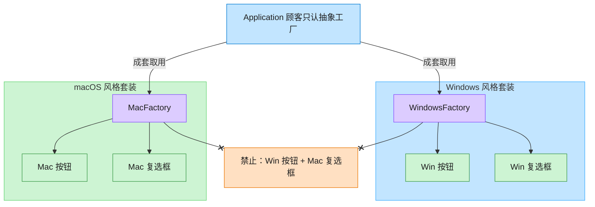

# Abstract Factory 抽象工厂模式（C++）

## 意图

提供一个创建一系列相关或相互依赖对象的接口，而无需指定它们具体的类。客户端只与抽象工厂、抽象产品打交道，切换整套产品族时无需修改客户端代码。

<!-- gof-architecture-diagram -->
## 架构图

> **生活类比**：家具店一次卖「成套风格」。Windows 工厂成套出 Win 按钮+Win 复选框，Mac 工厂成套出 Mac 风格 —— 绝不混搭。



| 图中角色 | 本仓库示例 |
|---------|-----------|
| 顾客 / 应用 | Application，只依赖 GUIFactory |
| 成套工厂 | WindowsFactory / MacFactory |
| 成套产品 | Button + Checkbox 必须同一家族 |

23 张图的完整图鉴见 [`docs/README.md`](../../docs/README.md#abstract-factory-抽象工厂)。

## 适用场景

- 系统需要独立于其产品的创建、组合和表示方式
- 一个系统要由多个产品系列中的一个来配置（如跨平台 UI 控件）
- 需要强调一系列相关产品对象的设计以便进行联合使用
- 想提供一个产品类库，只暴露接口而不暴露实现

## 实现方式

定义抽象产品 `Button`、`Checkbox`，以及对应的 Windows / macOS 具体实现；抽象工厂 `GUIFactory` 声明 `create_button()` / `create_checkbox()`，由 `WinFactory` / `MacFactory` 分别实现。客户端 `Application` 只持有 `GUIFactory&`，从头到尾不知道具体平台：

```cpp
class GUIFactory {
public:
    virtual ~GUIFactory() = default;
    virtual std::unique_ptr<Button> create_button() const = 0;
    virtual std::unique_ptr<Checkbox> create_checkbox() const = 0;
};

Application::Application(const GUIFactory& factory)
    : button_(factory.create_button()),
      checkbox_(factory.create_checkbox()) {}
```

更换 `WinFactory` 为 `MacFactory`，整套控件风格随之切换，且不影响 `Application` 内部逻辑。

## 文件说明

| 文件 | 说明 |
|------|------|
| `gui_factory.h` | 抽象产品/具体产品、抽象工厂/具体工厂、客户端 `Application` 的声明 |
| `gui_factory.cpp` | 各控件与工厂的具体实现 |
| `main.cpp` | 分别用 `WinFactory`、`MacFactory` 渲染界面，验证产品族一致性 |
| `Makefile` | 编译与运行 |

## 编译与运行

```bash
make        # 编译
make run    # 编译并运行
make clean  # 清理
```

## 输出示例

```
=== 抽象工厂模式：跨平台 GUI 控件族 ===

--- 渲染 Windows 界面 ---
  [Windows 按钮]
  [Windows 复选框]
  Windows 按钮：播放系统点击音效
  Windows 复选框：方形勾选切换

--- 渲染 macOS 界面 ---
  (macOS 按钮)
  (macOS 复选框)
  macOS 按钮：播放轻柔点击反馈
  macOS 复选框：圆角勾选切换
```

## 要点

1. **抽象工厂保证产品族一致性** — 同一工厂产出的控件风格必然匹配，不会出现 Windows 按钮配 macOS 复选框
2. **依赖倒置** — 客户端只依赖 `GUIFactory`/`Button`/`Checkbox` 抽象接口，具体类通过基类指针/引用使用
3. **扩展新平台只需新增一个工厂类**，无需修改已有代码，符合开闭原则
4. **与工厂方法的区别** — 工厂方法只生产一个产品等级，抽象工厂生产一整族相关产品
