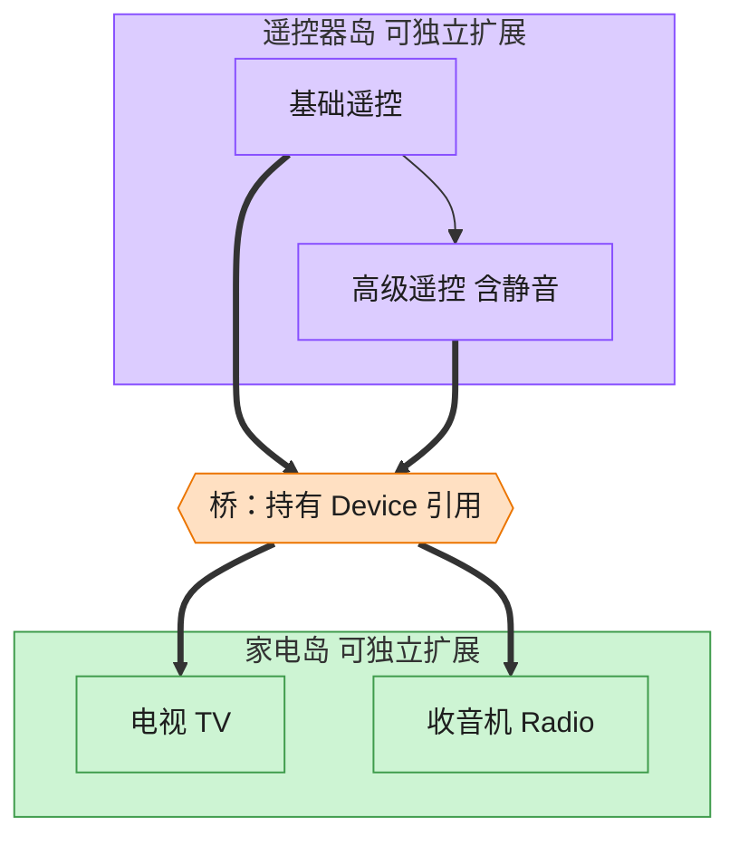

# Bridge 桥接模式（C++）

## 意图

将抽象部分与实现部分分离，使二者可以独立地变化。避免用继承在多个维度上组合出爆炸式增长的子类数量。

<!-- gof-architecture-diagram -->
## 架构图

> **生活类比**：遥控器和家电是两座岛。基础遥控 / 高级遥控是一座岛，电视 / 收音机是另一座岛。中间一座桥（组合引用）把它们连上，不必为每种组合造一个新类。



| 图中角色 | 本仓库示例 |
|---------|-----------|
| 遥控器岛 | RemoteControl / AdvancedRemoteControl 抽象 |
| 桥 | 抽象持有的 Device 引用 |
| 家电岛 | TV / Radio 实现 |

23 张图的完整图鉴见 [`docs/README.md`](../../docs/README.md#bridge-桥接)。

## 适用场景

- 一个类存在两个（或多个）独立变化的维度，且都需要扩展（遥控器种类 × 设备种类）
- 不希望抽象和实现之间有固定的绑定关系，运行时也可能需要切换实现
- 想对客户端隐藏实现细节

## 实现方式

`Device` 是实现化角色（TV/Radio 各自实现开关机、音量等底层操作）；`RemoteControl` 是抽象化角色，持有 `Device&` 而不是继承它——这就是“桥”：

```cpp
class RemoteControl {
public:
    explicit RemoteControl(Device& device) : device_(device) {}
    virtual void toggle_power();
protected:
    Device& device_;  // 桥接点：组合而非继承
};

class AdvancedRemoteControl : public RemoteControl {  // 扩充抽象
public:
    void mute();
};
```

`RemoteControl`/`AdvancedRemoteControl` 与 `TV`/`Radio` 是两条独立的继承体系，任意一个基础遥控器都可以搭配任意设备，新增一种遥控器或一种设备都不需要修改另一边。

## 文件说明

| 文件 | 说明 |
|------|------|
| `device.h` / `device.cpp` | 实现化角色 `Device` 及具体实现 `TV`、`Radio` |
| `remote.h` / `remote.cpp` | 抽象化角色 `RemoteControl` 及扩充抽象 `AdvancedRemoteControl` |
| `main.cpp` | 用基础遥控器操作电视机、用高级遥控器操作收音机 |
| `Makefile` | 编译与运行 |

## 编译与运行

```bash
make        # 编译
make run    # 编译并运行
make clean  # 清理
```

## 输出示例

```
=== 桥接模式：遥控器 x 设备 ===

[基础遥控器 操作电视机]
  [电视机] 开机，画面点亮
  [电视机] 音量调整为 40
  [电视机] 音量调整为 50
  [电视机] 音量调整为 40

[高级遥控器 操作收音机]
  [收音机] 开机，开始接收信号
  [收音机] 音量调整为 30
  [收音机] 音量调整为 0
  [高级遥控器] 已静音
  [收音机] 音量调整为 30
  [高级遥控器] 取消静音
```

## 要点

1. **两个独立继承体系** — `RemoteControl` 体系与 `Device` 体系互不知晓对方细节，通过引用连接
2. **避免组合爆炸** — 若用继承实现“N 种遥控器 × M 种设备”，需要 N×M 个类；桥接只需 N+M 个类
3. **可独立扩展** — 新增 `SmartRemoteControl` 或 `Speaker` 都只需新增一个类
4. **与策略模式的区别** — 桥接强调两个维度都可能有继承层次并独立演化，策略通常只封装一个可替换的算法维度
