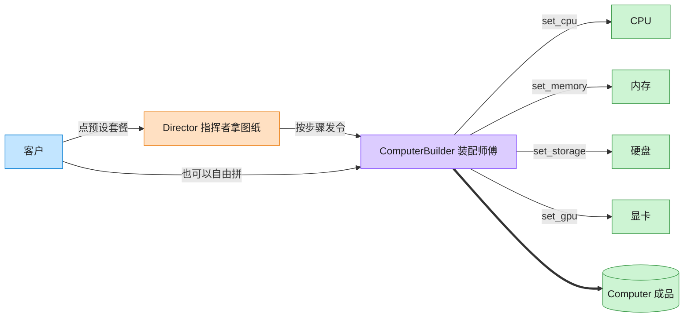

# Builder 建造者模式（C++）

## 意图

将一个复杂对象的构建过程与其表示分离，使同样的构建过程可以创建不同的表示。客户端无需了解装配细节，只需选择建造者和（可选的）指挥流程。

<!-- gof-architecture-diagram -->
## 架构图

> **生活类比**：装机店流水线：指挥者拿「办公机 / 游戏主机 / 工作站」图纸发令，装配师傅一步步装 CPU、内存、硬盘、显卡，最后交出一台电脑。客户也可以绕过图纸自由拼。



| 图中角色 | 本仓库示例 |
|---------|-----------|
| 指挥者 | ComputerDirector 预设装配顺序 |
| 装配师傅 | ComputerBuilder 链式分步接口 |
| 成品 | Computer |

23 张图的完整图鉴见 [`docs/README.md`](../../docs/README.md#builder-建造者)。

## 适用场景

- 创建复杂对象的算法应独立于该对象的组成部分及其装配方式
- 同一个构建过程需要产出多种不同表示（游戏主机 vs 办公主机）
- 需要对构建过程进行精细控制，允许分步骤、按需装配

## 实现方式

`Computer` 是产品；`ComputerBuilder` 声明 `build_cpu/build_ram/build_storage/build_gpu` 四个步骤并返回 `*this` 支持链式调用；`GamingComputerBuilder`、`OfficeComputerBuilder` 提供不同装配细节；`Director` 封装固定的装配顺序：

```cpp
std::unique_ptr<Computer> Director::construct() {
    builder_.build_cpu().build_ram().build_storage().build_gpu();
    return builder_.result();
}
```

客户端也可以绕开 `Director`，直接调用建造者的部分步骤，得到定制化的产品（见 `main.cpp` 中的“自定义配置”）。

## 文件说明

| 文件 | 说明 |
|------|------|
| `computer.h` | `Computer` 产品、抽象建造者、两个具体建造者、`Director` 的声明 |
| `computer.cpp` | 各步骤的具体实现 |
| `main.cpp` | 通过 Director 产出预设配置，并演示绕开 Director 的自定义装配 |
| `Makefile` | 编译与运行 |

## 编译与运行

```bash
make        # 编译
make run    # 编译并运行
make clean  # 清理
```

## 输出示例

```
=== 建造者模式：分步组装 Computer ===

[游戏主机预设] CPU=Intel Core i9-14900K, 内存=32GB DDR5, 存储=2TB NVMe SSD, 显卡=NVIDIA RTX 4090
[办公主机预设] CPU=Intel Core i5-13400, 内存=16GB DDR4, 存储=512GB SSD, 显卡=无独立显卡
[自定义配置]   CPU=Intel Core i9-14900K, 内存=32GB DDR5, 存储=未指定, 显卡=无独立显卡
```

## 要点

1. **构建与表示分离** — `Director` 只知道装配顺序，不知道每一步具体做了什么
2. **链式调用** — 每个 `build_xxx()` 返回 `ComputerBuilder&`，可以流畅地连写
3. **result() 后建造者自动复位**，可以连续建造多个产品而不互相污染
4. **Director 可选** — 客户端既可以用 Director 走预设流程，也可以直接操作 Builder 定制装配
