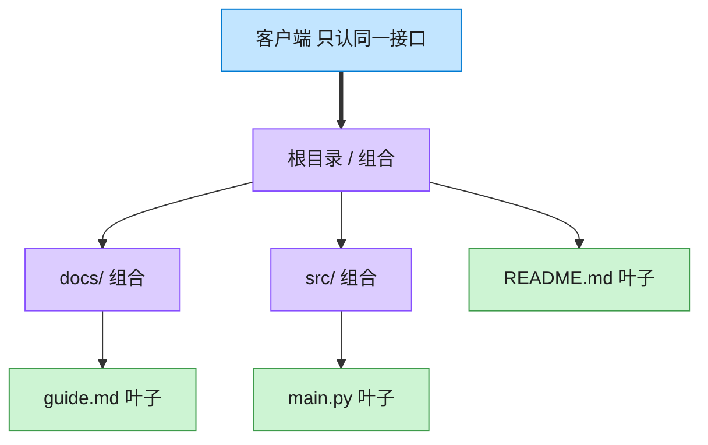

# Composite 组合模式（C++）

## 意图

将对象组合成树形结构以表示“部分-整体”的层次结构。组合模式使客户端对单个对象和组合对象的使用具有一致性。

<!-- gof-architecture-diagram -->
## 架构图

> **生活类比**：文件夹套娃：根目录装着子目录和文件。问「有多大」时，文件报自己的字节，目录把孩子们的大小加起来。客户端从不写 if 是文件还是目录。



| 图中角色 | 本仓库示例 |
|---------|-----------|
| 统一接口 | FileSystemNode.size / display |
| 叶子 | File |
| 容器 | Directory，递归包含子节点 |

23 张图的完整图鉴见 [`docs/README.md`](../../docs/README.md#composite-组合)。

## 适用场景

- 需要表示对象的整体-部分层次结构（文件系统、组织架构、UI 控件树）
- 希望客户端忽略组合对象与单个对象的差异，统一处理

## 实现方式

`FileSystemNode` 是抽象构件，声明 `size()` 与 `print()`；`File` 是叶子节点直接返回自身大小；`Directory` 是容器节点，持有子节点集合，递归调用子节点的 `size()`/`print()`：

```cpp
long Directory::size() const {
    long total = 0;
    for (const auto& child : children_) {
        total += child->size();  // File 与 Directory 被一视同仁地对待
    }
    return total;
}
```

客户端（`main.cpp`）只对 `root`（一个 `Directory`）调用 `print()`/`size()`，无需关心内部混合了多少层子目录和文件。

## 文件说明

| 文件 | 说明 |
|------|------|
| `filesystem.h` | 抽象构件 `FileSystemNode`、叶子 `File`、容器 `Directory` 的声明 |
| `filesystem.cpp` | 递归计算大小与打印树形结构的具体实现 |
| `main.cpp` | 搭建一棵包含多级目录与文件的树，统一计算总大小并打印 |
| `Makefile` | 编译与运行 |

## 编译与运行

```bash
make        # 编译
make run    # 编译并运行
make clean  # 清理
```

## 输出示例

```
=== 组合模式：文件系统 ===

+ project/ (2800 字节)
  + src/ (2000 字节)
    - main.cpp (1200 字节)
    - utils.cpp (800 字节)
  + docs/ (500 字节)
    - README.md (500 字节)
  - Makefile (300 字节)

项目总大小: 2800 字节
```

## 要点

1. **统一接口** — `File` 与 `Directory` 都实现 `FileSystemNode`，客户端代码无需 `if (是文件) ... else ...` 分支判断
2. **递归结构** — `Directory::size()`/`print()` 通过递归自然地处理任意深度的嵌套
3. **易于扩展** — 新增一种节点类型（如符号链接）只需实现 `FileSystemNode` 接口
4. **所有权清晰** — `Directory` 用 `unique_ptr` 持有子节点，树销毁时自动级联释放
