# Decorator 装饰器模式（C++）

## 意图

动态地给一个对象添加一些额外的职责。就增加功能而言，装饰器模式相比生成子类更为灵活，可以在运行时按任意顺序自由组合。

<!-- gof-architecture-diagram -->
## 架构图

> **生活类比**：咖啡加料：浓缩是内核，外面一层牛奶、一层糖、一层奶油。每一层都还是「一杯咖啡」，点单时问 cost，层层转发并加价。

```mermaid
flowchart LR
    classDef client fill:#C2E5FF,stroke:#007AD2,color:#1E1E1E
    classDef abs fill:#DCCCFF,stroke:#874FFF,color:#1E1E1E
    classDef concrete fill:#CDF4D3,stroke:#3E9B4B,color:#1E1E1E
    classDef extra fill:#FFE0C2,stroke:#EB7500,color:#1E1E1E
    classDef shared fill:#FFECBD,stroke:#E8A302,color:#1E1E1E
    classDef hub fill:#C6FAF6,stroke:#5AD8CC,color:#1E1E1E
    guest["顾客 只认 Coffee"]
    whip["奶油包装 +6"]
    sugar["糖包装 +2"]
    milk["牛奶包装 +4"]
    espresso["浓缩 Espresso 12"]
    guest ==> whip
    whip -->|"转发并加价"| sugar
    sugar -->|"转发并加价"| milk
    milk -->|"转发并加价"| espresso
    class guest client
    class whip,sugar,milk extra
    class espresso concrete
```



| 图中角色 | 本仓库示例 |
|---------|-----------|
| 内核 | Espresso / Americano 具体构件 |
| 加料包装 | Milk / Sugar / WhippedCream 装饰器 |
| 统一接口 | Coffee.cost / description |

23 张图的完整图鉴见 [`docs/README.md`](../../docs/README.md#decorator-装饰器)。

## 适用场景

- 需要在不影响其他对象的情况下，动态、透明地给单个对象添加职责
- 职责的组合方式很多，用继承会导致子类数量爆炸（Espresso、Espresso+Milk、Espresso+Milk+Sugar……）
- 希望职责可以在运行时增加也可以撤销

## 实现方式

`Coffee` 是抽象组件；`Espresso` 是具体组件；`CoffeeDecorator` 持有一个 `Coffee` 并同样实现 `Coffee` 接口；`MilkDecorator`、`SugarDecorator` 在调用被包装对象的基础上叠加自己的行为：

```cpp
class CoffeeDecorator : public Coffee {
protected:
    std::unique_ptr<Coffee> inner_;  // 持有被装饰对象，接口保持一致
};

double MilkDecorator::cost() const { return inner_->cost() + 4.0; }
```

客户端通过反复用装饰器包裹同一个 `unique_ptr<Coffee>`，像剥洋葱一样层层叠加：`Espresso -> +牛奶 -> +糖 -> +糖`。

## 文件说明

| 文件 | 说明 |
|------|------|
| `coffee.h` | 抽象组件 `Coffee`、具体组件 `Espresso`、装饰器基类与两个具体装饰 |
| `coffee.cpp` | `description()`/`cost()` 的具体实现 |
| `main.cpp` | 依次叠加 Milk、Sugar、Sugar，观察描述与价格的变化 |
| `Makefile` | 编译与运行 |

## 编译与运行

```bash
make        # 编译
make run    # 编译并运行
make clean  # 清理
```

## 输出示例

```
=== 装饰器模式：咖啡加料 ===

Espresso => 价格: 18 元
Espresso + 牛奶 => 价格: 22 元
Espresso + 牛奶 + 糖 => 价格: 24 元
Espresso + 牛奶 + 糖 + 糖 => 价格: 26 元
```

## 要点

1. **组合优于继承** — 用对象组合在运行时叠加行为，避免为每种加料组合都定义一个子类
2. **接口一致** — 装饰器与被装饰对象实现同一接口，因此可以无限层叠且对客户端透明
3. **顺序可控** — 装饰的顺序即是调用链的顺序，不同顺序可以产生不同的组合效果
4. **与继承的区别** — 继承在编译期静态地扩展行为，装饰器在运行时动态地扩展行为
