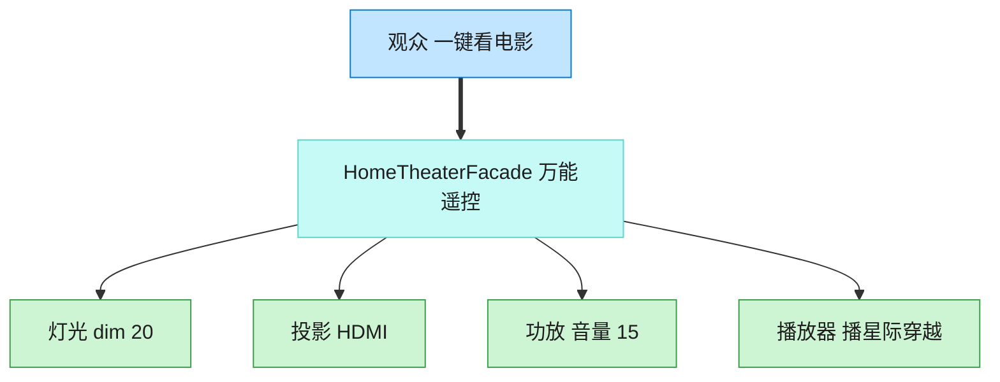

# Facade 外观模式（C++）

## 意图

为子系统中的一组接口提供一个一致的高层接口，使子系统更容易使用。外观定义了一个高层接口，让客户端不必了解子系统内部的复杂协调关系。

<!-- gof-architecture-diagram -->
## 架构图

> **生活类比**：家庭影院一键观影：观众只按「看电影」。外观对象按顺序关灯、开投影、调功放、按播放。高级玩家仍可绕过外观直接拨弄每个设备。



| 图中角色 | 本仓库示例 |
|---------|-----------|
| 观众 | 客户端，只调 watch_movie |
| 万能遥控 | HomeTheaterFacade |
| 子系统 | Lights / Projector / Amplifier / Player |

23 张图的完整图鉴见 [`docs/README.md`](../../docs/README.md#facade-外观)。

## 适用场景

- 子系统随着演化会变得越来越复杂，多数客户端只需要其中的简单功能
- 需要将客户端与子系统的实现解耦，减少编译依赖
- 需要为一个复杂子系统提供一个简单的入口，同时不隐藏子系统本身供高级用户直接使用

## 实现方式

`Projector`、`Amplifier`、`Lights`、`DiscPlayer` 是子系统，各自有独立的接口；`HomeTheaterFacade` 持有它们的引用，把“看电影”这一场景所需的多个步骤封装成一个方法：

```cpp
void HomeTheaterFacade::watch_movie(const std::string& movie) {
    lights_.dim(20);
    projector_.on();
    projector_.set_input("DiscPlayer");
    amplifier_.on();
    amplifier_.set_volume(60);
    player_.play(movie);
}
```

客户端只需调用 `watch_movie()` / `end_movie()`，无需了解四个子系统各自的接口与正确的调用顺序。

## 文件说明

| 文件 | 说明 |
|------|------|
| `hometheater.h` | 四个子系统类与外观类 `HomeTheaterFacade` 的声明 |
| `hometheater.cpp` | 子系统各自的行为与外观的协调逻辑 |
| `main.cpp` | 一键 `watch_movie()` / `end_movie()`，观察内部协调过程 |
| `Makefile` | 编译与运行 |

## 编译与运行

```bash
make        # 编译
make run    # 编译并运行
make clean  # 清理
```

## 输出示例

```
=== 外观模式：家庭影院 ===

[外观] 一键观影，正在协调各子系统...
  灯光：调节至 20%
  投影仪：开启
  投影仪：切换输入源为 DiscPlayer
  功放：开启
  功放：音量设置为 60
  播放器：播放《肖申克的救赎》
[外观] 一切就绪，尽情观影吧！

[外观] 一键关闭家庭影院...
  播放器：停止播放
  功放：关闭
  投影仪：关闭
  灯光：调节至 100%
[外观] 已恢复至正常照明
```

## 要点

1. **简化客户端使用** — 把多个子系统调用、固定的执行顺序封装成一个方法
2. **不封闭子系统** — 高级用户仍可以绕过外观，直接使用 `Projector`、`Amplifier` 等子系统类
3. **降低耦合** — 客户端只依赖 `HomeTheaterFacade`，子系统内部调整不影响客户端代码
4. **与中介者的区别** — 外观是单向的（客户端->子系统），中介者是多个同事对象之间的双向协调
