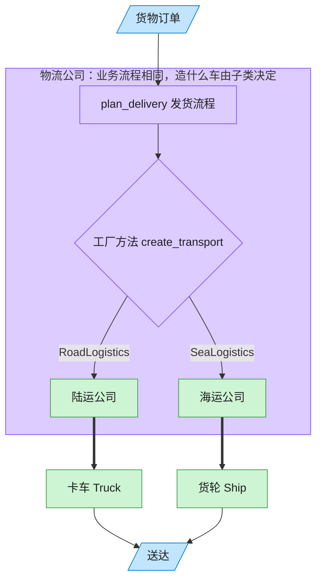

# Factory Method 工厂方法模式（C++）

## 意图

定义一个用于创建对象的接口，让子类决定实例化哪一个具体类。工厂方法使一个类的实例化延迟到其子类。

<!-- gof-architecture-diagram -->
## 架构图

> **生活类比**：客户只说「把货送走」。陆运公司决定造卡车，海运公司决定造货轮 —— 子类决定实例化哪一个产品。



| 图中角色 | 本仓库示例 |
|---------|-----------|
| 客户下单 | 调用 plan_delivery 的客户端 |
| 物流公司 | Logistics 抽象创建者及其子类 |
| 运输工具 | Truck / Ship 具体产品 |

23 张图的完整图鉴见 [`docs/README.md`](../../docs/README.md#factory-method-工厂方法)。

## 适用场景

- 一个类无法预知它必须创建的对象的具体类
- 一个类希望由其子类来指定所创建的对象
- 需要把创建逻辑局部化，同时向调用方隐藏具体产品类型

## 实现方式

`Logistics` 是抽象创建者，声明工厂方法 `create_transport()`；业务逻辑 `plan_delivery()` 只依赖该工厂方法返回的抽象产品 `Transport`。`RoadLogistics`、`SeaLogistics` 分别重写工厂方法决定生产 `Truck` 还是 `Ship`：

```cpp
class Logistics {
public:
    virtual std::unique_ptr<Transport> create_transport() const = 0;  // 工厂方法
    std::string plan_delivery() const;                                 // 只依赖抽象产品
};

std::unique_ptr<Transport> RoadLogistics::create_transport() const {
    return std::make_unique<Truck>();
}
```

`plan_delivery()` 全程不知道 `Transport` 具体是 `Truck` 还是 `Ship`，新增运输方式（如飞机）只需新增一个 `Logistics` 子类。

## 文件说明

| 文件 | 说明 |
|------|------|
| `logistics.h` | 抽象产品 `Transport`、具体产品、抽象创建者 `Logistics`、具体创建者的声明 |
| `logistics.cpp` | 各运输方式与物流子类的具体实现 |
| `main.cpp` | 面向 `Logistics` 基类调用 `plan_delivery()`，验证子类各自决定运输方式 |
| `Makefile` | 编译与运行 |

## 编译与运行

```bash
make        # 编译
make run    # 编译并运行
make clean  # 清理
```

## 输出示例

```
=== 工厂方法模式：物流运输 ===

物流单已生成 -> 使用卡车沿公路运输：适合陆地短途派送
物流单已生成 -> 使用轮船沿海路运输：适合跨海大宗货物
```

## 要点

1. **创建逻辑延迟到子类** — 基类 `Logistics` 不知道也不关心具体产品类型
2. **业务逻辑与创建逻辑分离** — `plan_delivery()` 是稳定的业务流程，`create_transport()` 是变化的创建细节
3. **符合开闭原则** — 新增一种运输方式只需新增 `Transport` 子类和对应的 `Logistics` 子类
4. **与抽象工厂的区别** — 工厂方法关注单一产品的创建，抽象工厂关注一整族产品的创建
