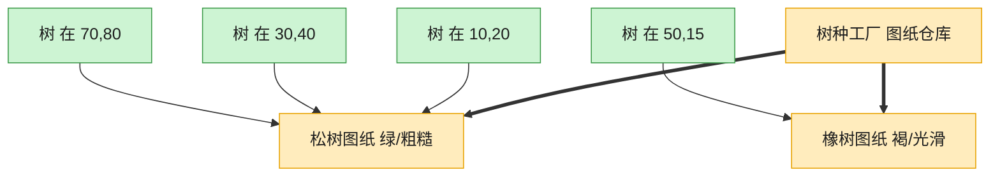

# Flyweight 享元模式（C++）

## 意图

运用共享技术有效地支持大量细粒度对象的复用。享元模式把对象的状态分为内在状态（可共享）与外在状态（不可共享），只为内在状态创建有限的共享对象。

<!-- gof-architecture-diagram -->
## 架构图

> **生活类比**：种一片森林：每棵树只要记住自己的坐标，树种、颜色、纹理是共享图纸。一千棵松树只印一张松树图纸，内存不再按棵数爆炸。



| 图中角色 | 本仓库示例 |
|---------|-----------|
| 图纸仓库 | TreeTypeFactory 按键缓存 |
| 共享图纸 | TreeType 内在状态 |
| 一棵树 | Tree 只存坐标外在状态 |

23 张图的完整图鉴见 [`docs/README.md`](../../docs/README.md#flyweight-享元)。

## 适用场景

- 应用需要生成大量相似对象，导致内存开销巨大
- 对象的大部分状态都可以外部化（外在状态），剩余的内在状态种类有限
- 对象的身份标识不重要，可以按内在状态共享

## 实现方式

`TreeType`（名称/颜色/纹理）是内在状态，由 `TreeTypeFactory` 用 `unordered_map` 缓存，相同参数只创建一份；`Tree` 只保存坐标（外在状态）和对共享 `TreeType` 的引用：

```cpp
TreeType& TreeTypeFactory::get_tree_type(...) {
    auto it = pool_.find(key);
    if (it == pool_.end()) {
        it = pool_.emplace(key, std::make_unique<TreeType>(...)).first;  // 缓存未命中才创建
    }
    return *it->second;
}

class Tree {
    int x_, y_;       // 外在状态：每棵树独有
    TreeType& type_;  // 内在状态：多棵树共享同一份
};
```

森林里种下 5 棵树，但只出现松树、枫树两种 `TreeType`，实际只创建了 2 个共享对象。

## 文件说明

| 文件 | 说明 |
|------|------|
| `forest.h` | 享元 `TreeType`、享元工厂 `TreeTypeFactory`、外在状态载体 `Tree`、`Forest` 的声明 |
| `forest.cpp` | 共享对象池的查找/创建逻辑与渲染实现 |
| `main.cpp` | 种下 5 棵树（3 种参数组合中有重复），验证只创建 2 个 `TreeType` |
| `Makefile` | 编译与运行 |

## 编译与运行

```bash
make        # 编译
make run    # 编译并运行
make clean  # 清理
```

## 输出示例

```
=== 享元模式：森林 ===

  [享元工厂] 池中没有，创建新的 TreeType: 松树-深绿色-松树纹理.png
  [享元工厂] 复用已有 TreeType: 松树-深绿色-松树纹理.png
  [享元工厂] 池中没有，创建新的 TreeType: 枫树-红色-枫树纹理.png
  [享元工厂] 复用已有 TreeType: 松树-深绿色-松树纹理.png
  [享元工厂] 复用已有 TreeType: 枫树-红色-枫树纹理.png

开始渲染森林（共 5 棵树）:
  在 (1,1) 绘制 深绿色松树 [纹理: 松树纹理.png]
  在 (2,5) 绘制 深绿色松树 [纹理: 松树纹理.png]
  在 (8,3) 绘制 红色枫树 [纹理: 枫树纹理.png]
  在 (4,9) 绘制 深绿色松树 [纹理: 松树纹理.png]
  在 (6,2) 绘制 红色枫树 [纹理: 枫树纹理.png]

实际创建的 TreeType 共享对象数: 2（远小于树的总数 5，内在状态被成功复用）
```

## 要点

1. **内在状态 vs 外在状态** — 内在状态（名称/颜色/纹理）与具体环境无关，可共享；外在状态（坐标）随对象场景变化，由客户端保存并传入
2. **工厂统一管理共享池** — `TreeTypeFactory` 是获取享元的唯一入口，保证相同 key 不会重复创建
3. **用引用而非拷贝** — `Tree` 持有 `TreeType&`，多棵树真正共享同一块内存，而不是各自拷贝一份
4. **典型收益场景**——树木、字符渲染、粒子特效等对象数量远大于种类数量的场合
