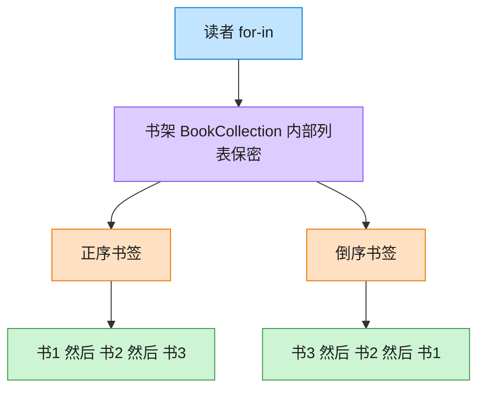

# Iterator 迭代器模式（C++）

## 意图

提供一种方法顺序访问一个聚合对象中的各个元素，而又不暴露该对象的内部表示。

<!-- gof-architecture-diagram -->
## 架构图

> **生活类比**：书架抽屉怎么排，读者看不见。正序书签从左往右滑，倒序书签从右往左滑。两种书签各记各的位置，互不干扰。



| 图中角色 | 本仓库示例 |
|---------|-----------|
| 书架 | BookCollection，内部列表不外露 |
| 正序书签 | BookIterator |
| 倒序书签 | ReverseBookIterator |

23 张图的完整图鉴见 [`docs/README.md`](../../docs/README.md#iterator-迭代器)。

## 适用场景

- 需要访问聚合对象的内容，但不想暴露其内部结构（数组？链表？树？）
- 需要为同一个聚合对象支持多种遍历方式
- 希望为不同的聚合结构提供统一的遍历接口

## 实现方式

`BookCollection` 内部用 `std::vector<Book>` 存储，但只对外暴露自定义的 `Iterator`（包装 `vector` 的常量迭代器）以及 `begin()`/`end()`：

```cpp
class Iterator {
public:
    const Book& operator*() const { return *it_; }
    Iterator& operator++() { ++it_; return *this; }
    bool operator!=(const Iterator& other) const { return it_ != other.it_; }
private:
    std::vector<Book>::const_iterator it_;
};
```

因为实现了 `operator*`/`operator++`/`operator!=` 并提供了 `begin()`/`end()`，`BookCollection` 可以直接用在 C++ 的 range-for 中，也支持手动 `for (auto it = ...; it != ...; ++it)` 遍历。

## 文件说明

| 文件 | 说明 |
|------|------|
| `book_collection.h` | 领域对象 `Book`、聚合类 `BookCollection` 及内嵌 `Iterator` 的声明 |
| `book_collection.cpp` | `add()` 的实现 |
| `main.cpp` | 分别用 range-for 与手动迭代器遍历同一个集合 |
| `Makefile` | 编译与运行 |

## 编译与运行

```bash
make        # 编译
make run    # 编译并运行
make clean  # 清理
```

## 输出示例

```
=== 迭代器模式：BookCollection ===

共 3 本书，用 range-for 顺序遍历:
  《三体》 —— 刘慈欣
  《活着》 —— 余华
  《百年孤独》 —— 加西亚·马尔克斯

手动使用迭代器遍历:
  三体
  活着
  百年孤独
```

## 要点

1. **封装内部结构** — 客户端不知道、也不关心 `BookCollection` 内部是 `vector` 还是其他容器
2. **符合 C++ 惯用法** — 实现最小迭代器接口即可接入 range-for、标准算法等语言机制
3. **可替换底层容器** — 将来把 `vector` 换成 `deque` 或链表，只需调整 `Iterator` 内部实现，客户端代码不受影响
4. **与 GoF 教科书写法的差异** — 传统 GoF 用 `has_next()/next()` 的显式迭代器，本示例改用更贴近 C++ 惯用风格的 `operator++`/`operator*`，二者思想一致
