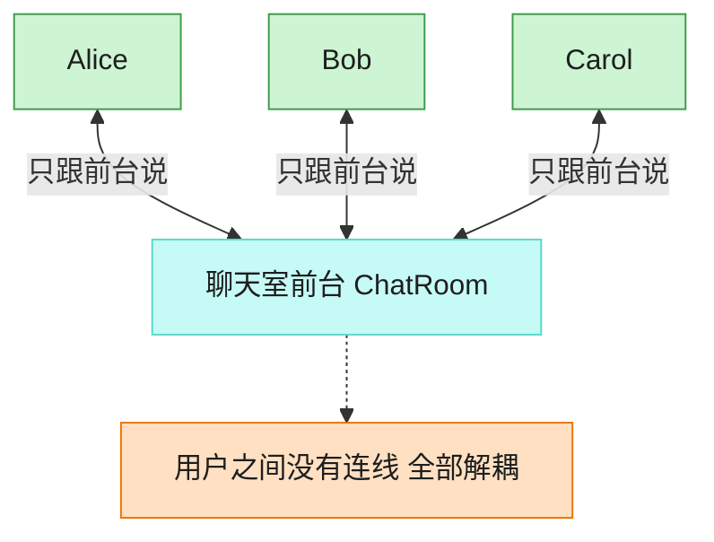

# Mediator 中介者模式（C++）

## 意图

用一个中介对象来封装一系列对象之间的交互。中介者使各对象不需要显式地相互引用，从而使其耦合松散，而且可以独立地改变它们之间的交互。

<!-- gof-architecture-diagram -->
## 架构图

> **生活类比**：聊天室前台：Alice、Bob、Carol 彼此不留电话，所有群消息和私信都交给前台转发。加人、禁言、改规则只改前台一处。



| 图中角色 | 本仓库示例 |
|---------|-----------|
| 前台 | ChatRoom 中介者 |
| 同事 | User，只持有中介引用 |
| 交互 | 广播 / 私信都经中介 |

23 张图的完整图鉴见 [`docs/README.md`](../../docs/README.md#mediator-中介者)。

## 适用场景

- 一组对象之间的通信关系复杂，形成了难以维护的网状引用
- 想复用某个对象，但它与很多其他对象紧密耦合
- 想定制一个分布在多个类中的行为，但又不想生成太多子类

## 实现方式

`User`（同事类）只持有 `ChatRoom&`（中介者），不直接持有其他 `User` 的引用；发消息、群发消息都通过中介者转发：

```cpp
class User {
public:
    void send_to(const std::string& message, const std::string& to_name) {
        room_.send(message, this, to_name);   // 交给中介者转发，而非直接调用对方
    }
private:
    ChatRoom& room_;
};
```

`ConcreteChatRoom` 维护所有已注册用户，负责查找目标用户并转发/群发消息。新增用户只需构造 `User` 并传入同一个 `ChatRoom`，不影响其他用户的代码。

## 文件说明

| 文件 | 说明 |
|------|------|
| `chatroom.h` | 抽象中介者 `ChatRoom`、具体中介者 `ConcreteChatRoom`、同事类 `User` 的声明 |
| `chatroom.cpp` | 消息注册、单发、群发的具体实现 |
| `main.cpp` | 三个用户通过聊天室私聊与群发消息 |
| `Makefile` | 编译与运行 |

## 编译与运行

```bash
make        # 编译
make run    # 编译并运行
make clean  # 清理
```

## 输出示例

```
=== 中介者模式：聊天室 ===

[Alice -> Bob] 晚上一起吃饭吗？
  (Bob 收到 Alice 的消息: 晚上一起吃饭吗？)
[Bob -> Alice] 好啊，几点？
  (Alice 收到 Bob 的消息: 好啊，几点？)
[Carol -> 所有人] 大家好，我是新来的 Carol！
  (Alice 收到 Carol 的消息: 大家好，我是新来的 Carol！)
  (Bob 收到 Carol 的消息: 大家好，我是新来的 Carol！)
```

## 要点

1. **从网状引用到星型引用** — 若没有中介者，N 个用户两两通信需要 O(N²) 条引用关系；引入中介者后每个用户只需持有一个中介者引用
2. **交互逻辑集中化** — 消息路由、群发等逻辑集中在 `ConcreteChatRoom`，便于统一维护和修改
3. **同事类之间彻底解耦** — `User` 之间互不知道对方的存在，只知道中介者
4. **与外观模式的区别** — 外观是单向封装子系统调用，中介者协调的是多个平等对象之间的双向交互
