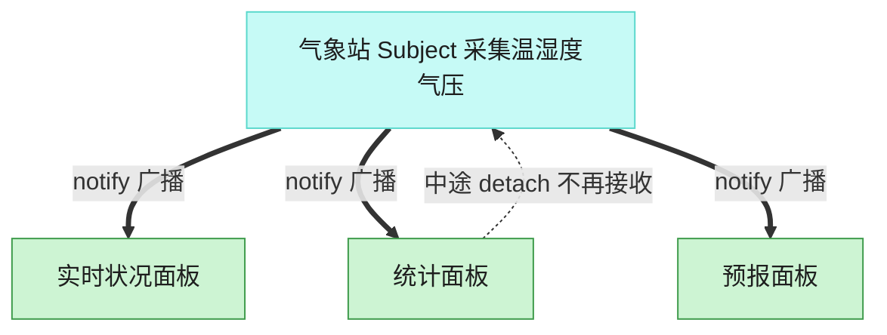

# Observer 观察者模式（C++）

## 意图

定义对象间一种一对多的依赖关系，使得每当一个对象（目标）改变状态，所有依赖它的对象（观察者）都会得到通知并自动更新。

<!-- gof-architecture-diagram -->
## 架构图

> **生活类比**：气象站一更新读数，所有挂着的面板自动刷新。统计面板中途拔掉天线，后面的广播就不再找它，其余面板不受影响。



| 图中角色 | 本仓库示例 |
|---------|-----------|
| 气象站 | WeatherStation 主题 |
| 面板 | 实时 / 统计 / 预报 观察者 |
| 订阅关系 | attach / detach / notify |

23 张图的完整图鉴见 [`docs/README.md`](../../docs/README.md#observer-观察者)。

## 适用场景

- 一个对象状态的改变需要同时更新其他多个对象，且不知道具体有多少个、是哪些对象
- 目标对象与观察者对象之间需要保持松耦合，目标不需要知道观察者的具体类
- 需要支持在运行时动态增加/移除观察者

## 实现方式

`WeatherObserver` 是抽象观察者，声明 `update()`；`WeatherStation`（目标）维护一个观察者指针列表，数据变化时遍历通知：

```cpp
void WeatherStation::set_measurements(double temperature, double humidity) {
    temperature_ = temperature;
    humidity_ = humidity;
    notify_all();                 // 数据变化，统一通知所有观察者
}

void WeatherStation::notify_all() const {
    for (auto* observer : observers_) {
        observer->update(temperature_, humidity_);
    }
}
```

`PhoneDisplay`、`BillboardDisplay` 各自以不同方式展示同一份数据；`WeatherStation` 全程不知道具体挂了哪些观察者，新增一种展示方式（如网页仪表盘）只需实现 `WeatherObserver` 并 `attach()`。

## 文件说明

| 文件 | 说明 |
|------|------|
| `weather.h` | 抽象观察者 `WeatherObserver`、目标 `WeatherStation`、两个具体观察者的声明 |
| `weather.cpp` | 观察者列表管理与通知逻辑的具体实现 |
| `main.cpp` | 注册两个观察者，更新数据触发通知；移除一个观察者后再次更新数据 |
| `Makefile` | 编译与运行 |

## 编译与运行

```bash
make        # 编译
make run    # 编译并运行
make clean  # 清理
```

## 输出示例

```
=== 观察者模式：气象站 ===

[气象站] 采集到新数据: 温度=28.5C, 湿度=65%
  [手机 App] 当前温度 28.5C，湿度 65%
  [广告屏] 温度: 28.5C | 湿度: 65%

广告屏下线维护...

[气象站] 采集到新数据: 温度=26C, 湿度=70%
  [手机 App] 当前温度 26C，湿度 70%
```

## 要点

1. **一对多的松耦合通知** — `WeatherStation` 只依赖 `WeatherObserver` 抽象接口，不知道观察者的具体类型
2. **动态订阅/取消订阅** — `attach()`/`detach()` 可以在运行时调整观察者集合（示例中广告屏下线后不再收到通知）
3. **开闭原则** — 新增一种观察者不需要修改 `WeatherStation` 的任何代码
4. **注意生命周期** — 本示例用裸指针指向观察者，需保证观察者的生命周期长于其被订阅的时间，否则应改用 `weak_ptr` 或显式取消订阅
