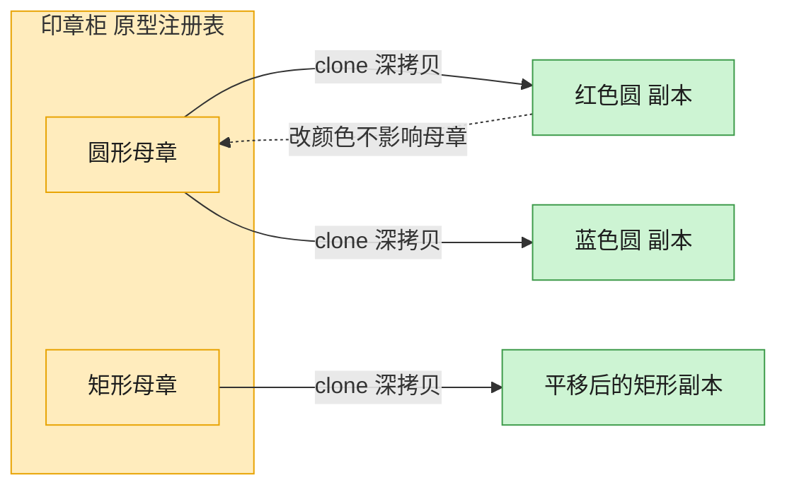

# Prototype 原型模式（C++）

## 意图

用原型实例指定创建对象的种类，并通过拷贝这个原型来创建新对象，而不必知道对应的类，也不必重新执行昂贵的初始化过程。

<!-- gof-architecture-diagram -->
## 架构图

> **生活类比**：印章柜里放着圆形、矩形两枚母章。要新图时不从零雕刻，盖一下（clone）就得到互不干扰的副本，改颜色也不脏了母章。



| 图中角色 | 本仓库示例 |
|---------|-----------|
| 母章 / 原型 | Shape.clone，默认 deepcopy |
| 印章柜 | 按名字取模板的原型注册表 |
| 盖出的副本 | 改颜色、位置、标签，不影响原件 |

23 张图的完整图鉴见 [`docs/README.md`](../../docs/README.md#prototype-原型)。

## 适用场景

- 创建对象的成本较高（初始化复杂、涉及资源加载等），复制比重新构造更划算
- 需要在运行时动态指定要实例化的类，且实例的种类相对较少
- 要避免创建与产品类层次平行的工厂类层次

## 实现方式

`Shape` 声明纯虚函数 `clone()`；`Circle`、`Rectangle` 各自在 `clone()` 内部调用**自身私有的拷贝构造函数**，一次性复制颜色、坐标等所有状态：

```cpp
class Shape {
public:
    virtual std::unique_ptr<Shape> clone() const = 0;  // 原型接口
protected:
    Shape(const Shape&) = default;  // 供子类的拷贝构造调用
};

std::unique_ptr<Shape> Circle::clone() const {
    return std::unique_ptr<Shape>(new Circle(*this));  // 调用私有拷贝构造
}
```

客户端只持有 `Shape*`/`Shape&`，调用 `clone()` 即可获得一个状态相同、但完全独立的新对象；修改克隆体不会影响原型。

## 文件说明

| 文件 | 说明 |
|------|------|
| `shape.h` | 抽象原型 `Shape` 及具体原型 `Circle`、`Rectangle` 的声明 |
| `shape.cpp` | `clone()` 与 `describe()` 的具体实现 |
| `main.cpp` | 克隆图形、修改克隆体、验证与原型互不影响 |
| `Makefile` | 编译与运行 |

## 编译与运行

```bash
make        # 编译
make run    # 编译并运行
make clean  # 清理
```

## 输出示例

```
=== 原型模式：克隆 Shape ===

原始圆形: 圆形 [颜色=红色, 位置=(0,0), 半径=10]
克隆圆形: 圆形 [颜色=红色, 位置=(0,0), 半径=10]

--- 修改克隆体的位置与颜色后 ---
原始圆形: 圆形 [颜色=红色, 位置=(0,0), 半径=10]
克隆圆形: 圆形 [颜色=蓝色, 位置=(50,50), 半径=10]

原始矩形: 矩形 [颜色=绿色, 位置=(5,5), 宽=100, 高=50]
克隆矩形: 矩形 [颜色=绿色, 位置=(5,5), 宽=100, 高=50]
```

## 要点

1. **clone() 返回的是深拷贝** — 克隆体与原型是两个独立对象，互不影响
2. **拷贝构造函数设为 private/protected**，只允许 `clone()` 内部使用，避免外部误用发生对象切片（object slicing）
3. **客户端无需知道具体类型**——只面向 `Shape` 基类调用 `clone()`，仍能得到正确的子类副本（虚函数动态分发）
4. **适合对象初始化成本高或种类繁多**的场景，用“复制现有实例”代替“重新构造”
