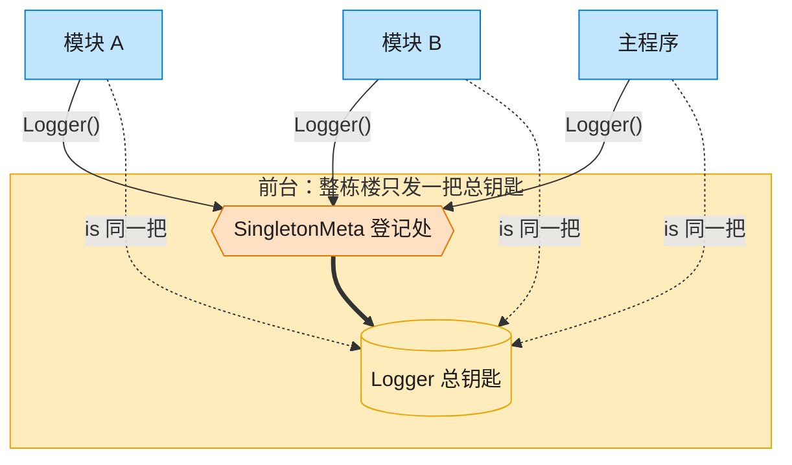

# Singleton 单例模式（C++）

## 意图

确保一个类只有一个实例，并提供一个全局访问点。

<!-- gof-architecture-diagram -->
## 架构图

> **生活类比**：整栋大楼只发一把总钥匙。模块 A、模块 B、主程序去前台领取，拿到的永远是同一把 —— 这就是单例。



| 图中角色 | 本仓库示例 |
|---------|-----------|
| 前台 / 总钥匙 | SingletonMeta + Logger 全局唯一实例 |
| 来领钥匙的部门 | ModuleA / ModuleB / 主程序 |

23 张图的完整图鉴见 [`docs/README.md`](../../docs/README.md#singleton-单例)。

## 适用场景

- 日志记录器、配置管理器、线程池等全局只需一份的资源
- 需要严格控制对共享资源的访问

## 实现方式

本示例采用 **Meyers' Singleton**，利用 C++11 局部静态变量的线程安全初始化特性：

```cpp
static Logger& instance() {
    static Logger inst;  // 首次调用时构造，线程安全
    return inst;
}
```

同时通过 `delete` 禁止拷贝和移动，防止产生第二个实例。

## 文件说明

| 文件 | 说明 |
|------|------|
| `singleton.h` | Logger 单例类声明 |
| `singleton.cpp` | Logger 单例类实现 |
| `main.cpp` | 使用示例：多个模块共享同一个 Logger |
| `Makefile` | 编译与运行 |

## 编译与运行

```bash
make        # 编译
make run    # 编译并运行
make clean  # 清理
```

## 输出示例

```
[DEBUG] main: 程序启动
[DEBUG] module_a: 正在初始化
[DEBUG] module_b: 正在处理数据

地址验证:
  main    中的 Logger 地址: 0x104fdc000
  再次获取的 Logger 地址: 0x104fdc000
```

地址相同，证明各处获取的都是同一个实例。

## 要点

1. **私有构造函数** — 外部无法直接创建对象
2. **delete 拷贝/移动** — 杜绝复制出第二个实例
3. **局部 static** — C++11 保证线程安全，无需手动加锁
