# GoF 设计模式 · 形象架构图

用生活场景把 23 个模式画成架构图。每张图对应本仓库可运行示例里的角色，
而不是抽象的 UML 类框 —— 先看懂「这像什么」，再去对照各语言实现。

## 怎么看这些图

| 颜色 | 含义 |
|------|------|
| 蓝色 | 客户端 / 调用方 |
| 紫色 | 抽象接口 / 骨架 / 固定步骤 |
| 绿色 | 具体实现 / 产品 / 叶子 |
| 橙色 | 转换、包装、额外职责、可变步骤 |
| 黄色 / 青色 | 共享、唯一、中枢、仓库 |

各语言目录下每个模式的 `README.md` 也嵌入了对应的图，打开即可对照。

## 目录

### 创建型（Creational）— 关注对象怎么被造出来

- [Singleton 单例](#singleton-单例)
- [Factory Method 工厂方法](#factory-method-工厂方法)
- [Abstract Factory 抽象工厂](#abstract-factory-抽象工厂)
- [Builder 建造者](#builder-建造者)
- [Prototype 原型](#prototype-原型)

### 结构型（Structural）— 关注对象怎么被组装

- [Adapter 适配器](#adapter-适配器)
- [Bridge 桥接](#bridge-桥接)
- [Composite 组合](#composite-组合)
- [Decorator 装饰器](#decorator-装饰器)
- [Facade 外观](#facade-外观)
- [Flyweight 享元](#flyweight-享元)
- [Proxy 代理](#proxy-代理)

### 行为型（Behavioral）— 关注对象怎么互相说话

- [Chain of Responsibility 责任链](#chain-of-responsibility-责任链)
- [Command 命令](#command-命令)
- [Interpreter 解释器](#interpreter-解释器)
- [Iterator 迭代器](#iterator-迭代器)
- [Mediator 中介者](#mediator-中介者)
- [Memento 备忘录](#memento-备忘录)
- [Observer 观察者](#observer-观察者)
- [State 状态](#state-状态)
- [Strategy 策略](#strategy-策略)
- [Template Method 模板方法](#template-method-模板方法)
- [Visitor 访问者](#visitor-访问者)

## 创建型（Creational）— 关注对象怎么被造出来

### Singleton 单例

> **生活类比**：整栋大楼只发一把总钥匙。模块 A、模块 B、主程序去前台领取，拿到的永远是同一把 —— 这就是单例。

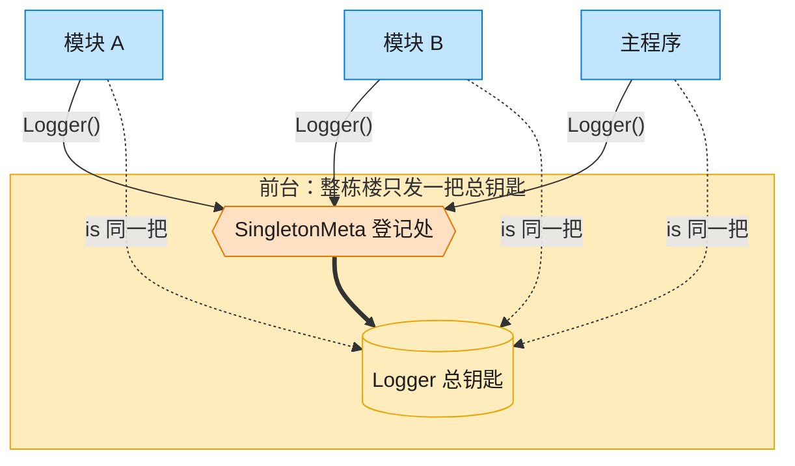

| 图中角色 | 本仓库示例 |
|---------|-----------|
| 前台 / 总钥匙 | SingletonMeta + Logger 全局唯一实例 |
| 来领钥匙的部门 | ModuleA / ModuleB / 主程序 |

### Factory Method 工厂方法

> **生活类比**：客户只说「把货送走」。陆运公司决定造卡车，海运公司决定造货轮 —— 子类决定实例化哪一个产品。

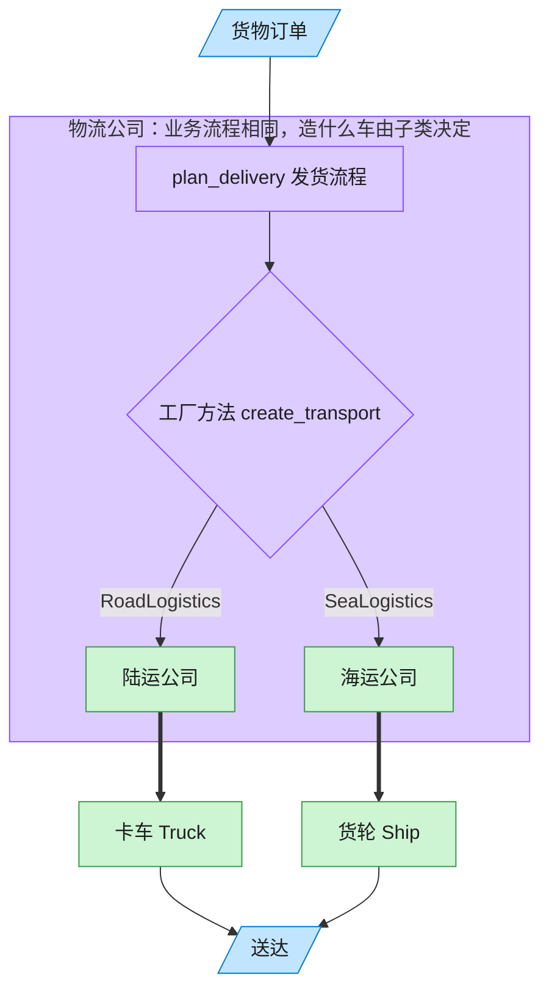

| 图中角色 | 本仓库示例 |
|---------|-----------|
| 客户下单 | 调用 plan_delivery 的客户端 |
| 物流公司 | Logistics 抽象创建者及其子类 |
| 运输工具 | Truck / Ship 具体产品 |

### Abstract Factory 抽象工厂

> **生活类比**：家具店一次卖「成套风格」。Windows 工厂成套出 Win 按钮+Win 复选框，Mac 工厂成套出 Mac 风格 —— 绝不混搭。

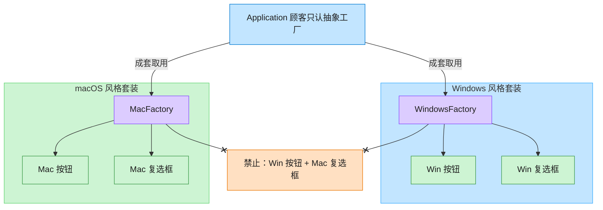

| 图中角色 | 本仓库示例 |
|---------|-----------|
| 顾客 / 应用 | Application，只依赖 GUIFactory |
| 成套工厂 | WindowsFactory / MacFactory |
| 成套产品 | Button + Checkbox 必须同一家族 |

### Builder 建造者

> **生活类比**：装机店流水线：指挥者拿「办公机 / 游戏主机 / 工作站」图纸发令，装配师傅一步步装 CPU、内存、硬盘、显卡，最后交出一台电脑。客户也可以绕过图纸自由拼。

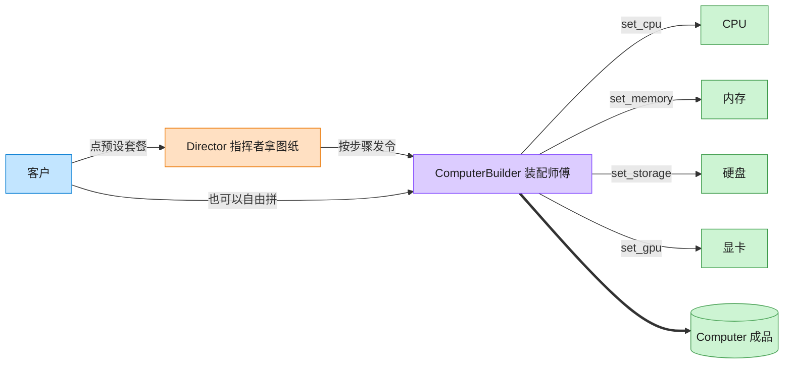

| 图中角色 | 本仓库示例 |
|---------|-----------|
| 指挥者 | ComputerDirector 预设装配顺序 |
| 装配师傅 | ComputerBuilder 链式分步接口 |
| 成品 | Computer |

### Prototype 原型

> **生活类比**：印章柜里放着圆形、矩形两枚母章。要新图时不从零雕刻，盖一下（clone）就得到互不干扰的副本，改颜色也不脏了母章。

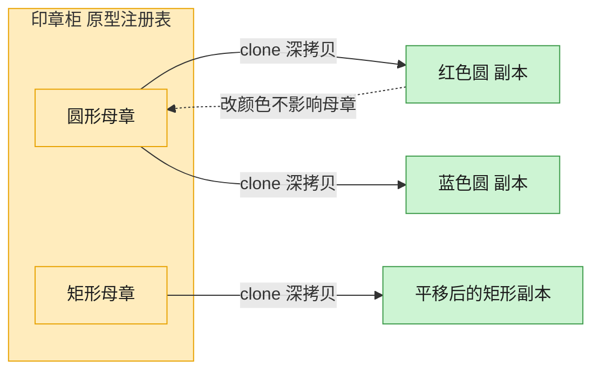

| 图中角色 | 本仓库示例 |
|---------|-----------|
| 母章 / 原型 | Shape.clone，默认 deepcopy |
| 印章柜 | 按名字取模板的原型注册表 |
| 盖出的副本 | 改颜色、位置、标签，不影响原件 |

## 结构型（Structural）— 关注对象怎么被组装

### Adapter 适配器

> **生活类比**：出国旅行的转换插头：手机充电器只认「pay(元)」，Stripe 要「charge(分)」，PayPal 要「美元」。适配器在中间换单位、改方法名，收银台毫无感知。

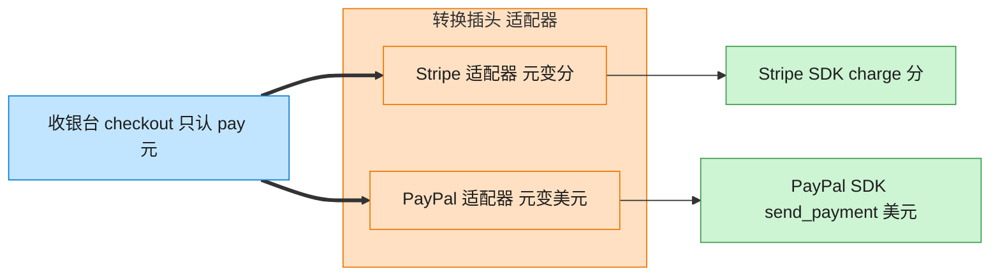

| 图中角色 | 本仓库示例 |
|---------|-----------|
| 收银台 | checkout，只依赖 PaymentProcessor |
| 转换插头 | StripeAdapter / PayPalAdapter |
| 异形插座 | StripePayment / PayPalPayment 第三方 SDK |

### Bridge 桥接

> **生活类比**：遥控器和家电是两座岛。基础遥控 / 高级遥控是一座岛，电视 / 收音机是另一座岛。中间一座桥（组合引用）把它们连上，不必为每种组合造一个新类。

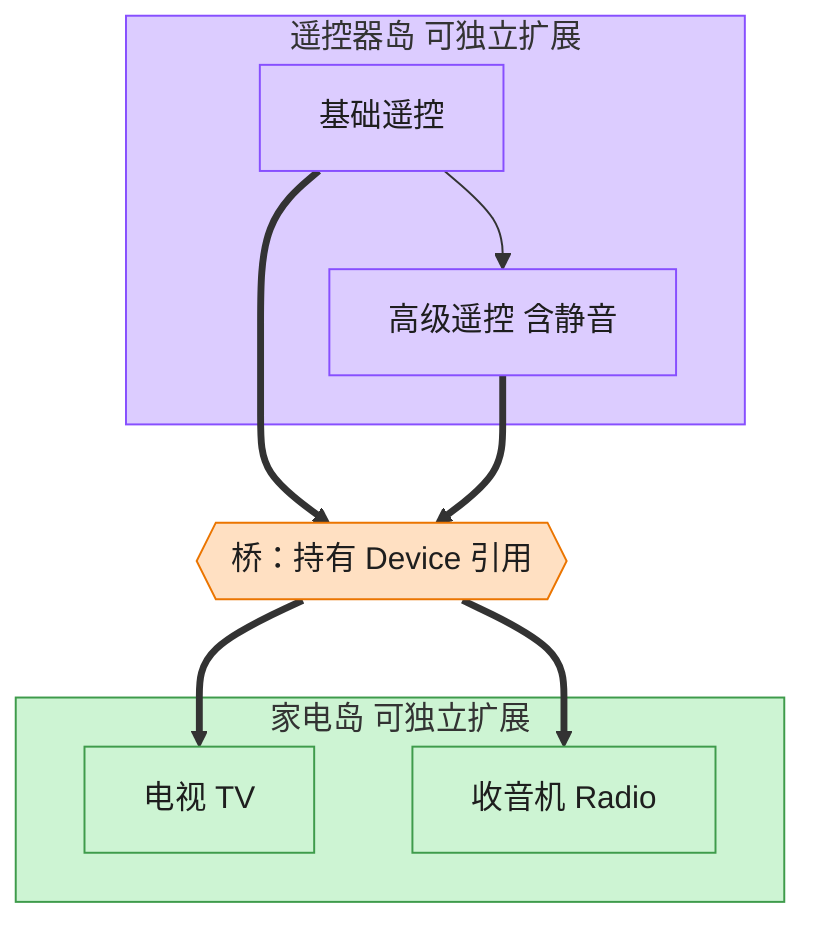

| 图中角色 | 本仓库示例 |
|---------|-----------|
| 遥控器岛 | RemoteControl / AdvancedRemoteControl 抽象 |
| 桥 | 抽象持有的 Device 引用 |
| 家电岛 | TV / Radio 实现 |

### Composite 组合

> **生活类比**：文件夹套娃：根目录装着子目录和文件。问「有多大」时，文件报自己的字节，目录把孩子们的大小加起来。客户端从不写 if 是文件还是目录。

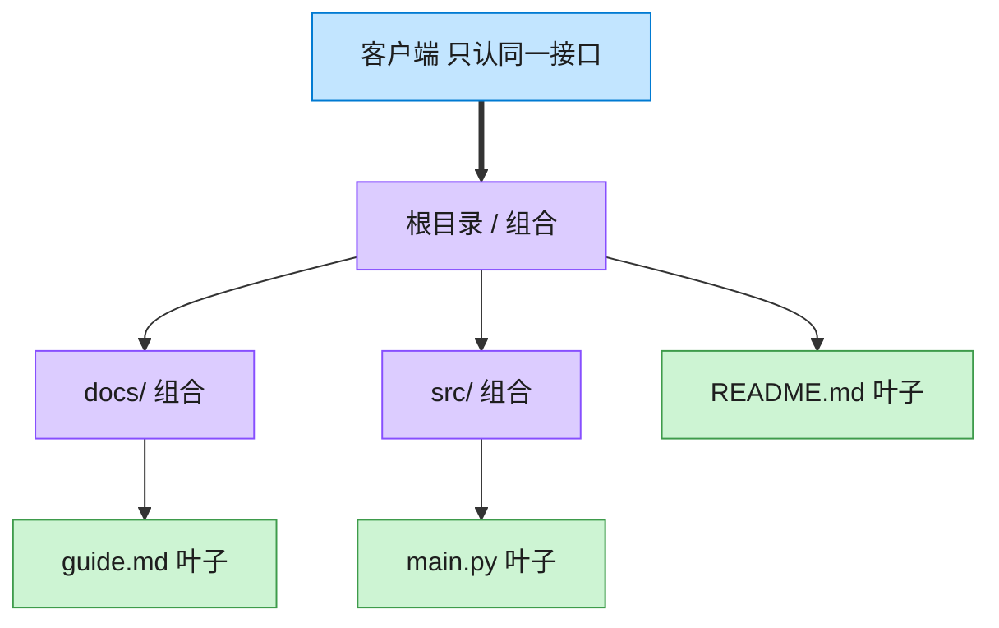

| 图中角色 | 本仓库示例 |
|---------|-----------|
| 统一接口 | FileSystemNode.size / display |
| 叶子 | File |
| 容器 | Directory，递归包含子节点 |

### Decorator 装饰器

> **生活类比**：咖啡加料：浓缩是内核，外面一层牛奶、一层糖、一层奶油。每一层都还是「一杯咖啡」，点单时问 cost，层层转发并加价。

```mermaid
flowchart LR
    classDef client fill:#C2E5FF,stroke:#007AD2,color:#1E1E1E
    classDef abs fill:#DCCCFF,stroke:#874FFF,color:#1E1E1E
    classDef concrete fill:#CDF4D3,stroke:#3E9B4B,color:#1E1E1E
    classDef extra fill:#FFE0C2,stroke:#EB7500,color:#1E1E1E
    classDef shared fill:#FFECBD,stroke:#E8A302,color:#1E1E1E
    classDef hub fill:#C6FAF6,stroke:#5AD8CC,color:#1E1E1E
    guest["顾客 只认 Coffee"]
    whip["奶油包装 +6"]
    sugar["糖包装 +2"]
    milk["牛奶包装 +4"]
    espresso["浓缩 Espresso 12"]
    guest ==> whip
    whip -->|"转发并加价"| sugar
    sugar -->|"转发并加价"| milk
    milk -->|"转发并加价"| espresso
    class guest client
    class whip,sugar,milk extra
    class espresso concrete
```

| 图中角色 | 本仓库示例 |
|---------|-----------|
| 内核 | Espresso / Americano 具体构件 |
| 加料包装 | Milk / Sugar / WhippedCream 装饰器 |
| 统一接口 | Coffee.cost / description |

### Facade 外观

> **生活类比**：家庭影院一键观影：观众只按「看电影」。外观对象按顺序关灯、开投影、调功放、按播放。高级玩家仍可绕过外观直接拨弄每个设备。

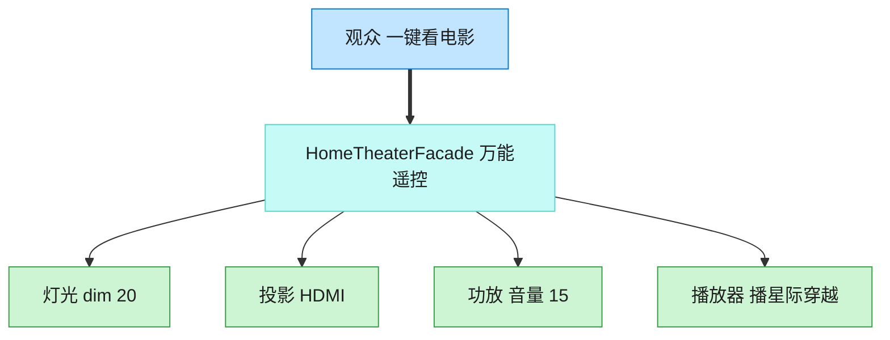

| 图中角色 | 本仓库示例 |
|---------|-----------|
| 观众 | 客户端，只调 watch_movie |
| 万能遥控 | HomeTheaterFacade |
| 子系统 | Lights / Projector / Amplifier / Player |

### Flyweight 享元

> **生活类比**：种一片森林：每棵树只要记住自己的坐标，树种、颜色、纹理是共享图纸。一千棵松树只印一张松树图纸，内存不再按棵数爆炸。

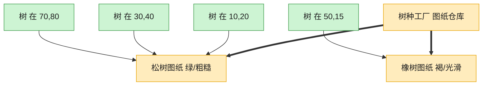

| 图中角色 | 本仓库示例 |
|---------|-----------|
| 图纸仓库 | TreeTypeFactory 按键缓存 |
| 共享图纸 | TreeType 内在状态 |
| 一棵树 | Tree 只存坐标外在状态 |

### Proxy 代理

> **生活类比**：相册先摆三张空相框。点开才从仓库搬出真照片；没点开的那张，磁盘加载一次都不会发生。

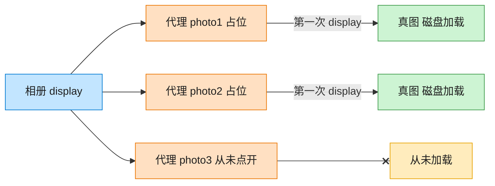

| 图中角色 | 本仓库示例 |
|---------|-----------|
| 相册 | 客户端，只认 Image.display |
| 空相框 | ImageProxy 虚拟代理 |
| 仓库真图 | RealImage，构造时才加载 |

## 行为型（Behavioral）— 关注对象怎么互相说话

### Chain of Responsibility 责任链

> **生活类比**：采购单沿公章接力：经理能批 5000 就盖章，否则递给总监，再递给 CEO。提交人只把单子交给第一环，从不管最终谁批。

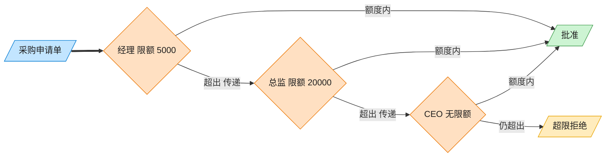

| 图中角色 | 本仓库示例 |
|---------|-----------|
| 采购单 | PurchaseRequest |
| 审批链 | Manager → Director → CEO |
| 提交人 | 只调用链头 handle |

### Command 命令

> **生活类比**：遥控器按钮里装的不是电线，是一封命令信封。按下就把信封交给灯去执行；撤销则打开上一封信封做反操作。按钮不用知道灯怎么开。

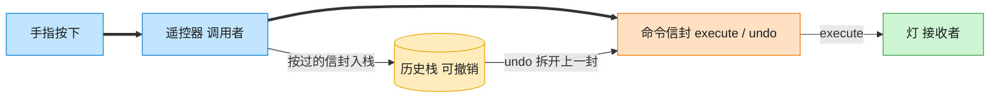

| 图中角色 | 本仓库示例 |
|---------|-----------|
| 遥控器 | RemoteControl 调用者 |
| 命令信封 | LightOnCommand / LightOffCommand |
| 灯 | Light 接收者 |

### Interpreter 解释器

> **生活类比**：把「5 + 3 - 2」拆成积木树：加减是组合积木，数字和变量是末端积木。对着变量表走一遍 interpret，树就算出结果。

```mermaid
flowchart TB
    classDef client fill:#C2E5FF,stroke:#007AD2,color:#1E1E1E
    classDef abs fill:#DCCCFF,stroke:#874FFF,color:#1E1E1E
    classDef concrete fill:#CDF4D3,stroke:#3E9B4B,color:#1E1E1E
    classDef extra fill:#FFE0C2,stroke:#EB7500,color:#1E1E1E
    classDef shared fill:#FFECBD,stroke:#E8A302,color:#1E1E1E
    classDef hub fill:#C6FAF6,stroke:#5AD8CC,color:#1E1E1E
    src["句子：5 + 3 - 2"]
    parse["parse 拆成积木树"]
    src --> parse
    sub["减法 非终结符"]
    add["加法 非终结符"]
    n5["5"]
    n3["3"]
    n2["2"]
    parse --> sub
    sub --> add
    sub --> n2
    add --> n5
    add --> n3
    ctx[(Context 变量表)]
    result["interpret 结果 = 6"]
    sub ==> result
    ctx -.-> result
    class src client
    class parse,sub,add extra
    class n5,n3,n2 concrete
    class ctx,result shared
```

| 图中角色 | 本仓库示例 |
|---------|-----------|
| 句子 | 中缀表达式字符串 |
| 积木树 | Add / Subtract / Number / Variable |
| 词典 | Context 变量表 |

### Iterator 迭代器

> **生活类比**：书架抽屉怎么排，读者看不见。正序书签从左往右滑，倒序书签从右往左滑。两种书签各记各的位置，互不干扰。

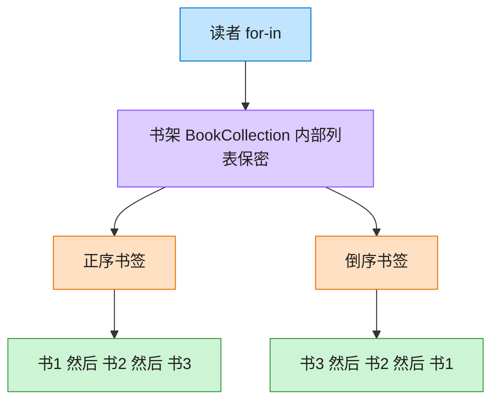

| 图中角色 | 本仓库示例 |
|---------|-----------|
| 书架 | BookCollection，内部列表不外露 |
| 正序书签 | BookIterator |
| 倒序书签 | ReverseBookIterator |

### Mediator 中介者

> **生活类比**：聊天室前台：Alice、Bob、Carol 彼此不留电话，所有群消息和私信都交给前台转发。加人、禁言、改规则只改前台一处。

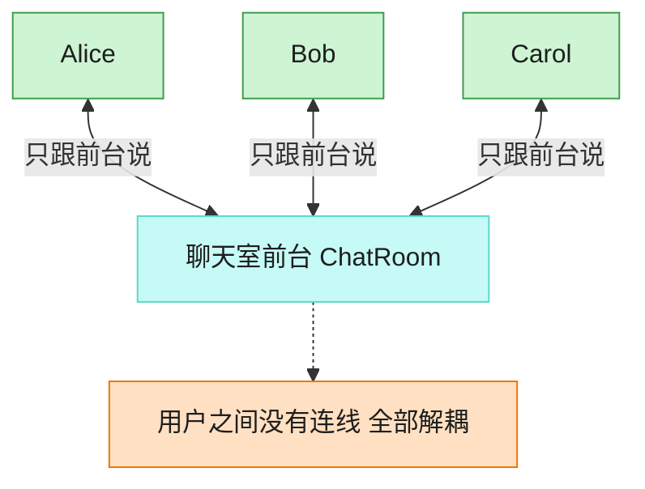

| 图中角色 | 本仓库示例 |
|---------|-----------|
| 前台 | ChatRoom 中介者 |
| 同事 | User，只持有中介引用 |
| 交互 | 广播 / 私信都经中介 |

### Memento 备忘录

> **生活类比**：编辑器把这一刻的正文和光标封进时间胶囊。历史管理员只负责把胶囊堆起来、按撤销交回去，从不拆开偷看 —— 封装不被破坏。

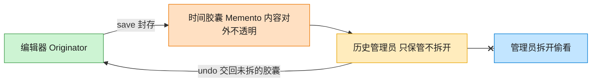

| 图中角色 | 本仓库示例 |
|---------|-----------|
| 编辑器 | TextEditor 发起人，唯二能读写胶囊 |
| 时间胶囊 | EditorMemento 不可变快照 |
| 历史管理员 | History，只压栈出栈 |

### Observer 观察者

> **生活类比**：气象站一更新读数，所有挂着的面板自动刷新。统计面板中途拔掉天线，后面的广播就不再找它，其余面板不受影响。

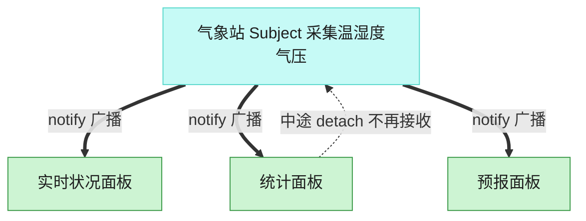

| 图中角色 | 本仓库示例 |
|---------|-----------|
| 气象站 | WeatherStation 主题 |
| 面板 | 实时 / 统计 / 预报 观察者 |
| 订阅关系 | attach / detach / notify |

### State 状态

> **生活类比**：同一颗暂停键：播放中按下就暂停，停止中按下则无效。播放器没有满屏 if-else，而是把「这个状态下该干什么」交给当前状态对象。

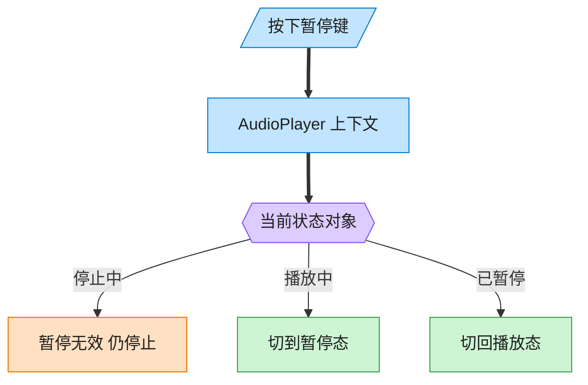

```mermaid
stateDiagram-v2
    [*] --> Stopped
    Stopped --> Playing: play
    Playing --> Paused: pause
    Paused --> Playing: play
    Playing --> Stopped: stop
    Paused --> Stopped: stop
    Stopped --> Stopped: pause 无效
```

| 图中角色 | 本仓库示例 |
|---------|-----------|
| 播放器 | AudioPlayer 上下文，委托当前状态 |
| 三态 | Stopped / Playing / Paused |
| 转换 | 状态对象自己决定下一态 |

### Strategy 策略

> **生活类比**：收银台插卡：购物车不关心怎么扣款，结账时插入信用卡、PayPal 或加密货币策略卡。用户在结算页改选，算法当场替换。

```mermaid
flowchart TB
    classDef client fill:#C2E5FF,stroke:#007AD2,color:#1E1E1E
    classDef abs fill:#DCCCFF,stroke:#874FFF,color:#1E1E1E
    classDef concrete fill:#CDF4D3,stroke:#3E9B4B,color:#1E1E1E
    classDef extra fill:#FFE0C2,stroke:#EB7500,color:#1E1E1E
    classDef shared fill:#FFECBD,stroke:#E8A302,color:#1E1E1E
    classDef hub fill:#C6FAF6,stroke:#5AD8CC,color:#1E1E1E
    user["顾客结账"]
    cart["购物车 Context"]
    slot{{"当前支付策略卡槽"}}
    cc["信用卡策略"]
    pp["PayPal 策略"]
    crypto["加密货币策略"]
    user ==> cart
    cart ==> slot
    slot -->|"可运行时替换"| cc
    slot -->|"可运行时替换"| pp
    slot -->|"可运行时替换"| crypto
    class user,cart client
    class slot abs
    class cc,pp,crypto concrete
```

| 图中角色 | 本仓库示例 |
|---------|-----------|
| 购物车 | ShoppingCart 上下文 |
| 卡槽 | PaymentStrategy 可替换算法 |
| 策略卡 | CreditCard / PayPal / Crypto |

### Template Method 模板方法

> **生活类比**：冲泡饮料的菜谱骨架写死：烧水 → 冲泡 → 倒杯 → 是否加料。茶放茶叶加柠檬，咖啡放咖啡粉加糖奶，黑咖啡用钩子跳过加料。流程顺序谁也不能改。

```mermaid
flowchart TB
    classDef client fill:#C2E5FF,stroke:#007AD2,color:#1E1E1E
    classDef abs fill:#DCCCFF,stroke:#874FFF,color:#1E1E1E
    classDef concrete fill:#CDF4D3,stroke:#3E9B4B,color:#1E1E1E
    classDef extra fill:#FFE0C2,stroke:#EB7500,color:#1E1E1E
    classDef shared fill:#FFECBD,stroke:#E8A302,color:#1E1E1E
    classDef hub fill:#C6FAF6,stroke:#5AD8CC,color:#1E1E1E
    start([prepare 模板骨架 顺序固定])
    boil["烧水 固定步骤"]
    brew{"冲泡 子类实现"}
    pour["倒杯 固定步骤"]
    hook{"要加料吗 钩子"}
    teaBrew["茶：浸泡茶叶"]
    coffeeBrew["咖啡：冲泡咖啡粉"]
    lemon["加柠檬"]
    milkSugar["加糖奶"]
    done([完成])
    start --> boil --> brew
    brew --> teaBrew --> pour
    brew --> coffeeBrew --> pour
    pour --> hook
    hook -->|"茶 / 咖啡 是"| lemon
    hook -->|"茶 / 咖啡 是"| milkSugar
    hook -->|"黑咖啡 否"| done
    lemon --> done
    milkSugar --> done
    class start,boil,pour abs
    class brew,hook extra
    class teaBrew,coffeeBrew,lemon,milkSugar concrete
    class done client
```

| 图中角色 | 本仓库示例 |
|---------|-----------|
| 菜谱骨架 | Beverage.prepare 模板方法 |
| 可变步骤 | _brew / _add_condiments |
| 钩子 | _wants_condiments，黑咖啡返回否 |

### Visitor 访问者

> **生活类比**：图形园的种类很少变（圆、矩形），但巡检工作经常加：今天来面积员，明天来画师，后天新增周长员。图形只负责开门（accept），工具箱在访问者身上 —— 双重分派。

```mermaid
flowchart LR
    classDef client fill:#C2E5FF,stroke:#007AD2,color:#1E1E1E
    classDef abs fill:#DCCCFF,stroke:#874FFF,color:#1E1E1E
    classDef concrete fill:#CDF4D3,stroke:#3E9B4B,color:#1E1E1E
    classDef extra fill:#FFE0C2,stroke:#EB7500,color:#1E1E1E
    classDef shared fill:#FFECBD,stroke:#E8A302,color:#1E1E1E
    classDef hub fill:#C6FAF6,stroke:#5AD8CC,color:#1E1E1E
    caller["客户端带着访问者进园"]
    subgraph park ["图形园 元素类型稳定"]
        circle["圆 accept"]
        rect["矩形 accept"]
    end
    subgraph inspectors ["巡检员 操作可增长"]
        area["面积员 visit_circle / visit_rectangle"]
        draw["画师"]
        peri["周长员 新增操作"]
    end
    caller --> circle
    caller --> rect
    circle -->|"双重分派"| area
    circle --> draw
    circle --> peri
    rect --> area
    rect --> draw
    rect --> peri
    class caller client
    class circle,rect concrete
    class area,draw,peri extra
    style park fill:#CDF4D3,stroke:#3E9B4B
    style inspectors fill:#FFE0C2,stroke:#EB7500
```

| 图中角色 | 本仓库示例 |
|---------|-----------|
| 图形园 | Circle / Rectangle，元素稳定 |
| 开门 | accept 第一次分派 |
| 巡检员 | Area / Draw / Perimeter，操作可增长 |
