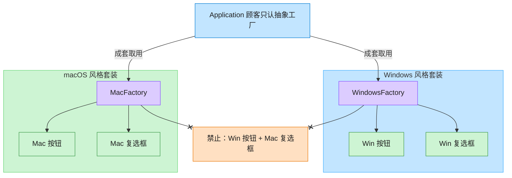

# Abstract Factory 抽象工厂模式（Go）

## 意图

提供一个创建一系列相关或相互依赖对象的接口，而无需指定它们具体的类。
调用方只与抽象工厂、抽象产品打交道，运行时切换具体工厂即可切换整套产品族。

<!-- gof-architecture-diagram -->
## 架构图

> **生活类比**：家具店一次卖「成套风格」。Windows 工厂成套出 Win 按钮+Win 复选框，Mac 工厂成套出 Mac 风格 —— 绝不混搭。



| 图中角色 | 本仓库示例 |
|---------|-----------|
| 顾客 / 应用 | Application，只依赖 GUIFactory |
| 成套工厂 | WindowsFactory / MacFactory |
| 成套产品 | Button + Checkbox 必须同一家族 |

23 张图的完整图鉴见 [`docs/README.md`](../../docs/README.md#abstract-factory-抽象工厂)。

## 适用场景

- 系统需要独立于其产品的创建、组合和表示方式
- 需要保证同一族产品搭配使用（如同一平台风格的按钮必须配同一平台风格的复选框）
- 想通过替换具体工厂来切换整个产品族，而不修改客户端代码

## 实现方式

定义 `Button`、`Checkbox` 两个抽象产品接口，以及 `GUIFactory` 抽象工厂接口；
`WindowsFactory` / `MacFactory` 两个具体工厂分别生产成套的 Windows / macOS 控件。
客户端函数 `renderUI` 只依赖 `GUIFactory` 接口：

```go
// 抽象工厂：声明一组创建方法，生产成套的相关产品（同一平台的 Button + Checkbox）
type GUIFactory interface {
	CreateButton() Button
	CreateCheckbox() Checkbox
}

func renderUI(factory GUIFactory) {
	button := factory.CreateButton()
	checkbox := factory.CreateCheckbox()
	fmt.Println(button.Render())
	fmt.Println(checkbox.Render())
}
```

Go 没有类继承，这里用**接口**表达"抽象产品/抽象工厂"，用不同的具体类型分别实现接口来表达"具体产品/具体工厂"。

## 文件说明

| 文件 | 说明 |
|------|------|
| `main.go` | 抽象产品/工厂接口、Windows 与 macOS 两套具体实现、`main` 演示入口 |

## 编译与运行

```bash
cd go/abstract-factory
go run .
```

## 输出示例

预期输出（本机未安装 Go 工具链，未实机运行）：

```
=== 抽象工厂模式：跨平台 GUI ===

-- 构建 Windows 界面 --
[Windows 按钮]
Windows 按钮被点击（Win32 消息）
[Windows 复选框]
Windows 复选框状态已切换

-- 构建 macOS 界面 --
(macOS 按钮)
macOS 按钮被点击（Cocoa 事件）
(macOS 复选框)
macOS 复选框状态已切换
```

## 要点

1. **抽象工厂 vs 工厂方法** — 抽象工厂关注"一族"产品（Button + Checkbox），工厂方法只关注"单个"产品。
2. **小接口** — `Button`/`Checkbox`/`GUIFactory` 都只有 1-2 个方法，符合 Go 惯用的小接口风格。
3. **易于扩展新平台** — 新增 Linux 支持只需新增 `LinuxFactory` 及其产品，无需修改 `renderUI`。
4. **一次性保证族内一致性** — 客户端不可能把 `WindowsButton` 和 `MacCheckbox` 混用。
