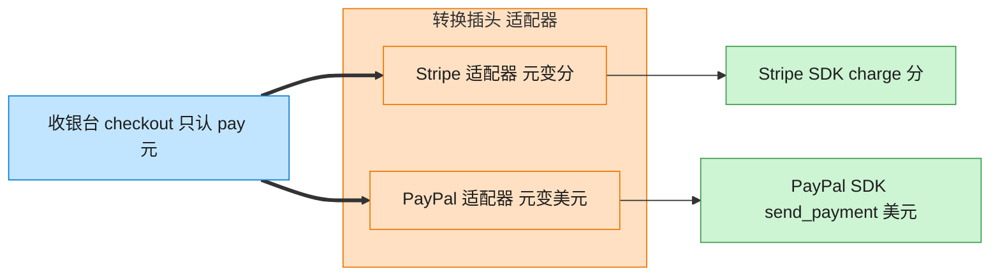

# Adapter 适配器模式（Go）

## 意图

将一个类型的接口转换成客户端期望的另一个接口，使原本因接口不兼容而无法协同工作的类型可以一起工作。

<!-- gof-architecture-diagram -->
## 架构图

> **生活类比**：出国旅行的转换插头：手机充电器只认「pay(元)」，Stripe 要「charge(分)」，PayPal 要「美元」。适配器在中间换单位、改方法名，收银台毫无感知。



| 图中角色 | 本仓库示例 |
|---------|-----------|
| 收银台 | checkout，只依赖 PaymentProcessor |
| 转换插头 | StripeAdapter / PayPalAdapter |
| 异形插座 | StripePayment / PayPalPayment 第三方 SDK |

23 张图的完整图鉴见 [`docs/README.md`](../../docs/README.md#adapter-适配器)。

## 适用场景

- 需要接入的第三方库/SDK 接口与系统内部统一接口不一致
- 希望复用现有类型，但其接口不符合当前系统的抽象
- 需要让新旧接口共存，逐步替换而不必大改调用方代码

## 实现方式

应用统一接口 `PaymentProcessor.Pay(yuan float64)` 以"元"为单位；
第三方 `StripePayment.ChargeInCents(amountInCents int)` 以"分"为单位且方法名不同。
`StripeAdapter` 持有一个 `*StripePayment`，实现 `PaymentProcessor` 接口，内部完成单位换算：

```go
// 适配器：把 StripePayment 适配成应用期望的 PaymentProcessor 接口
type StripeAdapter struct {
	stripe *StripePayment
}

// Pay 实现 PaymentProcessor：把"元"换算成"分"后再调用被适配者的方法
func (a *StripeAdapter) Pay(yuan float64) (string, error) {
	cents := int(yuan * 100)
	return a.stripe.ChargeInCents(cents), nil
}
```

## 文件说明

| 文件 | 说明 |
|------|------|
| `main.go` | `PaymentProcessor` 目标接口、`StripePayment` 被适配者、`StripeAdapter` 适配器、`main` 演示入口 |

## 编译与运行

```bash
cd go/adapter
go run .
```

## 输出示例

预期输出（本机未安装 Go 工具链，未实机运行）：

```
=== 适配器模式：统一支付接口 ===
应用请求支付 99.90 元 -> 支付宝已扣款 99.90 元
应用请求支付 199.50 元 -> Stripe 已扣款 19950 分

(演示非法金额的错误处理)
支付失败: 支付金额必须为正数，收到: -10.00
```

## 要点

1. **组合而非继承** — `StripeAdapter` 内部持有 `*StripePayment`（对象适配器），而非试图继承它。
2. **客户端无感知** — `checkout` 函数只依赖 `PaymentProcessor` 接口，不关心背后是原生实现还是适配器。
3. **error 返回值** — 借助适配层顺便统一了参数校验，非法金额直接返回 `error`。
