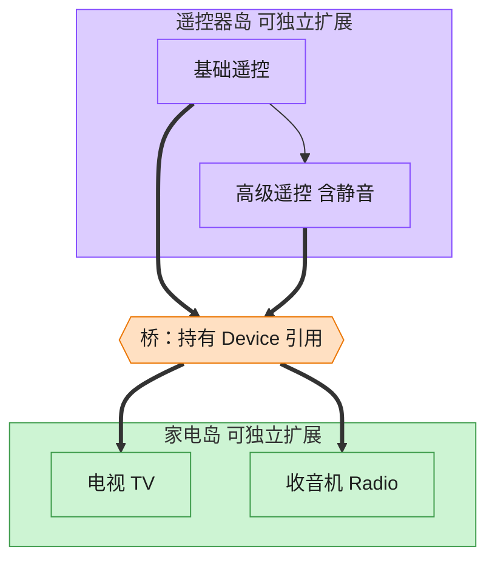

# Bridge 桥接模式（Go）

## 意图

将抽象部分与实现部分分离，使二者可以沿各自的维度独立变化，而不是用继承把两个维度的组合硬编码成一堆子类。

<!-- gof-architecture-diagram -->
## 架构图

> **生活类比**：遥控器和家电是两座岛。基础遥控 / 高级遥控是一座岛，电视 / 收音机是另一座岛。中间一座桥（组合引用）把它们连上，不必为每种组合造一个新类。



| 图中角色 | 本仓库示例 |
|---------|-----------|
| 遥控器岛 | RemoteControl / AdvancedRemoteControl 抽象 |
| 桥 | 抽象持有的 Device 引用 |
| 家电岛 | TV / Radio 实现 |

23 张图的完整图鉴见 [`docs/README.md`](../../docs/README.md#bridge-桥接)。

## 适用场景

- 存在两个（或多个）独立变化的维度，例如"遥控器种类 × 设备种类"
- 想避免"基础遥控器/高级遥控器" × "电视/收音机"这种组合导致类数量爆炸
- 希望在运行时自由搭配抽象与实现（同一个遥控器可以换着控制不同设备）

## 实现方式

`Device` 是实现接口（`TV`/`Radio` 为具体实现）；`RemoteControl` 是抽象部分，
持有一个 `Device`，二者通过组合"桥接"在一起。`AdvancedRemoteControl` 组合
`RemoteControl` 扩展出静音等新功能，而不改动 `Device` 一侧：

```go
// 抽象部分：遥控器，持有一个 Device（桥接关系）
type RemoteControl struct {
	device Device
}

// 扩展抽象：高级遥控器，组合 RemoteControl 复用基础功能（而非继承）
type AdvancedRemoteControl struct {
	RemoteControl
}

func (r *AdvancedRemoteControl) Mute() string {
	r.device.SetVolume(0)
	return r.device.Name() + " 已静音"
}
```

## 文件说明

| 文件 | 说明 |
|------|------|
| `main.go` | `Device` 实现接口、`TV`/`Radio`、`RemoteControl`/`AdvancedRemoteControl` 抽象部分、`main` 演示入口 |

## 编译与运行

```bash
cd go/bridge
go run .
```

## 输出示例

预期输出（本机未安装 Go 工具链，未实机运行）：

```
=== 桥接模式：遥控器与设备 ===
电视 已开启
电视 音量提升至 40

收音机 已开启
收音机 音量提升至 60
收音机 已静音
```

## 要点

1. **两个维度独立扩展** — 新增 `ProjectorDevice` 或 `PremiumRemoteControl` 都不影响另一侧。
2. **struct 嵌入实现"扩展抽象"** — `AdvancedRemoteControl` 嵌入 `RemoteControl`，自动获得其方法集，再新增 `Mute`。
3. **与装饰器的区别** — 桥接是静态设计期就分离两个维度，装饰器是运行时动态叠加职责。
