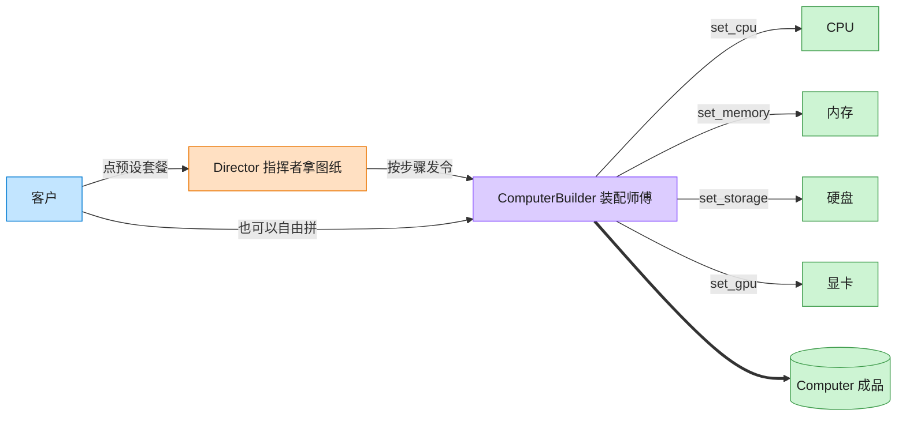

# Builder 建造者模式（Go）

## 意图

将一个复杂对象的构建过程与其表示分离，使同样的构建过程可以创建不同的表示。
把"分步设置字段"和"最终产品长什么样"解耦，避免构造函数参数爆炸。

<!-- gof-architecture-diagram -->
## 架构图

> **生活类比**：装机店流水线：指挥者拿「办公机 / 游戏主机 / 工作站」图纸发令，装配师傅一步步装 CPU、内存、硬盘、显卡，最后交出一台电脑。客户也可以绕过图纸自由拼。



| 图中角色 | 本仓库示例 |
|---------|-----------|
| 指挥者 | ComputerDirector 预设装配顺序 |
| 装配师傅 | ComputerBuilder 链式分步接口 |
| 成品 | Computer |

23 张图的完整图鉴见 [`docs/README.md`](../../docs/README.md#builder-建造者)。

## 适用场景

- 对象有多个可选/必需部件，构造函数参数过多（"telescoping constructor"问题）
- 同一构建过程需要产出多种不同配置的产品（办公电脑 vs 游戏电脑）
- 希望构建步骤支持链式调用，或希望在构建完成前对必要字段做校验

## 实现方式

`ComputerBuilder` 接口声明 `SetCPU/SetMemory/SetStorage/SetGPU` 等分步方法，
每步返回自身以支持链式调用；`Build()` 校验必填项后返回 `(*Computer, error)`。
`Director` 封装了"办公电脑"“游戏电脑"两种预设组装流程：

```go
// Build 校验关键部件后返回最终产品；缺少必要部件时返回 error（Go 惯用做法）
func (b *computerBuilder) Build() (*Computer, error) {
	if b.computer.CPU == "" {
		return nil, errors.New("缺少 CPU，无法组装电脑")
	}
	// ... 校验 Memory / Storage
	return b.computer, nil
}

func (d *Director) BuildGamingPC(b ComputerBuilder) (*Computer, error) {
	return b.SetCPU("Intel i9").SetMemory("32GB").
		SetStorage("2TB SSD").SetGPU("NVIDIA RTX 4090").Build()
}
```

## 文件说明

| 文件 | 说明 |
|------|------|
| `main.go` | `Computer` 产品、`ComputerBuilder` 接口与实现、`Director`、`main` 演示入口 |

## 编译与运行

```bash
cd go/builder
go run .
```

## 输出示例

预期输出（本机未安装 Go 工具链，未实机运行）：

```
=== 建造者模式：组装电脑 ===
办公电脑: 电脑配置 [CPU: Intel i5, 内存: 16GB, 存储: 512GB SSD, GPU: 无（集成显卡）]
游戏电脑: 电脑配置 [CPU: Intel i9, 内存: 32GB, 存储: 2TB SSD, GPU: NVIDIA RTX 4090]
自定义电脑: 电脑配置 [CPU: AMD Ryzen 9, 内存: 64GB, 存储: 4TB NVMe, GPU: AMD RX 7900]

(演示缺少必要部件时的错误处理)
组装失败: 缺少内存，无法组装电脑
```

## 要点

1. **链式调用** — 每个 `Set*` 方法返回接口自身类型，天然支持 fluent API。
2. **Director 可选** — 客户端既可以用 `Director` 走预设流程，也能绕过它自由组合。
3. **error 返回值** — `Build()` 返回 `error` 而非 panic，是 Go 处理"构建失败"的惯用方式。
4. **接口隔离具体类型** — `computerBuilder` 未导出，外部只能通过 `ComputerBuilder` 接口和 `NewComputerBuilder` 使用它。
