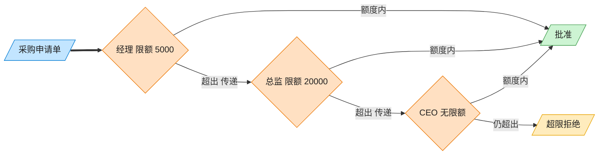

# Chain of Responsibility 责任链模式（Go）

## 意图

将请求沿着一条由多个处理者组成的链传递，每个处理者判断自己能否处理，
不能处理则转交给下一个，直到有人处理或链尾，从而解耦请求发送者与具体处理者。

<!-- gof-architecture-diagram -->
## 架构图

> **生活类比**：采购单沿公章接力：经理能批 5000 就盖章，否则递给总监，再递给 CEO。提交人只把单子交给第一环，从不管最终谁批。



| 图中角色 | 本仓库示例 |
|---------|-----------|
| 采购单 | PurchaseRequest |
| 审批链 | Manager → Director → CEO |
| 提交人 | 只调用链头 handle |

23 张图的完整图鉴见 [`docs/README.md`](../../docs/README.md#chain-of-responsibility-责任链)。

## 适用场景

- 多个对象都可能处理同一个请求，具体由哪个处理要在运行时确定
- 希望在不明确指定接收者的情况下，向多个对象中的一个提交请求
- 处理者集合及顺序需要动态指定（如按审批额度逐级上报）

## 实现方式

`Approver` 接口声明 `SetNext`/`Approve`；`baseApprover` 封装"转交下一环节"的通用逻辑，
`Manager`/`Director`/`CEO` 通过**组合**内嵌 `baseApprover` 复用它，只需实现各自的限额判断：

```go
// 基础处理者：封装"转交下一环节"的通用逻辑，供各级审批人组合复用（而非继承）
type baseApprover struct {
	next Approver
}

func (m *Manager) Approve(req *PurchaseRequest) {
	if req.Amount <= m.limit {
		fmt.Printf("经理批准了采购申请 ...")
		return
	}
	m.passToNext(req) // 超出权限，转交下一处理者
}
```

## 文件说明

| 文件 | 说明 |
|------|------|
| `main.go` | `Approver` 接口、`baseApprover`、`Manager`/`Director`/`CEO`、`main` 演示入口 |

## 编译与运行

```bash
cd go/chain-of-responsibility
go run .
```

## 输出示例

预期输出（本机未安装 Go 工具链，未实机运行）：

```
=== 责任链模式：采购审批 ===
经理批准了采购申请 [办公用品, 800 元]

经理权限不足（限额 5000），转交上级
总监批准了采购申请 [会议室设备, 15000 元]

经理权限不足（限额 5000），转交上级
总监权限不足（限额 20000），转交上级
CEO 批准了采购申请 [新服务器, 80000 元]

经理权限不足（限额 5000），转交上级
总监权限不足（限额 20000），转交上级
CEO 权限不足（限额 100000），申请被拒绝
采购申请 [并购项目, 500000 元] 无人可审批，已被拒绝

```

## 要点

1. **组合复用公共逻辑** — 三级审批人都嵌入 `baseApprover`，避免重复实现"转交下一个"的代码。
2. **链的构造与业务逻辑分离** — `manager.SetNext(director).SetNext(ceo)` 只负责搭链，判断逻辑在各自 `Approve` 中。
3. **链尾兜底** — 若没有人能处理（超过 CEO 权限），`passToNext` 在 `next == nil` 时给出明确的拒绝提示，而非静默失败。
