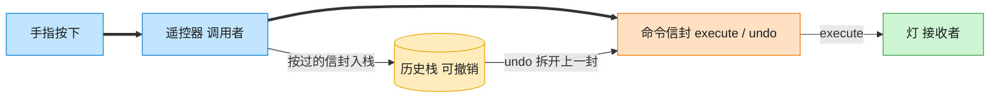

# Command 命令模式（Go）

## 意图

将请求封装成一个独立的对象，从而可以用不同的请求对客户进行参数化、
对请求排队或记录日志，并支持可撤销的操作。

<!-- gof-architecture-diagram -->
## 架构图

> **生活类比**：遥控器按钮里装的不是电线，是一封命令信封。按下就把信封交给灯去执行；撤销则打开上一封信封做反操作。按钮不用知道灯怎么开。



| 图中角色 | 本仓库示例 |
|---------|-----------|
| 遥控器 | RemoteControl 调用者 |
| 命令信封 | LightOnCommand / LightOffCommand |
| 灯 | Light 接收者 |

23 张图的完整图鉴见 [`docs/README.md`](../../docs/README.md#command-命令)。

## 适用场景

- 需要把"发出请求的对象"和"知道如何执行请求的对象"解耦（遥控器不需要知道灯的实现细节）
- 需要支持撤销/重做，或需要将操作记录成历史
- 需要将操作放入队列排队执行，或对操作进行参数化配置

## 实现方式

`Command` 接口声明 `Execute()`/`Undo()`；`LightOnCommand`/`LightOffCommand`
封装对接收者 `Light` 的具体调用；`RemoteControl` 只依赖 `Command` 接口，
记录历史命令以支持撤销：

```go
// 调用者：遥控器，记录已执行的命令历史以支持撤销，不关心命令具体做了什么
func (r *RemoteControl) PressButton(cmd Command) {
	fmt.Println(cmd.Execute())
	r.history = append(r.history, cmd)
}

func (r *RemoteControl) PressUndo() {
	last := r.history[len(r.history)-1]
	r.history = r.history[:len(r.history)-1]
	fmt.Println("撤销:", last.Undo())
}
```

## 文件说明

| 文件 | 说明 |
|------|------|
| `main.go` | `Command` 接口、`Light` 接收者、`LightOnCommand`/`LightOffCommand`、`RemoteControl` 调用者、`main` 演示入口 |

## 编译与运行

```bash
cd go/command
go run .
```

## 输出示例

预期输出（本机未安装 Go 工具链，未实机运行）：

```
=== 命令模式：遥控器与撤销 ===
客厅 的灯已打开
卧室 的灯已打开
客厅 的灯已关闭

--- 依次撤销 ---
撤销: 客厅 的灯已打开
撤销: 卧室 的灯已关闭
撤销: 客厅 的灯已关闭
没有可撤销的操作
```

## 要点

1. **调用者与接收者解耦** — `RemoteControl` 只认识 `Command` 接口，完全不知道 `Light` 的存在。
2. **撤销即反向命令** — 每个具体命令都清楚自己的逆操作（开灯命令的 `Undo` 就是关灯）。
3. **历史栈** — 用切片模拟栈结构（`append` 入栈、`s[:len-1]` 出栈）实现多级撤销。
