# Decorator 装饰器模式（Go）

## 意图

在不改变对象自身的前提下，动态地为其添加额外职责。相比生成子类，装饰器提供了更灵活的、可任意叠加的扩展方式。

<!-- gof-architecture-diagram -->
## 架构图

> **生活类比**：咖啡加料：浓缩是内核，外面一层牛奶、一层糖、一层奶油。每一层都还是「一杯咖啡」，点单时问 cost，层层转发并加价。

```mermaid
flowchart LR
    classDef client fill:#C2E5FF,stroke:#007AD2,color:#1E1E1E
    classDef abs fill:#DCCCFF,stroke:#874FFF,color:#1E1E1E
    classDef concrete fill:#CDF4D3,stroke:#3E9B4B,color:#1E1E1E
    classDef extra fill:#FFE0C2,stroke:#EB7500,color:#1E1E1E
    classDef shared fill:#FFECBD,stroke:#E8A302,color:#1E1E1E
    classDef hub fill:#C6FAF6,stroke:#5AD8CC,color:#1E1E1E
    guest["顾客 只认 Coffee"]
    whip["奶油包装 +6"]
    sugar["糖包装 +2"]
    milk["牛奶包装 +4"]
    espresso["浓缩 Espresso 12"]
    guest ==> whip
    whip -->|"转发并加价"| sugar
    sugar -->|"转发并加价"| milk
    milk -->|"转发并加价"| espresso
    class guest client
    class whip,sugar,milk extra
    class espresso concrete
```



| 图中角色 | 本仓库示例 |
|---------|-----------|
| 内核 | Espresso / Americano 具体构件 |
| 加料包装 | Milk / Sugar / WhippedCream 装饰器 |
| 统一接口 | Coffee.cost / description |

23 张图的完整图鉴见 [`docs/README.md`](../../docs/README.md#decorator-装饰器)。

## 适用场景

- 需要给对象动态、可叠加地添加职责，且职责组合数量会随需求增长（加奶/加糖/加冰……）
- 不希望通过继承为每种组合都建一个子类（组合爆炸）
- 希望装饰的顺序、次数可以在运行时自由决定

## 实现方式

`Beverage` 是组件接口；`Espresso` 是具体组件；`MilkDecorator`/`SugarDecorator`
内嵌 `beverageDecorator`（持有被装饰对象），层层包裹并在原有结果上叠加自己的部分：

```go
// 装饰器基础结构：持有被装饰的 Beverage（组合而非继承）
type beverageDecorator struct {
	wrapped Beverage
}

func (m *MilkDecorator) Cost() float64 {
	return m.wrapped.Cost() + 3.0
}
```

每包裹一层，`Description()`/`Cost()` 都会在被包裹对象结果之上继续叠加，实现"洋葱式"调用链。

## 文件说明

| 文件 | 说明 |
|------|------|
| `main.go` | `Beverage` 接口、`Espresso` 组件、`MilkDecorator`/`SugarDecorator` 装饰器、`main` 演示入口 |

## 编译与运行

```bash
cd go/decorator
go run .
```

## 输出示例

预期输出（本机未安装 Go 工具链，未实机运行）：

```
=== 装饰器模式：咖啡加料 ===
Espresso 意式浓缩 => 15.00 元
Espresso 意式浓缩 + 牛奶 => 18.00 元
Espresso 意式浓缩 + 牛奶 + 糖 => 19.50 元
Espresso 意式浓缩 + 牛奶 + 糖 + 糖 => 21.00 元
```

## 要点

1. **可任意叠加与重复** — 同一种装饰器可以叠加多次（如两份糖），顺序不同结果的描述文本也不同。
2. **装饰器与被装饰者同接口** — `MilkDecorator` 本身也是 `Beverage`，因此可以被再次装饰，形成链式包装。
3. **与桥接的区别** — 装饰器是运行时动态叠加职责，桥接是设计期分离两个独立变化的维度。
