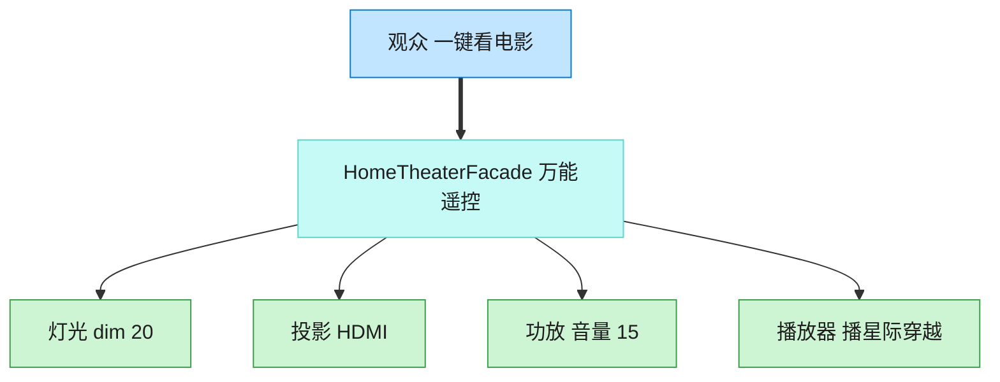

# Facade 外观模式（Go）

## 意图

为复杂子系统提供一个统一的高层接口，让子系统更易使用，同时不暴露内部各组件之间的协调细节。

<!-- gof-architecture-diagram -->
## 架构图

> **生活类比**：家庭影院一键观影：观众只按「看电影」。外观对象按顺序关灯、开投影、调功放、按播放。高级玩家仍可绕过外观直接拨弄每个设备。



| 图中角色 | 本仓库示例 |
|---------|-----------|
| 观众 | 客户端，只调 watch_movie |
| 万能遥控 | HomeTheaterFacade |
| 子系统 | Lights / Projector / Amplifier / Player |

23 张图的完整图鉴见 [`docs/README.md`](../../docs/README.md#facade-外观)。

## 适用场景

- 子系统包含多个相互协作的组件，客户端每次使用都要重复一套固定的调用顺序
- 希望降低客户端与子系统之间的耦合，为子系统提供一个简单的入口
- 需要为遗留的复杂系统包一层简单接口，方便新代码调用

## 实现方式

`Projector`/`Amplifier`/`Lights`/`StreamingPlayer` 是各自独立的子系统；
`HomeTheaterFacade` 组合它们，对外只暴露 `WatchMovie`/`EndMovie` 两个方法：

```go
// 外观：为投影仪/功放/灯光/播放器等复杂子系统提供简单统一的高层接口
type HomeTheaterFacade struct {
	projector *Projector
	amplifier *Amplifier
	lights    *Lights
	player    *StreamingPlayer
}

// WatchMovie 一键完成观影前所有子系统的协调工作，客户端无需了解内部细节
func (h *HomeTheaterFacade) WatchMovie(movie string) {
	h.lights.Dim(20)
	h.projector.On()
	h.amplifier.On()
	h.player.Play(movie)
}
```

## 文件说明

| 文件 | 说明 |
|------|------|
| `main.go` | 四个子系统类型、`HomeTheaterFacade` 外观、`main` 演示入口 |

## 编译与运行

```bash
cd go/facade
go run .
```

## 输出示例

预期输出（本机未安装 Go 工具链，未实机运行）：

```
=== 外观模式：家庭影院 ===
--- 准备观影 ---
灯光: 调暗至 20%
投影仪: 开启
投影仪: 切换输入源为 流媒体
功放: 开启
功放: 音量设置为 60
播放器: 正在播放《盗梦空间》

--- 结束观影 ---
播放器: 停止播放
功放: 关闭
投影仪: 关闭
灯光: 恢复明亮
```

## 要点

1. **不封锁子系统** — 外观只是"更方便的入口"，需要精细控制时仍可直接使用 `Projector` 等子系统类型。
2. **降低耦合** — 客户端代码只依赖 `HomeTheaterFacade`，子系统内部调整顺序或新增组件不影响客户端。
3. **与中介者的区别** — 外观是单向简化"客户端 -> 子系统"的调用，中介者是协调多个平等对象之间的双向交互。
