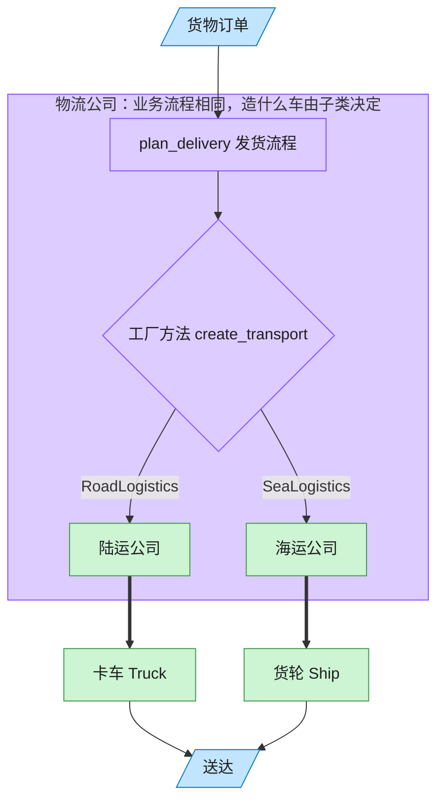

# Factory Method 工厂方法模式（Go）

## 意图

定义一个用于创建对象的接口，由实现者决定实例化哪一个具体类。
让创建逻辑延迟到子类型（在 Go 中体现为不同的接口实现），使新增产品无需修改已有业务逻辑。

<!-- gof-architecture-diagram -->
## 架构图

> **生活类比**：客户只说「把货送走」。陆运公司决定造卡车，海运公司决定造货轮 —— 子类决定实例化哪一个产品。



| 图中角色 | 本仓库示例 |
|---------|-----------|
| 客户下单 | 调用 plan_delivery 的客户端 |
| 物流公司 | Logistics 抽象创建者及其子类 |
| 运输工具 | Truck / Ship 具体产品 |

23 张图的完整图鉴见 [`docs/README.md`](../../docs/README.md#factory-method-工厂方法)。

## 适用场景

- 一个类无法预知它必须创建的对象的具体类型
- 想把"决定创建哪种产品"的职责下放给调用方提供的具体实现
- 业务逻辑只应依赖产品的抽象接口，不应依赖具体类型

## 实现方式

`Logistics` 接口只声明一个工厂方法 `CreateTransport() Transport`；
`RoadLogistics`/`SeaLogistics` 分别返回 `Truck`/`Ship`。
与业务逻辑相关的 `PlanDelivery` 函数只依赖 `Logistics` 接口，不关心具体产品：

```go
// 抽象创建者：只声明工厂方法，具体创建哪种 Transport 交由实现者决定
type Logistics interface {
	CreateTransport() Transport
}

// PlanDelivery 是不依赖具体产品的通用业务逻辑
func PlanDelivery(l Logistics) string {
	transport := l.CreateTransport()
	return "规划运输路线 -> " + transport.Deliver()
}
```

Go 中没有"子类覆盖父类方法"，这里直接用不同的具体类型实现同一个接口来代替。

## 文件说明

| 文件 | 说明 |
|------|------|
| `main.go` | `Transport`/`Logistics` 接口、`Truck`/`Ship`/`RoadLogistics`/`SeaLogistics` 实现、`main` 演示入口 |

## 编译与运行

```bash
cd go/factory-method
go run .
```

## 输出示例

预期输出（本机未安装 Go 工具链，未实机运行）：

```
=== 工厂方法模式：物流运输 ===
[陆运] 规划运输路线 -> 卡车在陆地上运输货物
[海运] 规划运输路线 -> 轮船在海上运输货物
```

## 要点

1. **依赖抽象而非具体类型** — `PlanDelivery` 只接受 `Logistics` 接口，新增 `AirLogistics` 无需改动它。
2. **用函数代替"模板方法"** — 没有走 Java 式基类+虚方法，而是把公共逻辑写成一个接受接口参数的普通函数。
3. **与抽象工厂的区别** — 本例只生产一种产品（Transport），如需同时生产多个相关产品应使用抽象工厂。
