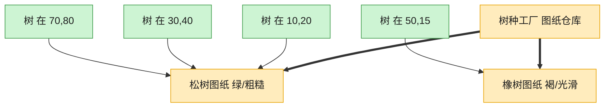

# Flyweight 享元模式（Go）

## 意图

利用共享技术高效支持大量细粒度对象：把可共享的"内在状态"抽取出来复用，
只为每个对象保留必须独立存储的"外在状态"，从而大幅降低内存占用。

<!-- gof-architecture-diagram -->
## 架构图

> **生活类比**：种一片森林：每棵树只要记住自己的坐标，树种、颜色、纹理是共享图纸。一千棵松树只印一张松树图纸，内存不再按棵数爆炸。



| 图中角色 | 本仓库示例 |
|---------|-----------|
| 图纸仓库 | TreeTypeFactory 按键缓存 |
| 共享图纸 | TreeType 内在状态 |
| 一棵树 | Tree 只存坐标外在状态 |

23 张图的完整图鉴见 [`docs/README.md`](../../docs/README.md#flyweight-享元)。

## 适用场景

- 需要创建海量相似对象，且直接存储会消耗大量内存（如森林中的树、地图上的图标）
- 对象的大部分状态可以抽取为共享的、不随上下文变化的"内在状态"
- 对象的"外在状态"（如坐标）相对轻量，可以由客户端在使用时传入

## 实现方式

`TreeType`（名称/颜色/纹理）是可共享的内在状态，由 `TreeFactory` 缓存复用；
`Tree` 只保存坐标（外在状态）和指向共享 `TreeType` 的指针：

```go
// 享元工厂：缓存并复用已创建的 TreeType，避免为相同内在状态重复创建对象
func (f *TreeFactory) GetTreeType(name, color, texture string) *TreeType {
	key := name + "|" + color + "|" + texture
	if t, ok := f.types[key]; ok {
		return t // 复用已有实例
	}
	t := &TreeType{Name: name, Color: color, Texture: texture}
	f.types[key] = t
	return t
}
```

## 文件说明

| 文件 | 说明 |
|------|------|
| `main.go` | `TreeType` 享元、`TreeFactory` 享元工厂、`Tree`/`Forest`、`main` 演示入口 |

## 编译与运行

```bash
cd go/flyweight
go run .
```

## 输出示例

预期输出（本机未安装 Go 工具链，未实机运行）：

```
=== 享元模式：森林 ===
(创建新的 TreeType: 松树|深绿色|粗糙 )
(创建新的 TreeType: 枫树|红色|光滑 )
在 (1,1) 绘制 [松树, 深绿色, 纹理:粗糙]
在 (2,5) 绘制 [松树, 深绿色, 纹理:粗糙]
在 (8,3) 绘制 [枫树, 红色, 纹理:光滑]
在 (10,10) 绘制 [松树, 深绿色, 纹理:粗糙]
在 (4,7) 绘制 [枫树, 红色, 纹理:光滑]

共种植 5 棵树，但只创建了 2 个 TreeType 对象（内在状态被共享）
```

## 要点

1. **内在状态 vs 外在状态** — `TreeType` 不含坐标等易变数据，才能被安全地跨对象共享。
2. **工厂负责去重** — `TreeFactory` 用 map 以内在状态组合为 key 缓存实例，命中则直接复用。
3. **效果可观测** — 输出末尾对比"种植数量"与"实际创建的 TreeType 数量"，直观体现节省效果。
