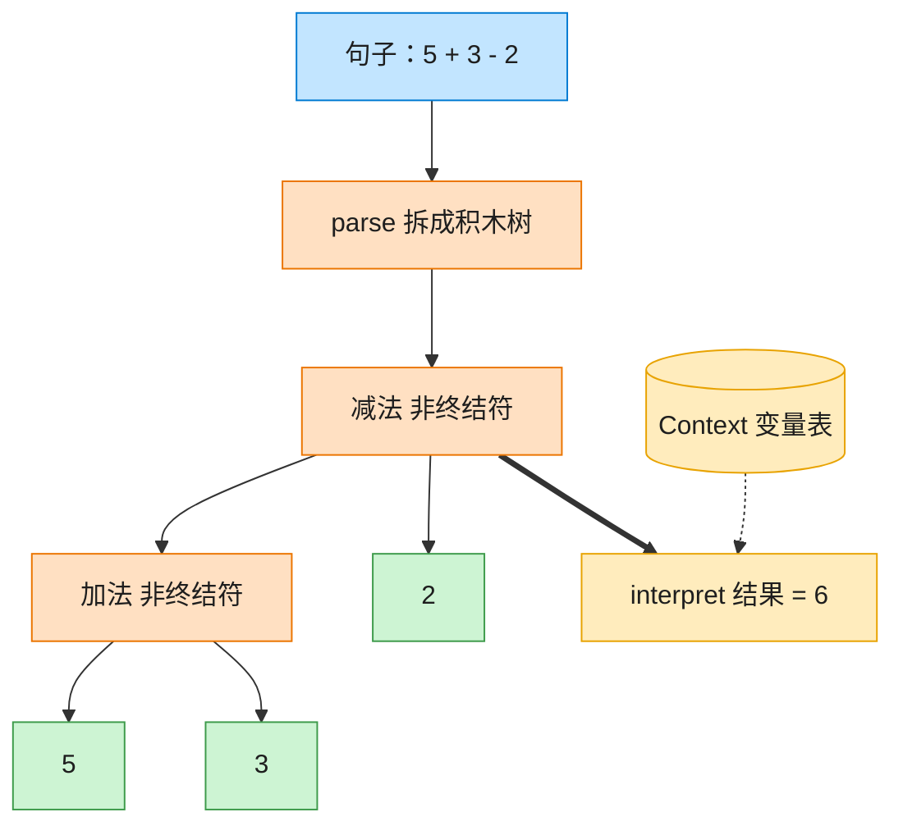

# Interpreter 解释器模式（Go）

## 意图

为语言（或简单文法）中的每一种句子结构定义一个表达式类，
并提供一个解释器，通过组合这些表达式对象来解释、求值句子。

<!-- gof-architecture-diagram -->
## 架构图

> **生活类比**：把「5 + 3 - 2」拆成积木树：加减是组合积木，数字和变量是末端积木。对着变量表走一遍 interpret，树就算出结果。



| 图中角色 | 本仓库示例 |
|---------|-----------|
| 句子 | 中缀表达式字符串 |
| 积木树 | Add / Subtract / Number / Variable |
| 词典 | Context 变量表 |

23 张图的完整图鉴见 [`docs/README.md`](../../docs/README.md#interpreter-解释器)。

## 适用场景

- 需要反复解释执行结构简单、规则固定的"小语言"（如本例的算术表达式）
- 文法可以很自然地表示为一棵由"终结符"与"非终结符"组成的语法树
- 追求实现清晰、可扩展性优先于极致性能（复杂文法建议改用专业的解析器生成工具）

## 实现方式

`Expression` 接口统一了终结符（`NumberExpression`/`VariableExpression`）与
非终结符（`AddExpression`/`SubExpression`）。`Parse` 把 `"x + y - 3"` 这样的字符串
从左到右组装成表达式树，`Interpret` 递归求值，变量从 `Context` 中查询：

```go
// AddExpression 非终结符表达式：加法
type AddExpression struct {
	left, right Expression
}

func (a *AddExpression) Interpret(ctx *Context) int {
	return a.left.Interpret(ctx) + a.right.Interpret(ctx)
}
```

## 文件说明

| 文件 | 说明 |
|------|------|
| `main.go` | `Context`、`Expression` 接口及四种实现、`Parse` 解析函数、`main` 演示入口 |

## 编译与运行

```bash
cd go/interpreter
go run .
```

## 输出示例

预期输出（本机未安装 Go 工具链，未实机运行）：

```
=== 解释器模式：算术表达式 ===
5 + 3 - 2 = 6
x + y - 3 = 11  (x=10, y=4)
```

## 要点

1. **终结符 vs 非终结符** — 数字/变量是不可再分的终结符表达式，加减法是组合子表达式的非终结符表达式。
2. **Context 隔离变量状态** — 变量的取值不写死在表达式树里，而是运行时从 `Context` 查询，同一棵树可用不同上下文求值。
3. **error 返回值** — `Parse` 遇到不支持的运算符返回 `error` 而非 panic，调用方可以优雅处理非法输入。
