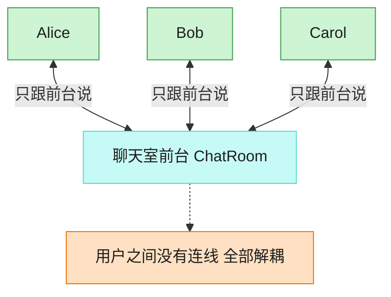

# Mediator 中介者模式（Go）

## 意图

用一个中介对象封装一系列对象之间的交互，使各对象不需要显式地相互引用，
从而降低对象间的耦合，并可以独立地改变它们之间的交互方式。

<!-- gof-architecture-diagram -->
## 架构图

> **生活类比**：聊天室前台：Alice、Bob、Carol 彼此不留电话，所有群消息和私信都交给前台转发。加人、禁言、改规则只改前台一处。



| 图中角色 | 本仓库示例 |
|---------|-----------|
| 前台 | ChatRoom 中介者 |
| 同事 | User，只持有中介引用 |
| 交互 | 广播 / 私信都经中介 |

23 张图的完整图鉴见 [`docs/README.md`](../../docs/README.md#mediator-中介者)。

## 适用场景

- 一组对象之间存在复杂的网状通信关系，难以维护和复用
- 希望新增一个参与者时，不需要修改其它所有参与者的代码
- 想把"交互规则"集中在一处管理，而不是分散在各个对象内部

## 实现方式

`User` 只持有 `ChatMediator` 接口，发消息时交给中介者转发；
`ChatRoom` 作为具体中介者，负责把消息广播给除发送者外的所有已注册用户，
用户彼此之间不直接持有对方的引用：

```go
// Broadcast 将消息转发给除发送者外的所有用户
func (r *ChatRoom) Broadcast(sender *User, message string) {
	for _, u := range r.users {
		if u != sender {
			u.Receive(sender.Name, message)
		}
	}
}
```

## 文件说明

| 文件 | 说明 |
|------|------|
| `main.go` | `ChatMediator` 接口、`ChatRoom` 具体中介者、`User` 同事类、`main` 演示入口 |

## 编译与运行

```bash
cd go/mediator
go run .
```

## 输出示例

预期输出（本机未安装 Go 工具链，未实机运行）：

```
=== 中介者模式：聊天室 ===
[Alice 发送]: 大家好！
  -> Bob 收到来自 Alice 的消息: 大家好！
  -> Carol 收到来自 Alice 的消息: 大家好！

[Bob 发送]: Alice 你好，我是 Bob
  -> Alice 收到来自 Bob 的消息: Alice 你好，我是 Bob
  -> Carol 收到来自 Bob 的消息: Alice 你好，我是 Bob
```

## 要点

1. **同事对象互不知道对方** — `User` 只依赖 `ChatMediator` 接口，`alice` 和 `bob` 之间没有任何直接引用。
2. **交互逻辑集中管理** — 广播规则（排除发送者本身）只写在 `ChatRoom.Broadcast` 一处。
3. **易于扩展** — 新增禁言、私聊等规则，只需修改 `ChatRoom`，不必改动 `User`。
