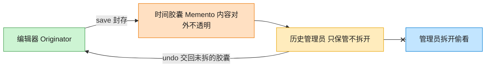

# Memento 备忘录模式（Go）

## 意图

在不破坏封装性的前提下，捕获并保存一个对象的内部状态，以便之后可以将该对象恢复到先前保存的状态（撤销）。

<!-- gof-architecture-diagram -->
## 架构图

> **生活类比**：编辑器把这一刻的正文和光标封进时间胶囊。历史管理员只负责把胶囊堆起来、按撤销交回去，从不拆开偷看 —— 封装不被破坏。



| 图中角色 | 本仓库示例 |
|---------|-----------|
| 编辑器 | TextEditor 发起人，唯二能读写胶囊 |
| 时间胶囊 | EditorMemento 不可变快照 |
| 历史管理员 | History，只压栈出栈 |

23 张图的完整图鉴见 [`docs/README.md`](../../docs/README.md#memento-备忘录)。

## 适用场景

- 需要提供撤销/重做功能（文本编辑器、图形编辑器）
- 需要保存对象状态的快照，但又不希望暴露其内部实现细节给外部
- 直接暴露对象所有字段来实现"保存/恢复"会破坏封装性

## 实现方式

`TextEditor`（发起人）通过 `Save()` 产生一个 `EditorMemento`（备忘录），
`Restore()` 用备忘录还原状态；`History`（管理者）只负责保存/取出快照，
不关心快照内部结构：

```go
// Save 创建当前状态的快照（备忘录）
func (e *TextEditor) Save() *EditorMemento {
	return &EditorMemento{content: e.content}
}

// Pop 弹出最近一次快照；历史为空时返回 error 而非零值，调用方需显式处理
func (h *History) Pop() (*EditorMemento, error) {
	if len(h.snapshots) == 0 {
		return nil, errors.New("没有可撤销的历史记录")
	}
	// ...
}
```

## 文件说明

| 文件 | 说明 |
|------|------|
| `main.go` | `EditorMemento` 备忘录、`TextEditor` 发起人、`History` 管理者、`main` 演示入口 |

## 编译与运行

```bash
cd go/memento
go run .
```

## 输出示例

预期输出（本机未安装 Go 工具链，未实机运行）：

```
=== 备忘录模式：文本编辑器 ===
当前内容: 第一段内容。
当前内容: 第一段内容。第二段内容。
当前内容: 第一段内容。第二段内容。第三段内容（误操作）。

--- 撤销误操作 ---
恢复后内容: 第一段内容。第二段内容。

--- 再次撤销 ---
恢复后内容: 第一段内容。

--- 撤销次数过多 ---
撤销失败: 没有可撤销的历史记录
```

## 要点

1. **封装不被破坏** — `EditorMemento.content` 未导出，外部只能通过 `Content()` 只读访问，不能随意篡改快照。
2. **职责分离** — `TextEditor` 负责产生/应用快照，`History` 只负责存取，两者互不关心对方细节。
3. **error 返回值** — `Pop()` 在历史为空时返回 `error`，调用方必须显式处理，避免误用空快照。
