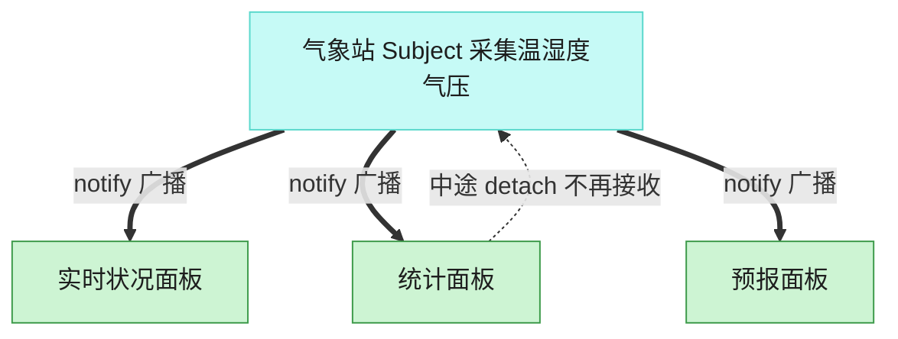

# Observer 观察者模式（Go）

## 意图

定义对象间一对多的依赖关系，当一个对象（主题）的状态发生变化时，
所有依赖它的对象（观察者）都会自动收到通知并更新。

<!-- gof-architecture-diagram -->
## 架构图

> **生活类比**：气象站一更新读数，所有挂着的面板自动刷新。统计面板中途拔掉天线，后面的广播就不再找它，其余面板不受影响。



| 图中角色 | 本仓库示例 |
|---------|-----------|
| 气象站 | WeatherStation 主题 |
| 面板 | 实时 / 统计 / 预报 观察者 |
| 订阅关系 | attach / detach / notify |

23 张图的完整图鉴见 [`docs/README.md`](../../docs/README.md#observer-观察者)。

## 适用场景

- 一个对象状态变化需要联动更新多个其它对象，且不希望它们紧耦合
- 观察者的数量和类型在编译期未知，需要在运行时动态订阅/取消订阅
- 广播式通知场景：事件总线、UI 数据绑定、气象站推送等

## 实现方式

`WeatherStation`（主题）维护一个 `[]Observer`；温度变化时遍历调用每个
观察者的 `Update`。`PhoneDisplay`/`BillboardDisplay` 是两种具体观察者，
关注点不同但都实现同一个 `Observer` 接口：

```go
// SetTemperature 更新温度并自动通知所有观察者
func (w *WeatherStation) SetTemperature(temp float64) {
	w.temperature = temp
	w.Notify()
}

func (w *WeatherStation) Notify() {
	for _, o := range w.observers {
		o.Update(w.temperature)
	}
}
```

## 文件说明

| 文件 | 说明 |
|------|------|
| `main.go` | `Observer`/`Subject` 接口、`WeatherStation` 主题、`PhoneDisplay`/`BillboardDisplay` 观察者、`main` 演示入口 |

## 编译与运行

```bash
cd go/observer
go run .
```

## 输出示例

预期输出（本机未安装 Go 工具链，未实机运行）：

```
=== 观察者模式：气象站 ===

气象站: 温度更新为 26.5°C
[Alice 的手机] 手机推送: 当前温度 26.5°C
[电子广告牌] 显示温度: 26.5°C

气象站: 温度更新为 31.2°C
[Alice 的手机] 手机推送: 当前温度 31.2°C
[电子广告牌] 显示温度: 31.2°C

(手机取消订阅)

气象站: 温度更新为 18.0°C
[电子广告牌] 显示温度: 18.0°C
```

## 要点

1. **一对多自动通知** — 主题只需调用一次 `Notify()`，所有已订阅的观察者都会收到更新，无需主题逐个了解它们。
2. **可动态订阅/取消** — `Detach(phone)` 之后，手机不再收到后续的温度更新，输出中可直接观察到这一变化。
3. **小接口解耦** — `Observer` 只有一个 `Update` 方法，任何类型只要实现它就能接入通知机制。
