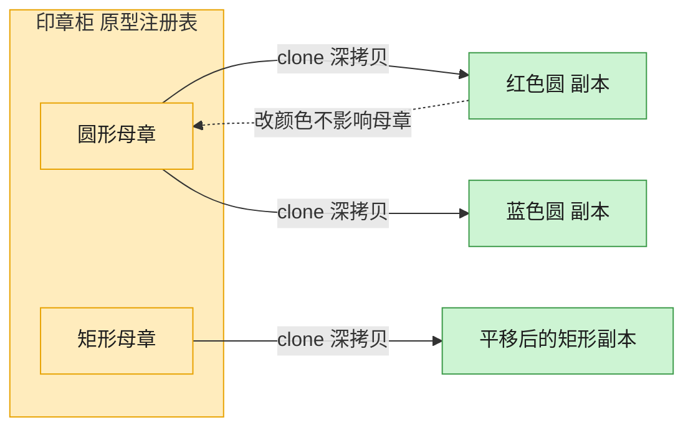

# Prototype 原型模式（Go）

## 意图

通过复制（克隆）现有实例来创建新对象，而不是通过 `new`/构造函数从头构建。
适合创建成本较高或需要保留运行时状态副本的对象。

<!-- gof-architecture-diagram -->
## 架构图

> **生活类比**：印章柜里放着圆形、矩形两枚母章。要新图时不从零雕刻，盖一下（clone）就得到互不干扰的副本，改颜色也不脏了母章。



| 图中角色 | 本仓库示例 |
|---------|-----------|
| 母章 / 原型 | Shape.clone，默认 deepcopy |
| 印章柜 | 按名字取模板的原型注册表 |
| 盖出的副本 | 改颜色、位置、标签，不影响原件 |

23 张图的完整图鉴见 [`docs/README.md`](../../docs/README.md#prototype-原型)。

## 适用场景

- 创建对象的成本（初始化、计算）比复制一份现有对象更高
- 需要在原有对象基础上做小幅修改产生新对象，且不希望影响原对象
- 想在运行时动态注册一批"样板对象"，按需克隆而非重新构造

## 实现方式

`Shape` 接口声明 `Clone() Shape`；`Circle`、`Rectangle` 各自实现克隆逻辑。
Go 中结构体赋值 `cp := *c` 本身就是逐字段值拷贝，对只含值类型字段的结构体等价于深拷贝：

```go
// Clone 返回自身的一份拷贝。Go 中结构体赋值本身就是逐字段值拷贝
func (c *Circle) Clone() Shape {
	cp := *c
	return &cp
}
```

克隆后修改副本的位置，验证原对象不受影响。

## 文件说明

| 文件 | 说明 |
|------|------|
| `main.go` | `Shape` 接口、`Circle`/`Rectangle` 具体原型、`main` 演示入口 |

## 编译与运行

```bash
cd go/prototype
go run .
```

## 输出示例

预期输出（本机未安装 Go 工具链，未实机运行）：

```
=== 原型模式：克隆图形 ===
原始图形: 圆形[颜色=红色, 位置=(10,20), 半径=5]
克隆图形（修改位置后）: 圆形[颜色=红色, 位置=(100,200), 半径=5]
原始图形（应保持不变）: 圆形[颜色=红色, 位置=(10,20), 半径=5]

原始矩形: 矩形[颜色=蓝色, 位置=(0,0), 宽高=30x40]
克隆矩形（修改位置后）: 矩形[颜色=蓝色, 位置=(5,5), 宽高=30x40]
```

## 要点

1. **值拷贝即克隆** — `cp := *c` 会复制结构体所有字段；若字段中含切片/map/指针，则需要手动做深拷贝。
2. **接口返回接口** — `Clone() Shape` 返回抽象类型，调用方无需知道具体是 `Circle` 还是 `Rectangle`。
3. **与 Builder 的区别** — Builder 是从零分步构建，Prototype 是基于现有实例复制再修改。
