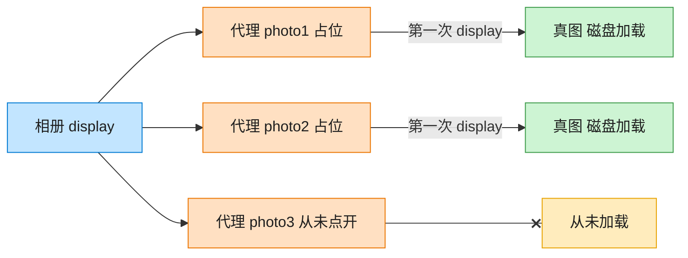

# Proxy 代理模式（Go）

## 意图

为另一个对象提供一个替身或占位符，以控制对它的访问——例如延迟创建开销较大的对象，直到真正需要它为止。

<!-- gof-architecture-diagram -->
## 架构图

> **生活类比**：相册先摆三张空相框。点开才从仓库搬出真照片；没点开的那张，磁盘加载一次都不会发生。



| 图中角色 | 本仓库示例 |
|---------|-----------|
| 相册 | 客户端，只认 Image.display |
| 空相框 | ImageProxy 虚拟代理 |
| 仓库真图 | RealImage，构造时才加载 |

23 张图的完整图鉴见 [`docs/README.md`](../../docs/README.md#proxy-代理)。

## 适用场景

- 目标对象创建/加载成本高，希望推迟到真正使用时才创建（懒加载）
- 需要在访问真实对象前后插入额外逻辑（权限校验、缓存、日志）而不改动真实对象
- 希望客户端代码对"直接使用真实对象"还是"通过代理使用"无感知

## 实现方式

`Image` 是主题接口；`RealImage` 是真实主题，构造时就模拟"从磁盘加载"的开销；
`ImageProxy` 实现同样的接口，仅在首次调用 `Display()` 时才创建 `RealImage`：

```go
// 代理：持有真实图片的引用，延迟到首次 Display() 才真正创建 RealImage
func (p *ImageProxy) Display() string {
	if p.realImage == nil {
		p.realImage = NewRealImage(p.filename)
	}
	return p.realImage.Display()
}
```

## 文件说明

| 文件 | 说明 |
|------|------|
| `main.go` | `Image` 接口、`RealImage` 真实主题、`ImageProxy` 代理、`main` 演示入口 |

## 编译与运行

```bash
cd go/proxy
go run .
```

## 输出示例

预期输出（本机未安装 Go 工具链，未实机运行）：

```
=== 代理模式：图片懒加载 ===
图片代理已创建，但尚未加载实际图片数据

首次显示 photo1:
  (从磁盘加载图片: photo1.jpg )
显示图片: photo1.jpg

再次显示 photo1（代理复用已加载的图片，无需重新加载）:
显示图片: photo1.jpg

首次显示 photo2:
  (从磁盘加载图片: photo2.jpg )
显示图片: photo2.jpg
```

## 要点

1. **懒加载** — 创建 `ImageProxy` 时不产生任何加载开销，"加载"日志只在首次 `Display()` 时出现一次。
2. **接口一致** — 客户端持有的是 `[]Image`，全程不知道也不需要知道背后是代理还是真实对象。
3. **虚拟代理** — 本例属于"虚拟代理"（控制昂贵对象的创建时机），其它变体还有保护代理、远程代理等。
