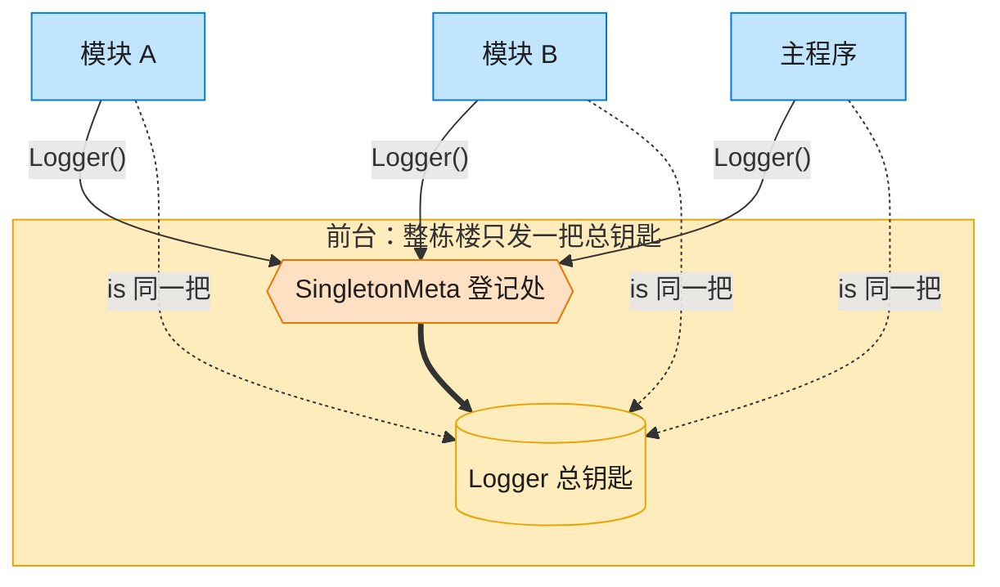

# Singleton 单例模式（Go）

## 意图

确保一个类型在整个程序生命周期内只有一个实例，并提供一个全局访问点。

<!-- gof-architecture-diagram -->
## 架构图

> **生活类比**：整栋大楼只发一把总钥匙。模块 A、模块 B、主程序去前台领取，拿到的永远是同一把 —— 这就是单例。



| 图中角色 | 本仓库示例 |
|---------|-----------|
| 前台 / 总钥匙 | SingletonMeta + Logger 全局唯一实例 |
| 来领钥匙的部门 | ModuleA / ModuleB / 主程序 |

23 张图的完整图鉴见 [`docs/README.md`](../../docs/README.md#singleton-单例)。

## 适用场景

- 全局唯一的日志记录器、配置管理器、连接池等共享资源
- 需要严格控制某个昂贵资源只被初始化一次
- 多处代码需要访问同一份可变状态（如日志历史）

## 实现方式

用包级变量 `instance` 保存唯一实例，`sync.Once` 保证初始化只执行一次且并发安全，
这是 Go 中实现单例的惯用方式（替代 Java 式的双重检查锁 + `synchronized`）：

```go
var (
	instance *Logger
	once     sync.Once
)

// GetLogger 返回全局唯一的 Logger 实例
func GetLogger() *Logger {
	once.Do(func() {
		instance = &Logger{level: LevelInfo}
	})
	return instance
}
```

日志级别 `LogLevel` 用 `iota` 定义为枚举，并实现 `String()` 方法方便打印。

## 文件说明

| 文件 | 说明 |
|------|------|
| `main.go` | `LogLevel` 枚举、`Logger` 单例及 `GetLogger`、`main` 演示入口 |

## 编译与运行

```bash
cd go/singleton
go run .
```

## 输出示例

预期输出（本机未安装 Go 工具链，未实机运行）：

```
=== 单例模式：全局 Logger ===
(创建 Logger 实例...)
[INFO] 模块 A 初始化
[DEBUG] 模块 B 调试信息

logger1 与 logger2 是否为同一实例: true
共记录日志条数: 2
```

## 要点

1. **`sync.Once` 是核心** — 保证 `once.Do` 里的初始化逻辑无论多少 goroutine 并发调用都只执行一次。
2. **懒加载** — 直到第一次 `GetLogger()` 调用才真正创建实例（可见"创建 Logger 实例..."只打印一次）。
3. **iota 枚举** — `LogLevel` 用 `iota` 定义 DEBUG/INFO/WARN/ERROR，符合 Go 惯用写法。
4. **无需导出构造函数** — 包外代码只能通过 `GetLogger()` 获取实例，天然杜绝了绕过单例直接构造的可能。
