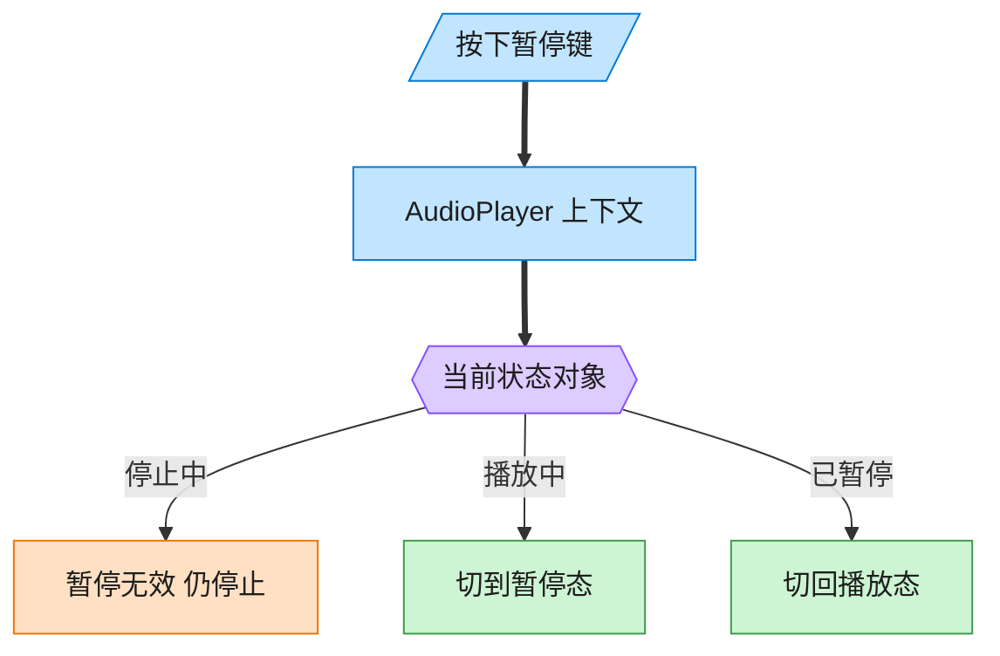
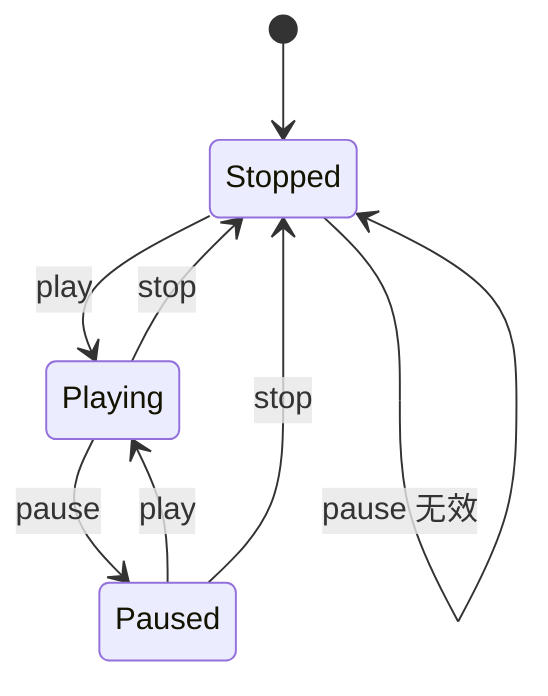

# State 状态模式（Go）

## 意图

允许对象在其内部状态改变时改变它的行为，使对象看起来像是修改了自己的类。
将"某状态下该做什么"的逻辑拆分到各个状态类型中，避免一大堆 `if/switch` 判断当前状态。

<!-- gof-architecture-diagram -->
## 架构图

> **生活类比**：同一颗暂停键：播放中按下就暂停，停止中按下则无效。播放器没有满屏 if-else，而是把「这个状态下该干什么」交给当前状态对象。





| 图中角色 | 本仓库示例 |
|---------|-----------|
| 播放器 | AudioPlayer 上下文，委托当前状态 |
| 三态 | Stopped / Playing / Paused |
| 转换 | 状态对象自己决定下一态 |

23 张图的完整图鉴见 [`docs/README.md`](../../docs/README.md#state-状态)。

## 适用场景

- 对象的行为强依赖于当前状态，且状态数量较多、转换关系复杂
- 同一操作在不同状态下的行为差异很大（播放中/暂停/停止时对"暂停"按钮的响应完全不同）
- 希望新增一种状态时不必修改已有状态的代码

## 实现方式

`PlayerState` 接口声明 `Play`/`Pause`/`Stop`；`PlayingState`/`PausedState`/`StoppedState`
各自实现在该状态下这些操作应有的行为，并通过 `player.SetState(...)` 触发状态迁移；
`AudioPlayer`（上下文）把操作委托给当前状态对象处理：

```go
func (s *PlayingState) Pause(player *AudioPlayer) {
	fmt.Println("暂停播放")
	player.SetState(&PausedState{})
}

func (p *AudioPlayer) Play()  { p.state.Play(p) }
func (p *AudioPlayer) Pause() { p.state.Pause(p) }
```

## 文件说明

| 文件 | 说明 |
|------|------|
| `main.go` | `PlayerState` 接口、三种具体状态、`AudioPlayer` 上下文、`main` 演示入口 |

## 编译与运行

```bash
cd go/state
go run .
```

## 输出示例

预期输出（本机未安装 Go 工具链，未实机运行）：

```
=== 状态模式：音频播放器 ===
开始播放
  (状态切换为: 播放中 )
暂停播放
  (状态切换为: 已暂停 )
恢复播放
  (状态切换为: 播放中 )
停止播放
  (状态切换为: 已停止 )
尚未播放，无法暂停
```

## 要点

1. **状态自身决定下一状态** — 状态迁移逻辑（如"播放中 -> 暂停"）写在 `PlayingState.Pause` 里，而不是集中在 `AudioPlayer` 的大 `switch` 中。
2. **消除条件分支** — `AudioPlayer.Play/Pause/Stop` 都只是一行委托调用，没有任何 `if state == ...` 判断。
3. **与策略模式的区别** — 状态模式里各状态知道彼此并主动触发切换，策略模式中各策略互不知道、由外部选择。
