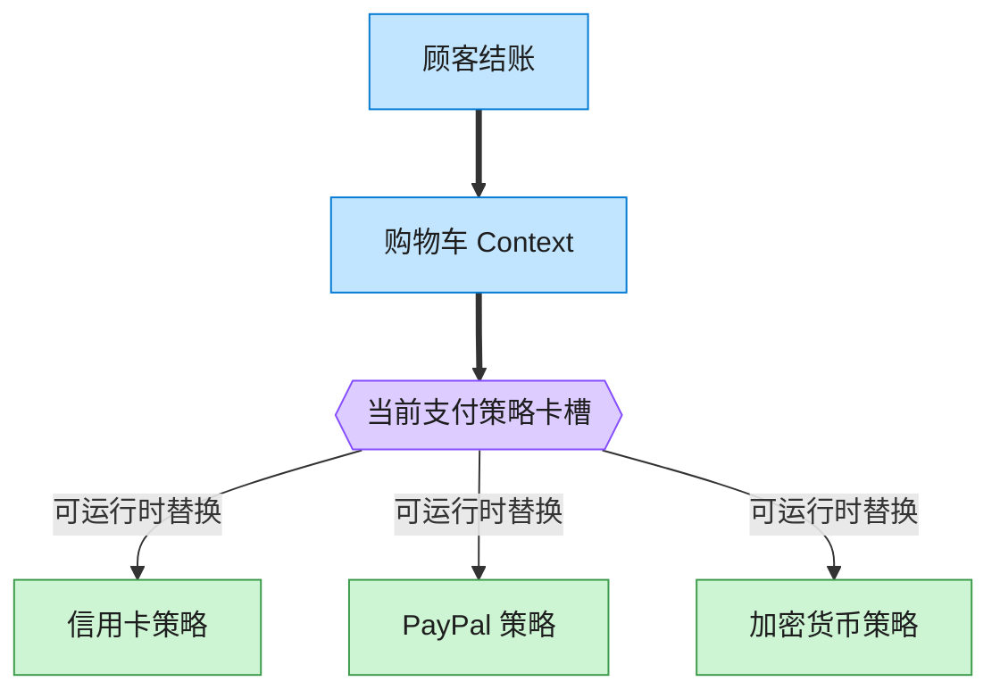

# Strategy 策略模式（Go）

## 意图

定义一系列可相互替换的算法，把每个算法封装起来，使它们可以独立于使用它们的客户端而变化。

<!-- gof-architecture-diagram -->
## 架构图

> **生活类比**：收银台插卡：购物车不关心怎么扣款，结账时插入信用卡、PayPal 或加密货币策略卡。用户在结算页改选，算法当场替换。



| 图中角色 | 本仓库示例 |
|---------|-----------|
| 购物车 | ShoppingCart 上下文 |
| 卡槽 | PaymentStrategy 可替换算法 |
| 策略卡 | CreditCard / PayPal / Crypto |

23 张图的完整图鉴见 [`docs/README.md`](../../docs/README.md#strategy-策略)。

## 适用场景

- 同一个行为存在多种实现方式，且需要在运行时动态切换（信用卡/PayPal/加密货币支付）
- 想避免为每种算法写一堆 `if/else` 或 `switch` 分支
- 算法本身状态很少甚至无状态，用函数表达比用一整个接口 + 结构体更轻量

## 实现方式

Go 惯用法：不定义"策略接口 + N 个实现类"，而是直接用**函数类型**
`PaymentStrategy` 作为策略，每个"具体策略"是一个返回闭包的构造函数：

```go
// PaymentStrategy 策略类型：支付策略本质是一个函数
type PaymentStrategy func(amount float64) string

// CreditCardPay 具体策略：信用卡支付，返回一个绑定了卡号的闭包
func CreditCardPay(cardNumber string) PaymentStrategy {
	return func(amount float64) string {
		return fmt.Sprintf("信用卡(...%s) 支付 %.2f 元", cardNumber[len(cardNumber)-4:], amount)
	}
}

func (c *ShoppingCart) SetPaymentStrategy(strategy PaymentStrategy) {
	c.strategy = strategy
}
```

## 文件说明

| 文件 | 说明 |
|------|------|
| `main.go` | `PaymentStrategy` 函数类型、三种具体策略、`ShoppingCart` 上下文、`main` 演示入口 |

## 编译与运行

```bash
cd go/strategy
go run .
```

## 输出示例

预期输出（本机未安装 Go 工具链，未实机运行）：

```
=== 策略模式：可互换的支付方式 ===
信用卡(**** **** **** 1234) 支付 299.50 元
PayPal(alice@example.com) 支付 299.50 元
加密钱包(bc1qxyz...abcd) 支付 299.50 元（约合 0.004792 BTC）
```

## 要点

1. **函数值即策略** — 不需要为每种支付方式单独定义结构体+接口实现，闭包本身就携带了"私有状态"（如卡号）。
2. **运行时可替换** — `SetPaymentStrategy` 让 `ShoppingCart` 在不修改自身代码的情况下切换算法。
3. **比 Java 式接口更轻量** — 当策略无需维护复杂内部状态时，Go 的函数值比"接口 + 结构体"更简洁。
