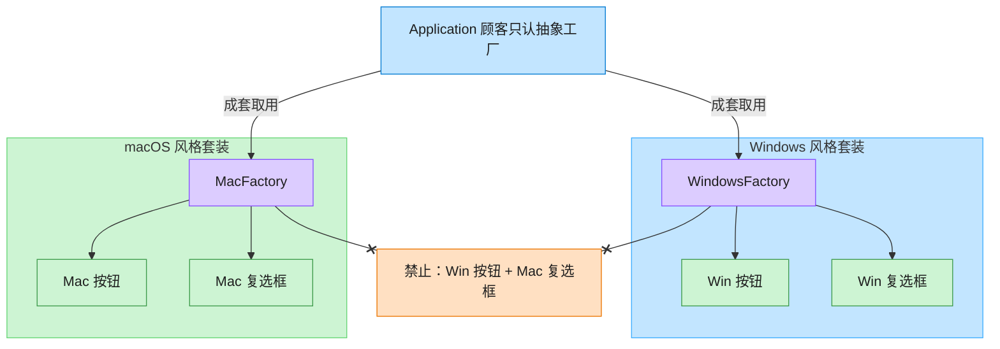

# Abstract Factory 抽象工厂模式（Java）

## 意图

提供一个创建一系列相关或相互依赖对象的接口，而无需指定它们具体的类。客户端只与抽象接口打交道，
从而保证同一产品族内的对象总是被配套使用。

<!-- gof-architecture-diagram -->
## 架构图

> **生活类比**：家具店一次卖「成套风格」。Windows 工厂成套出 Win 按钮+Win 复选框，Mac 工厂成套出 Mac 风格 —— 绝不混搭。



| 图中角色 | 本仓库示例 |
|---------|-----------|
| 顾客 / 应用 | Application，只依赖 GUIFactory |
| 成套工厂 | WindowsFactory / MacFactory |
| 成套产品 | Button + Checkbox 必须同一家族 |

23 张图的完整图鉴见 [`docs/README.md`](../../docs/README.md#abstract-factory-抽象工厂)。

## 适用场景

- 系统需要独立于其产品的创建、组合和表示方式
- 系统需要由多个产品系列中的一个来配置
- 需要强调一系列相关产品对象的设计以便进行联合使用
- 提供一个产品类库，只想显示它们的接口而非实现

## 实现方式

定义抽象产品 `Button`、`Checkbox` 和抽象工厂 `GUIFactory`；`WindowsFactory`、`MacFactory`
分别生产各自平台风格的具体产品。客户端 `Application` 只依赖 `GUIFactory` 接口：

```java
public interface GUIFactory {
    Button createButton();
    Checkbox createCheckbox();
}

public class Application {
    public Application(GUIFactory factory) {
        this.button = factory.createButton();     // 不知道具体是哪个平台的按钮
        this.checkbox = factory.createCheckbox();
    }
}
```

`Main` 中用 Java 17 的 **switch 表达式** 根据平台名称选出具体工厂，体现“同一族产品一次性切换”。

## 文件说明

| 文件 | 说明 |
|------|------|
| `Button.java` | 抽象产品：按钮接口 |
| `Checkbox.java` | 抽象产品：复选框接口 |
| `WindowsButton.java` / `WindowsCheckbox.java` | Windows 风格具体产品 |
| `MacButton.java` / `MacCheckbox.java` | macOS 风格具体产品 |
| `GUIFactory.java` | 抽象工厂接口 |
| `WindowsFactory.java` / `MacFactory.java` | 具体工厂，各自生产一整套同族产品 |
| `Application.java` | 客户端，只依赖抽象工厂与抽象产品 |
| `Main.java` | 程序入口，演示切换平台生成不同控件族 |

## 编译与运行

```bash
cd java/abstract-factory
javac *.java
java Main
```

## 输出示例

```
=== 抽象工厂模式：跨平台 GUI 控件 ===

-- 当前平台: windows --
[Windows] 渲染一个矩形边框、扁平化风格的按钮
[Windows] 渲染一个方形复选框，当前状态：未勾选
[Windows] 按钮被点击，播放系统默认点击音效
[Windows] 复选框状态切换为：已勾选

-- 当前平台: mac --
[macOS] 渲染一个圆角、带阴影的按钮
[macOS] 渲染一个圆角复选框，当前状态：未勾选
[macOS] 按钮被点击，触发轻微的按压动画
[macOS] 复选框状态切换为：已勾选
```

（预期输出：本机未安装 JDK，未实机运行）

## 要点

1. **产品族一致性** —— 抽象工厂保证同一次调用产出的所有产品都属于同一风格，不会出现
   Windows 按钮配 macOS 复选框的情况。
2. **开闭原则** —— 新增一个平台（如 Linux）只需新增一个具体工厂 + 一组具体产品，
   客户端代码 `Application` 无需修改。
3. **与工厂方法的区别** —— 工厂方法只关心一个产品等级结构，抽象工厂关心多个产品等级结构（产品族）。
