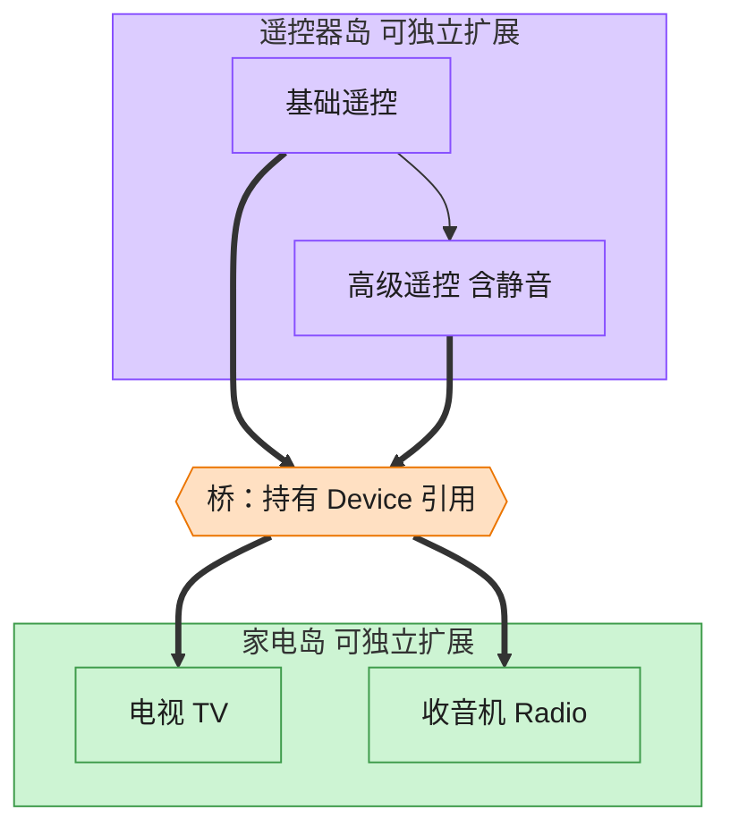

# Bridge 桥接模式（Java）

## 意图

将抽象部分与其实现部分分离，使二者都可以独立地变化，避免继承层次爆炸。

<!-- gof-architecture-diagram -->
## 架构图

> **生活类比**：遥控器和家电是两座岛。基础遥控 / 高级遥控是一座岛，电视 / 收音机是另一座岛。中间一座桥（组合引用）把它们连上，不必为每种组合造一个新类。



| 图中角色 | 本仓库示例 |
|---------|-----------|
| 遥控器岛 | RemoteControl / AdvancedRemoteControl 抽象 |
| 桥 | 抽象持有的 Device 引用 |
| 家电岛 | TV / Radio 实现 |

23 张图的完整图鉴见 [`docs/README.md`](../../docs/README.md#bridge-桥接)。

## 适用场景

- 一个类存在两个（或多个）独立变化的维度，且两者都需要扩展（如“遥控器种类” × “设备种类”）
- 不希望用继承在编译期固化抽象与实现之间的绑定关系
- 需要在运行时切换实现

## 实现方式

`RemoteControl`（抽象部分）持有一个 `Device`（实现部分）引用，这个引用就是“桥”：

```java
public class RemoteControl {
    protected final Device device;      // 桥：持有实现部分的引用

    public void volumeUp() {
        device.setVolume(device.getVolume() + 10);   // 转发给具体设备
    }
}
```

`AdvancedRemoteControl extends RemoteControl` 只扩展遥控器这一维度（新增静音功能），
`Tv` / `Radio` 只扩展设备这一维度；两个维度可以任意组合（如“高级遥控器 + 电视”
“高级遥控器 + 收音机”），无需为每种组合都创建一个新类。

## 文件说明

| 文件 | 说明 |
|------|------|
| `Device.java` | 实现部分接口（Implementor） |
| `Tv.java` / `Radio.java` | 具体实现（Concrete Implementor） |
| `RemoteControl.java` | 抽象部分（Abstraction），持有 Device 引用 |
| `AdvancedRemoteControl.java` | 精确抽象（Refined Abstraction），扩展静音等功能 |
| `Main.java` | 程序入口，演示遥控器与设备的多种组合 |

## 编译与运行

```bash
cd java/bridge
javac *.java
java Main
```

## 输出示例

```
=== 桥接模式：遥控器与设备 ===

-- 基础遥控器 + 电视 --
[电视] 已开机
[电视] 音量调整为 40

-- 高级遥控器 + 收音机 --
[收音机] 已开机，正在搜索频道
[收音机] 音量调整为 60
[收音机] 音量调整为 0
[高级遥控器] 收音机 已静音
[收音机] 音量调整为 60
[高级遥控器] 收音机 已取消静音

-- 高级遥控器 + 电视（同一套高级功能换一个设备照样可用）--
[电视] 已开机
[电视] 音量调整为 0
[高级遥控器] 电视 已静音
```

（预期输出：本机未安装 JDK，未实机运行）

## 要点

1. **两个维度独立扩展** —— 新增一种设备（如 `Speaker`）或新增一种遥控器
   （如 `VoiceRemoteControl`）都不会影响另一个维度的现有类。
2. **组合优于继承** —— 抽象部分通过持有实现部分的引用来复用其功能，
   而不是通过继承，避免了“遥控器 × 设备”组合数导致的类爆炸。
3. **运行时可切换** —— `RemoteControl` 的构造函数接收 `Device`，同一个遥控器对象
   理论上也可以在运行时更换所控制的设备。
