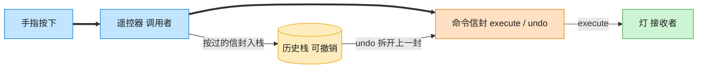

# Command 命令模式（Java）

## 意图

将一个请求封装为一个对象，从而使你可用不同的请求对客户进行参数化，
对请求排队或记录请求日志，以及支持可撤销的操作。

<!-- gof-architecture-diagram -->
## 架构图

> **生活类比**：遥控器按钮里装的不是电线，是一封命令信封。按下就把信封交给灯去执行；撤销则打开上一封信封做反操作。按钮不用知道灯怎么开。



| 图中角色 | 本仓库示例 |
|---------|-----------|
| 遥控器 | RemoteControl 调用者 |
| 命令信封 | LightOnCommand / LightOffCommand |
| 灯 | Light 接收者 |

23 张图的完整图鉴见 [`docs/README.md`](../../docs/README.md#command-命令)。

## 适用场景

- 需要将“发出请求的对象”和“执行请求的对象”解耦（如遥控器按钮 与 具体家电）
- 需要支持撤销（undo）、重做（redo）、操作日志、宏命令（组合多个命令）
- 需要将请求排队执行，或者在不同时间对请求排队和执行

## 实现方式

`LightOnCommand`/`LightOffCommand` 把对接收者 `Light` 的调用封装成对象，
并各自实现相反的 `undo()`；调用者 `RemoteControl` 只依赖 `Command` 接口，
同时用一个栈记录历史，支持撤销：

```java
public interface Command {
    void execute();
    void undo();
}

public class RemoteControl {
    private final Deque<Command> history = new ArrayDeque<>();

    public void pressButton(Command command) {
        command.execute();
        history.push(command);
    }

    public void pressUndo() {
        Command last = history.pop();
        last.undo();          // 撤销就是调用命令自己定义的逆操作
    }
}
```

## 文件说明

| 文件 | 说明 |
|------|------|
| `Command.java` | 命令接口，声明 `execute()` / `undo()` |
| `Light.java` | 接收者，真正执行开灯/关灯逻辑 |
| `LightOnCommand.java` / `LightOffCommand.java` | 具体命令 |
| `RemoteControl.java` | 调用者，触发命令并维护撤销历史栈 |
| `Main.java` | 程序入口，演示开灯、关灯、连续撤销 |

## 编译与运行

```bash
cd java/command
javac *.java
java Main
```

## 输出示例

```
=== 命令模式：遥控器控制灯光 ===

-- 按下开灯按钮 --
[客厅灯] 已打开
-- 按下关灯按钮 --
[客厅灯] 已关闭
-- 按下撤销按钮（应重新开灯）--
[遥控器] 撤销上一步操作
[客厅灯] 已打开
-- 再按一次撤销按钮（应重新关灯）--
[遥控器] 撤销上一步操作
[客厅灯] 已关闭
-- 再按一次撤销按钮（历史已空）--
[遥控器] 没有可撤销的操作
```

（预期输出：本机未安装 JDK，未实机运行）

## 要点

1. **请求对象化** —— `Command` 把“做什么”封装成对象，调用者与接收者之间不再直接耦合。
2. **撤销栈** —— `RemoteControl` 用 `Deque` 保存历史命令，`pressUndo()` 弹出最近一条并调用其 `undo()`。
3. **易于扩展** —— 新增一种命令（如 `FanOnCommand`）不需要修改 `RemoteControl`，
   符合开闭原则；也可以把多个命令组合成一个“宏命令”统一执行。
