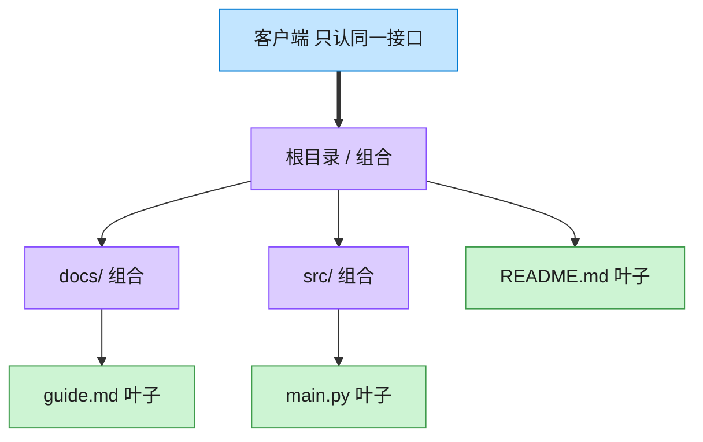

# Composite 组合模式（Java）

## 意图

将对象组合成树形结构以表示“部分-整体”的层次结构，使客户端对单个对象和组合对象的使用具有一致性。

<!-- gof-architecture-diagram -->
## 架构图

> **生活类比**：文件夹套娃：根目录装着子目录和文件。问「有多大」时，文件报自己的字节，目录把孩子们的大小加起来。客户端从不写 if 是文件还是目录。



| 图中角色 | 本仓库示例 |
|---------|-----------|
| 统一接口 | FileSystemNode.size / display |
| 叶子 | File |
| 容器 | Directory，递归包含子节点 |

23 张图的完整图鉴见 [`docs/README.md`](../../docs/README.md#composite-组合)。

## 适用场景

- 需要表示对象的整体-部分层次结构（如文件系统、组织架构、UI 组件树）
- 希望客户端忽略组合对象与单个对象之间的差异，统一处理

## 实现方式

`FileSystemComponent` 定义 `getSize()` / `print()` 两个抽象方法；叶子 `File` 直接返回自身大小，
组合节点 `Directory` 持有 `List<FileSystemComponent>`，递归累加子节点大小：

```java
public abstract class FileSystemComponent {
    public abstract long getSize();
}

public class Directory extends FileSystemComponent {
    private final List<FileSystemComponent> children = new ArrayList<>();

    @Override
    public long getSize() {
        long total = 0;
        for (FileSystemComponent child : children) {
            total += child.getSize();   // 子节点可能是 File，也可能又是一个 Directory
        }
        return total;
    }
}
```

客户端（`Main`）无需区分当前节点是文件还是目录，统一调用 `getSize()` / `print()` 即可。

## 文件说明

| 文件 | 说明 |
|------|------|
| `FileSystemComponent.java` | 组件抽象类，声明 `getSize()` / `print()` |
| `File.java` | 叶子节点：文件 |
| `Directory.java` | 组合节点：目录，持有子节点列表 |
| `Main.java` | 程序入口，搭建一棵文件系统树并统一计算大小、打印树形结构 |

## 编译与运行

```bash
cd java/composite
javac *.java
java Main
```

## 输出示例

```
=== 组合模式：文件系统 ===

+ project/ (76240 B)
  + src/ (2000 B)
    - Main.java (1200 B)
    - Utils.java (800 B)
  + assets/ (73728 B)
    + images/ (71680 B)
      - logo.png (20480 B)
      - banner.jpg (51200 B)
    - style.css (2048 B)
  - README.md (512 B)

项目总大小: 76240 B
assets 目录大小: 73728 B
```

（预期输出：本机未安装 JDK，未实机运行）

## 要点

1. **统一接口** —— `File` 与 `Directory` 都实现 `FileSystemComponent`，
   客户端代码不需要 `instanceof` 判断类型即可递归处理整棵树。
2. **递归组合** —— `Directory` 的子节点既可以是 `File` 也可以是另一个 `Directory`，
   树可以任意深度嵌套。
3. **链式建树** —— `add()` 返回 `this`，方便一次性搭建多层目录结构。
