# Decorator 装饰器模式（Java）

## 意图

动态地给一个对象添加一些额外的职责，就增加功能来说，装饰器模式比生成子类更为灵活。

<!-- gof-architecture-diagram -->
## 架构图

> **生活类比**：咖啡加料：浓缩是内核，外面一层牛奶、一层糖、一层奶油。每一层都还是「一杯咖啡」，点单时问 cost，层层转发并加价。

```mermaid
flowchart LR
    classDef client fill:#C2E5FF,stroke:#007AD2,color:#1E1E1E
    classDef abs fill:#DCCCFF,stroke:#874FFF,color:#1E1E1E
    classDef concrete fill:#CDF4D3,stroke:#3E9B4B,color:#1E1E1E
    classDef extra fill:#FFE0C2,stroke:#EB7500,color:#1E1E1E
    classDef shared fill:#FFECBD,stroke:#E8A302,color:#1E1E1E
    classDef hub fill:#C6FAF6,stroke:#5AD8CC,color:#1E1E1E
    guest["顾客 只认 Coffee"]
    whip["奶油包装 +6"]
    sugar["糖包装 +2"]
    milk["牛奶包装 +4"]
    espresso["浓缩 Espresso 12"]
    guest ==> whip
    whip -->|"转发并加价"| sugar
    sugar -->|"转发并加价"| milk
    milk -->|"转发并加价"| espresso
    class guest client
    class whip,sugar,milk extra
    class espresso concrete
```



| 图中角色 | 本仓库示例 |
|---------|-----------|
| 内核 | Espresso / Americano 具体构件 |
| 加料包装 | Milk / Sugar / WhippedCream 装饰器 |
| 统一接口 | Coffee.cost / description |

23 张图的完整图鉴见 [`docs/README.md`](../../docs/README.md#decorator-装饰器)。

## 适用场景

- 需要在不影响其他对象的情况下，动态、透明地给单个对象添加职责
- 职责的组合数量很多，用继承会导致子类数量爆炸（如“加奶咖啡”“加糖咖啡”“加奶加糖咖啡”……）
- 希望职责可以在运行时动态叠加和撤销

## 实现方式

`CoffeeDecorator` 同时**实现** `Coffee` 接口并**持有**一个 `Coffee` 引用，
具体装饰器只需在转发调用的基础上叠加自己的逻辑：

```java
public abstract class CoffeeDecorator implements Coffee {
    protected final Coffee wrapped;

    @Override
    public double getCost() {
        return wrapped.getCost();     // 转发给被包装对象
    }
}

public class MilkDecorator extends CoffeeDecorator {
    @Override
    public double getCost() {
        return super.getCost() + 3.0; // 在转发结果之上叠加自己的增量
    }
}
```

由于 `MilkDecorator` 本身也是一个 `Coffee`，可以被继续装饰
（`new SugarDecorator(new MilkDecorator(new Espresso()))`），层层叠加且顺序可任意组合。

## 文件说明

| 文件 | 说明 |
|------|------|
| `Coffee.java` | 抽象组件接口 |
| `Espresso.java` | 具体组件：基础咖啡 |
| `CoffeeDecorator.java` | 抽象装饰器，持有 Coffee 引用并转发调用 |
| `MilkDecorator.java` | 具体装饰器：加牛奶 |
| `SugarDecorator.java` | 具体装饰器：加糖 |
| `Main.java` | 程序入口，演示逐层叠加装饰及不同叠加顺序 |

## 编译与运行

```bash
cd java/decorator
javac *.java
java Main
```

## 输出示例

```
=== 装饰器模式：咖啡加料 ===

Espresso                       价格: 15.0 元
Espresso + Milk                价格: 18.0 元
Espresso + Milk + Sugar        价格: 19.0 元

-- 换个叠加顺序，先加糖再加奶 --
Espresso + Sugar + Milk        价格: 19.0 元
```

（预期输出：本机未安装 JDK，未实机运行）

## 要点

1. **组合优于继承** —— 避免为每种加料组合都创建一个子类，装饰器可以任意叠加。
2. **透明性** —— 装饰后的对象与原始对象实现同一接口，客户端无需区分。
3. **顺序可能影响语义** —— 本例中加奶加糖不影响总价，但在有折扣、四舍五入等业务规则时，
   装饰顺序可能会影响最终结果，这是装饰器模式使用时需要注意的点。
