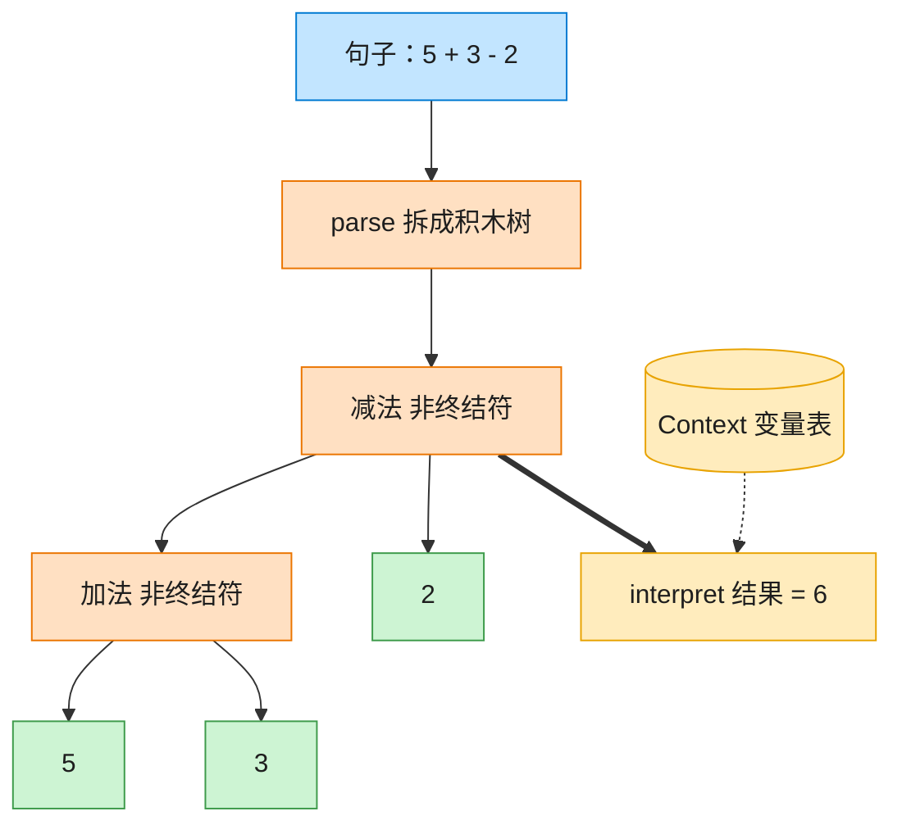

# Interpreter 解释器模式（Java）

## 意图

给定一个语言，定义它的文法的一种表示，并定义一个解释器，这个解释器使用该表示来解释语言中的句子。

<!-- gof-architecture-diagram -->
## 架构图

> **生活类比**：把「5 + 3 - 2」拆成积木树：加减是组合积木，数字和变量是末端积木。对着变量表走一遍 interpret，树就算出结果。



| 图中角色 | 本仓库示例 |
|---------|-----------|
| 句子 | 中缀表达式字符串 |
| 积木树 | Add / Subtract / Number / Variable |
| 词典 | Context 变量表 |

23 张图的完整图鉴见 [`docs/README.md`](../../docs/README.md#interpreter-解释器)。

## 适用场景

- 需要解释执行的语言中的句子可以表示为一棵抽象语法树（AST）
- 文法相对简单（复杂文法用这种方式会导致类数量爆炸、维护困难，通常改用专门的解析器生成器）
- 一些重复出现的问题可以用一种简单的语言来表达（如正则表达式、SQL、配置表达式、本例的算术表达式）

## 实现方式

`Expression` 是抽象表达式接口；`NumberExpression`/`VariableExpression` 是终结符表达式
（不能再往下拆分），`AddExpression`/`SubtractExpression` 是非终结符表达式
（组合两个子表达式）。求值时递归调用 `interpret(context)`：

```java
public interface Expression {
    int interpret(Context context);
}

public class AddExpression implements Expression {
    public int interpret(Context context) {
        return left.interpret(context) + right.interpret(context);   // 递归求值
    }
}
```

`Main` 中额外写了一个简易的递归下降解析器 `parse()`，把 `"5 + 3 - 2"` 这样的字符串
按空格分词后，从左到右组装成一棵表达式语法树；变量（如 `x`）则在求值时通过 `Context`
查表获得实际数值。

## 文件说明

| 文件 | 说明 |
|------|------|
| `Expression.java` | 抽象表达式接口 |
| `Context.java` | 上下文，保存变量名到数值的映射 |
| `NumberExpression.java` | 终结符表达式：数字字面量 |
| `VariableExpression.java` | 终结符表达式：变量，从 Context 中取值 |
| `AddExpression.java` / `SubtractExpression.java` | 非终结符表达式：加法 / 减法 |
| `Main.java` | 程序入口，内置简易解析器，演示纯数字与带变量两种表达式 |

## 编译与运行

```bash
cd java/interpreter
javac *.java
java Main
```

## 输出示例

```
=== 解释器模式：算术表达式求值 ===

表达式  : 5 + 3 - 2
语法树  : ((5 + 3) - 2)
求值结果: 6

表达式  : x + 3 - y  (上下文: x=10, y=4)
语法树  : ((x + 3) - y)
求值结果: 9
```

（预期输出：本机未安装 JDK，未实机运行）

## 要点

1. **组合模式的特例** —— `AddExpression`/`SubtractExpression` 持有子 `Expression`，
   语法树本身就是一棵组合模式的树，`interpret()` 是典型的递归调用。
2. **终结符与非终结符分离** —— 数字/变量不能再拆分（终结符），加减法组合两个子表达式
   （非终结符），文法规则与类结构一一对应。
3. **上下文携带可变状态** —— 变量的值不属于语法树本身，而是运行时通过 `Context` 提供，
   同一棵语法树换一个 `Context` 就能得到不同的求值结果。
