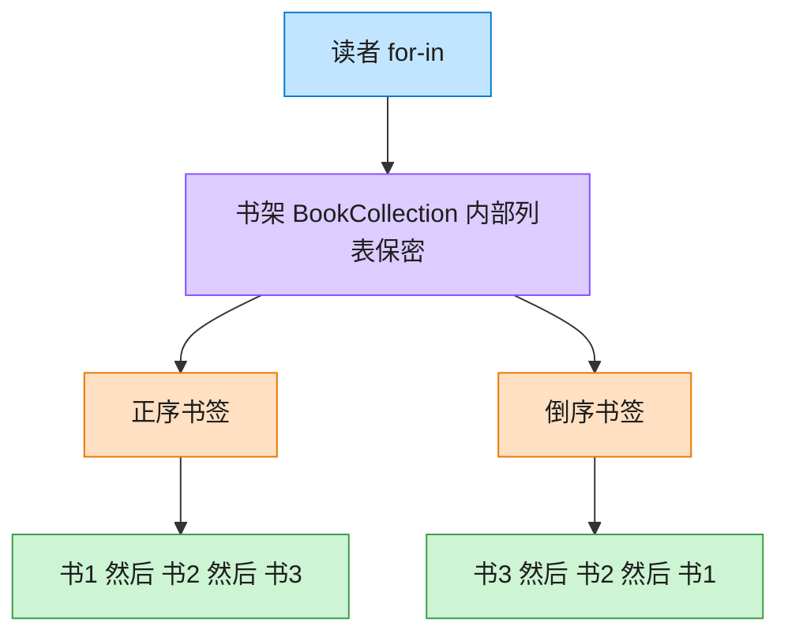

# Iterator 迭代器模式（Java）

## 意图

提供一种方法顺序访问一个聚合对象中各个元素，而又不暴露该对象的内部表示。

<!-- gof-architecture-diagram -->
## 架构图

> **生活类比**：书架抽屉怎么排，读者看不见。正序书签从左往右滑，倒序书签从右往左滑。两种书签各记各的位置，互不干扰。



| 图中角色 | 本仓库示例 |
|---------|-----------|
| 书架 | BookCollection，内部列表不外露 |
| 正序书签 | BookIterator |
| 倒序书签 | ReverseBookIterator |

23 张图的完整图鉴见 [`docs/README.md`](../../docs/README.md#iterator-迭代器)。

## 适用场景

- 需要遍历一个聚合对象，但又不想暴露其内部结构（数组、链表、树……）
- 需要为同一个聚合对象提供多种遍历方式
- 希望为遍历不同的聚合结构提供一个统一的接口（多态迭代）

## 实现方式

`BookCollection` 实现 `Iterable<Book>`，对外隐藏内部用 `List<Book>` 存储这一细节，
`iterator()` 返回一个独立的 `BookIterator` 负责维护遍历游标：

```java
public class BookCollection implements Iterable<Book> {
    private final List<Book> books = new ArrayList<>();

    @Override
    public Iterator<Book> iterator() {
        return new BookIterator(books);
    }
}

public class BookIterator implements Iterator<Book> {
    private int cursor = 0;

    @Override
    public boolean hasNext() { return cursor < books.size(); }

    @Override
    public Book next() { return books.get(cursor++); }
}
```

实现 `Iterable` 后即可直接使用 Java 的增强 for 循环（`for (Book b : collection)`），
这正是 Java 语言层面对迭代器模式的原生支持；也可以像 `Main` 一样显式获取
`Iterator` 手动调用 `hasNext()`/`next()`。

## 文件说明

| 文件 | 说明 |
|------|------|
| `Book.java` | 元素：书籍（record） |
| `BookIterator.java` | 具体迭代器，维护遍历游标 |
| `BookCollection.java` | 聚合类，实现 `Iterable<Book>` |
| `Main.java` | 程序入口，分别用增强 for 循环和显式迭代器遍历 |

## 编译与运行

```bash
cd java/iterator
javac *.java
java Main
```

## 输出示例

```
=== 迭代器模式：遍历书籍集合 ===

-- 用增强 for 循环遍历（底层由 iterator() 驱动）--
《设计模式》 —— GoF
《重构》 —— Martin Fowler
《代码整洁之道》 —— Robert C. Martin

-- 显式获取迭代器，手动调用 hasNext()/next() --
1. 《设计模式》 —— GoF
2. 《重构》 —— Martin Fowler
3. 《代码整洁之道》 —— Robert C. Martin
```

（预期输出：本机未安装 JDK，未实机运行）

## 要点

1. **封装内部结构** —— 客户端完全不知道 `BookCollection` 内部是 `List`，
   换成数组或链表也不影响客户端代码。
2. **与语言特性结合** —— Java 的 `for-each` 语法糖本质上就是对 `Iterable`/`Iterator`
   的语法层面支持，实现该接口即可直接享受这一特性。
3. **游标独立于聚合对象** —— 每次调用 `iterator()` 都返回一个新的 `BookIterator`
   实例，可以同时对同一个集合进行多个互不干扰的遍历。
