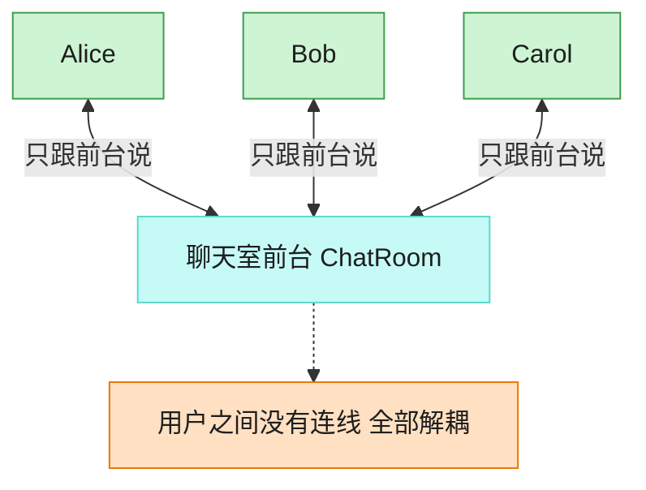

# Mediator 中介者模式（Java）

## 意图

用一个中介对象来封装一系列对象之间的交互，使各对象不需要显式地相互引用，
从而使其耦合松散，且可以独立地改变它们之间的交互。

<!-- gof-architecture-diagram -->
## 架构图

> **生活类比**：聊天室前台：Alice、Bob、Carol 彼此不留电话，所有群消息和私信都交给前台转发。加人、禁言、改规则只改前台一处。



| 图中角色 | 本仓库示例 |
|---------|-----------|
| 前台 | ChatRoom 中介者 |
| 同事 | User，只持有中介引用 |
| 交互 | 广播 / 私信都经中介 |

23 张图的完整图鉴见 [`docs/README.md`](../../docs/README.md#mediator-中介者)。

## 适用场景

- 一组对象之间存在复杂的、网状的相互引用关系（如聊天室成员两两互发消息会形成 N×N 的引用）
- 想要复用某个对象，但它与很多其他对象紧密耦合，难以单独抽出来
- 想通过一个中间对象来统一控制、协调多个对象的行为

## 实现方式

`User`（同事对象）发消息时不会直接调用其他 `User`，而是转交给 `ChatMediator`；
具体中介者 `ChatRoom` 持有所有注册用户，负责实际的消息分发：

```java
public class User {
    public void send(String message) {
        mediator.sendMessage(this, message);   // 不直接引用其他 User
    }
}

public class ChatRoom implements ChatMediator {
    @Override
    public void sendMessage(User sender, String message) {
        for (User user : users) {
            if (user != sender) {
                user.receive(sender.getName(), message);  // 由中介者负责转发
            }
        }
    }
}
```

## 文件说明

| 文件 | 说明 |
|------|------|
| `ChatMediator.java` | 抽象中介者接口 |
| `User.java` | 同事类：聊天室用户，只依赖 ChatMediator |
| `ChatRoom.java` | 具体中介者，维护用户列表并转发消息 |
| `Main.java` | 程序入口，三位用户轮流发言 |

## 编译与运行

```bash
cd java/mediator
javac *.java
java Main
```

## 输出示例

```
=== 中介者模式：聊天室 ===

[Alice 发送]: 大家好，我是 Alice
  [Bob 收到来自 Alice 的消息]: 大家好，我是 Alice
  [Carol 收到来自 Alice 的消息]: 大家好，我是 Alice

[Bob 发送]: Alice 你好，我是 Bob
  [Alice 收到来自 Bob 的消息]: Alice 你好，我是 Bob
  [Carol 收到来自 Bob 的消息]: Alice 你好，我是 Bob

[Carol 发送]: 欢迎两位～
  [Alice 收到来自 Carol 的消息]: 欢迎两位～
  [Bob 收到来自 Carol 的消息]: 欢迎两位～
```

（预期输出：本机未安装 JDK，未实机运行）

## 要点

1. **消除网状引用** —— 没有中介者时，N 个用户两两通信需要维护 N×N 条引用；
   引入 `ChatRoom` 后，每个 `User` 只需要认识中介者这一个对象。
2. **交互逻辑集中** —— 广播规则（是否排除发送者本人、是否记录历史等）都集中在
   `ChatRoom` 里，修改交互规则不需要触碰 `User` 类。
3. **易于替换中介策略** —— 若想实现“私聊”而非“群发”，只需新增一个实现
   `ChatMediator` 的类，`User` 的代码无需改动。
