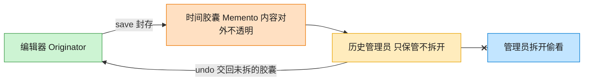

# Memento 备忘录模式（Java）

## 意图

在不破坏封装性的前提下，捕获一个对象的内部状态，并在该对象之外保存这个状态，
以便之后可以将该对象恢复到原先保存的状态（典型的 undo/redo 实现基础）。

<!-- gof-architecture-diagram -->
## 架构图

> **生活类比**：编辑器把这一刻的正文和光标封进时间胶囊。历史管理员只负责把胶囊堆起来、按撤销交回去，从不拆开偷看 —— 封装不被破坏。



| 图中角色 | 本仓库示例 |
|---------|-----------|
| 编辑器 | TextEditor 发起人，唯二能读写胶囊 |
| 时间胶囊 | EditorMemento 不可变快照 |
| 历史管理员 | History，只压栈出栈 |

23 张图的完整图鉴见 [`docs/README.md`](../../docs/README.md#memento-备忘录)。

## 适用场景

- 需要保存对象某一时刻的状态快照，以便之后能恢复到该状态（文本编辑器、表单、游戏存档）
- 不希望暴露对象的内部细节给负责保存快照的类（Caretaker）
- 直接提供接口来让客户端获取状态会暴露对象的实现细节，破坏封装性

## 实现方式

`Memento` 是一个不暴露任何方法的“空”接口；`TextEditor`（发起人）内部用
**私有静态内部类** `Snapshot` 实现它，外部代码即使拿到 `Memento` 引用也无法调用任何方法，
只有 `TextEditor` 自己能通过 `instanceof` 模式匹配把它还原成 `Snapshot`：

```java
public class TextEditor {
    public Memento save() {
        return new Snapshot(content.toString());     // 对外只暴露 Memento 接口
    }

    public void restore(Memento memento) {
        if (!(memento instanceof Snapshot snapshot)) {
            throw new IllegalArgumentException("非法的备忘录对象");
        }
        this.content = new StringBuilder(snapshot.content());
    }

    private record Snapshot(String content) implements Memento { }  // 外部不可见
}
```

`History`（管理者/Caretaker）只负责把 `Memento` 压栈、弹栈，完全不知道、也无法知道
里面到底装了什么。

## 文件说明

| 文件 | 说明 |
|------|------|
| `Memento.java` | 备忘录标记接口，不暴露任何方法 |
| `TextEditor.java` | 发起人：文本编辑器，内含私有的具体备忘录 `Snapshot` |
| `History.java` | 管理者，用栈保存历史快照，只负责存取不负责解读 |
| `Main.java` | 程序入口，演示连续输入、保存快照、以及两次撤销 |

## 编译与运行

```bash
cd java/memento
javac *.java
java Main
```

## 输出示例

```
=== 备忘录模式：文本编辑器 undo ===

[TextEditor] 保存快照: "Hello"
[TextEditor] 保存快照: "Hello, World"
当前内容: "Hello, World!!! (typo)"

-- 撤销一步 --
[TextEditor] 恢复到快照: "Hello, World"
当前内容: "Hello, World"

-- 再撤销一步 --
[TextEditor] 恢复到快照: "Hello"
当前内容: "Hello"
```

（预期输出：本机未安装 JDK，未实机运行）

## 要点

1. **封装性不被破坏** —— `Memento` 接口空空如也，`History` 拿到手的只是一个不透明的令牌，
   无法窥探或篡改编辑器的内部状态。
2. **私有内部类实现真正隔离** —— `Snapshot` 是 `TextEditor` 的 `private` 静态内部类，
   在 Java 的访问控制体系下，只有外层类自己能访问，比“同包可见”更严格。
3. **Caretaker 只负责存取时机** —— `History` 决定“什么时候保存、什么时候恢复”，
   但不参与状态本身的构造与解读，职责边界清晰。
