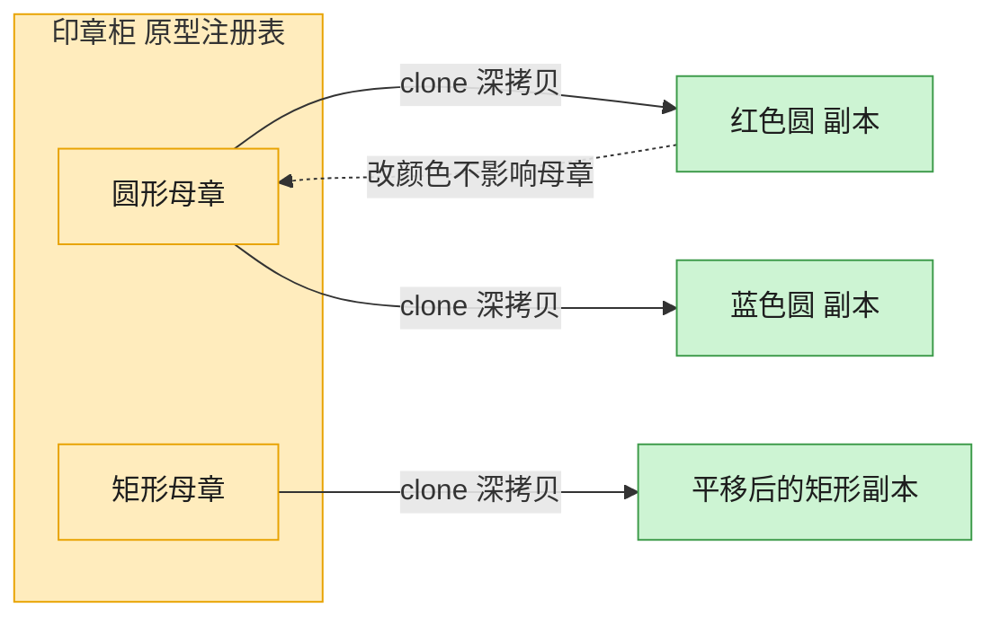

# Prototype 原型模式（Java）

## 意图

用原型实例指定创建对象的种类，并且通过拷贝这些原型创建新的对象，无需知道对象创建的具体类和过程。

<!-- gof-architecture-diagram -->
## 架构图

> **生活类比**：印章柜里放着圆形、矩形两枚母章。要新图时不从零雕刻，盖一下（clone）就得到互不干扰的副本，改颜色也不脏了母章。



| 图中角色 | 本仓库示例 |
|---------|-----------|
| 母章 / 原型 | Shape.clone，默认 deepcopy |
| 印章柜 | 按名字取模板的原型注册表 |
| 盖出的副本 | 改颜色、位置、标签，不影响原件 |

23 张图的完整图鉴见 [`docs/README.md`](../../docs/README.md#prototype-原型)。

## 适用场景

- 创建对象的成本较高（例如需要访问数据库、复杂计算），而已有一个相似实例可供复制
- 需要避免创建与产品类层次平行的工厂类层次
- 系统需要在运行时动态指定要创建的对象种类，比如通过一份“模板”注册表按需克隆

## 实现方式

`Shape` 声明抽象方法 `copy()`；具体子类 `Circle`/`Rectangle` 各自提供一个 **私有拷贝构造函数**，
在其中先复制父类公共字段，再复制自己特有的字段：

```java
public abstract class Shape {
    protected Shape(Shape source) {          // 拷贝构造函数：复制公共字段
        this.x = source.x;
        this.y = source.y;
        this.color = source.color;
    }
    public abstract Shape copy();
}

public class Circle extends Shape {
    private Circle(Circle source) {
        super(source);                        // 先复制公共字段
        this.radius = source.radius;          // 再复制自己的字段
    }
    @Override
    public Shape copy() { return new Circle(this); }
}
```

这里没有使用 `java.lang.Cloneable`／`Object.clone()`：后者是浅拷贝、需要处理受检异常，
且容易与子类的可变字段产生纠缠（Effective Java 建议谨慎使用）。拷贝构造函数写法更直观、
也更容易控制哪些字段需要深拷贝。

## 文件说明

| 文件 | 说明 |
|------|------|
| `Shape.java` | 抽象原型，声明 `copy()` 与公共字段 |
| `Circle.java` | 具体原型：圆形 |
| `Rectangle.java` | 具体原型：矩形 |
| `Main.java` | 程序入口，演示克隆、修改克隆体、以及简单的原型注册表 |

## 编译与运行

```bash
cd java/prototype
javac *.java
java Main
```

## 输出示例

```
=== 原型模式：克隆图形 ===

原始圆形     : Circle[颜色=红色, 位置=(10,10), 半径=5]
克隆并修改后 : Circle[颜色=蓝色, 位置=(100,100), 半径=5]
原始圆形不变 : Circle[颜色=红色, 位置=(10,10), 半径=5]

原始矩形     : Rectangle[颜色=黑色, 位置=(0,0), 宽高=20x10]
克隆并修改后 : Rectangle[颜色=黄色, 位置=(0,0), 宽高=20x10]

=== 原型注册表：预先配置好的模板可直接克隆复用 ===
从注册表克隆 : Circle[颜色=红色, 位置=(50,60), 半径=1]
```

（预期输出：本机未安装 JDK，未实机运行）

## 要点

1. **克隆独立于原型** —— 修改克隆体的属性（位置、颜色）完全不影响原始对象，两者内存独立。
2. **拷贝构造函数优于 Cloneable** —— 避免了 `CloneNotSupportedException` 和浅拷贝陷阱，
   且可以精确控制每个字段如何复制。
3. **原型注册表** —— 把常用的“模板”对象集中存放在 Map 中，需要时直接克隆，
   省去重复的初始化逻辑。
