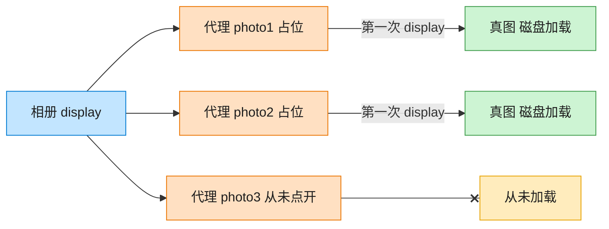

# Proxy 代理模式（Java）

## 意图

为其他对象提供一种代理以控制对这个对象的访问。代理与真实对象实现同一接口，
客户端感知不到访问的是代理还是真实对象。

<!-- gof-architecture-diagram -->
## 架构图

> **生活类比**：相册先摆三张空相框。点开才从仓库搬出真照片；没点开的那张，磁盘加载一次都不会发生。



| 图中角色 | 本仓库示例 |
|---------|-----------|
| 相册 | 客户端，只认 Image.display |
| 空相框 | ImageProxy 虚拟代理 |
| 仓库真图 | RealImage，构造时才加载 |

23 张图的完整图鉴见 [`docs/README.md`](../../docs/README.md#proxy-代理)。

## 适用场景

- **虚拟代理**：延迟创建开销较大的对象，直到真正需要它（本例：图片懒加载）
- **保护代理**：控制对原始对象的访问权限
- **远程代理**：为不同地址空间的对象提供本地代表
- 需要在访问真实对象前后附加额外逻辑（如缓存、日志、权限校验）而不修改真实对象本身

## 实现方式

`ImageProxy` 与 `RealImage` 都实现 `Image` 接口；`ImageProxy` 内部持有一个延迟初始化的
`RealImage` 引用，只有第一次调用 `display()` 时才真正创建它：

```java
public class ImageProxy implements Image {
    private RealImage realImage; // 初始为 null

    @Override
    public void display() {
        if (realImage == null) {
            realImage = new RealImage(filename);   // 首次访问才真正加载
        }
        realImage.display();
    }
}
```

## 文件说明

| 文件 | 说明 |
|------|------|
| `Image.java` | 主题接口（Subject） |
| `RealImage.java` | 真实主题，构造时模拟从磁盘加载的昂贵操作 |
| `ImageProxy.java` | 代理，延迟到首次 `display()` 才创建真实对象 |
| `Main.java` | 程序入口，演示创建列表不加载、首次显示才加载、重复显示复用缓存 |

## 编译与运行

```bash
cd java/proxy
javac *.java
java Main
```

## 输出示例

```
=== 代理模式：图片懒加载 ===

创建图片列表（此时不会真正加载任何图片）:
列表创建完成，尚未发生任何磁盘加载

第一次浏览，只查看 photo1 和 photo2:
[ImageProxy] photo1.jpg 首次访问，创建真实对象
  [RealImage] 正在从磁盘加载图片: photo1.jpg ...（耗时操作）
  [RealImage] 显示图片: photo1.jpg
[ImageProxy] photo2.jpg 首次访问，创建真实对象
  [RealImage] 正在从磁盘加载图片: photo2.jpg ...（耗时操作）
  [RealImage] 显示图片: photo2.jpg

再次查看 photo1（应直接复用，不再重新加载）:
[ImageProxy] photo1.jpg 已加载过，直接复用真实对象
  [RealImage] 显示图片: photo1.jpg
```

（预期输出：本机未安装 JDK，未实机运行）

## 要点

1. **懒加载** —— `photo3.jpg` 全程未被访问，因此永远不会触发真正的加载逻辑，节省资源。
2. **接口一致** —— 客户端统一持有 `List<Image>`，不区分哪个是代理、哪个是真实对象。
3. **控制点集中** —— 是否加载、是否缓存等控制逻辑都集中在 `ImageProxy` 中，
   `RealImage` 本身不需要关心这些，职责单一。
