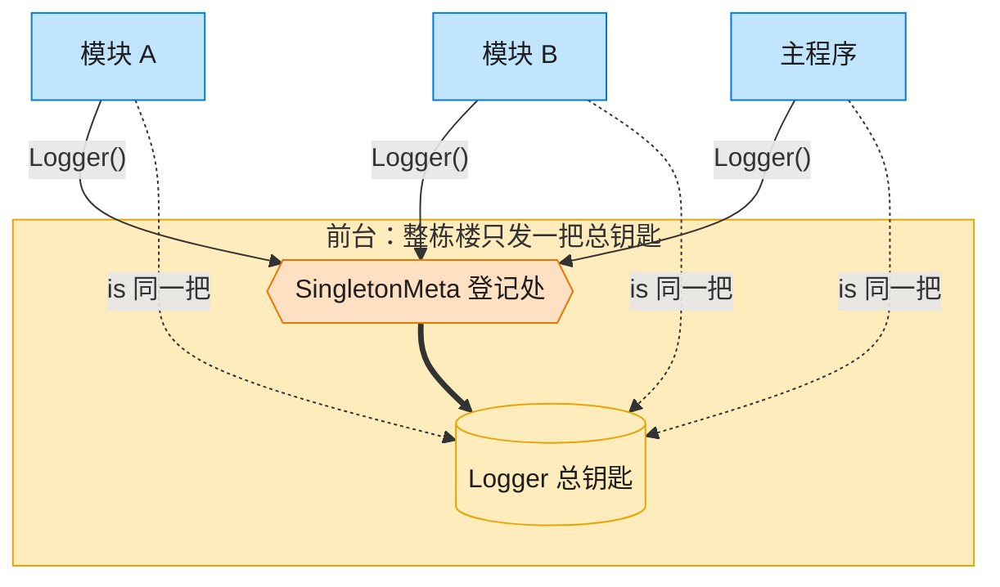

# Singleton 单例模式（Java）

## 意图

保证一个类只有一个实例，并提供一个全局访问点。

<!-- gof-architecture-diagram -->
## 架构图

> **生活类比**：整栋大楼只发一把总钥匙。模块 A、模块 B、主程序去前台领取，拿到的永远是同一把 —— 这就是单例。



| 图中角色 | 本仓库示例 |
|---------|-----------|
| 前台 / 总钥匙 | SingletonMeta + Logger 全局唯一实例 |
| 来领钥匙的部门 | ModuleA / ModuleB / 主程序 |

23 张图的完整图鉴见 [`docs/README.md`](../../docs/README.md#singleton-单例)。

## 适用场景

- 日志记录器、配置管理器、连接池等全局只需要一份的资源
- 需要严格控制某个类被实例化的次数
- 多处代码需要共享同一份可变状态（如日志级别）

## 实现方式

采用 **Bill Pugh 静态内部类方案**：`Holder` 类只有在第一次调用 `getInstance()` 时才会被
JVM 加载并完成初始化，类加载机制本身由 JVM 保证互斥，因此天然线程安全，无需
`synchronized` 或双重检查锁：

```java
public final class Logger {
    private Logger() { }                     // 私有构造函数

    private static class Holder {
        private static final Logger INSTANCE = new Logger();
    }

    public static Logger getInstance() {
        return Holder.INSTANCE;              // 全局访问点
    }
}
```

`OrderModule`、`PaymentModule` 分别模拟应用中两个不同的模块，各自独立调用
`Logger.getInstance()`，用来证明它们拿到的是同一个实例。

## 文件说明

| 文件 | 说明 |
|------|------|
| `Logger.java` | 单例类：全局日志器，内含 `Level` 枚举与 `Holder` 静态内部类 |
| `OrderModule.java` | 模拟下单模块，内部独立获取 Logger |
| `PaymentModule.java` | 模拟支付模块，内部独立获取 Logger |
| `Main.java` | 程序入口，演示跨模块共享同一 Logger 并验证实例一致性 |

## 编译与运行

```bash
cd java/singleton
javac *.java
java Main
```

## 输出示例

```
=== 单例模式：全局 Logger ===

[10:00:00] [INFO] 程序启动
[10:00:00] [INFO] 订单模块: 创建订单 ORD-1001
[10:00:00] [INFO] 支付模块: 订单 ORD-1001 支付成功，金额 ￥199.0

[10:00:00] [INFO] 日志级别已调整为 DEBUG
[10:00:00] [DEBUG] 支付模块: 开始处理订单 ORD-1002 的支付请求
[10:00:00] [INFO] 支付模块: 订单 ORD-1002 支付成功，金额 ￥88.5

=== 验证多处获取的是同一实例 ===
main 中的 Logger      : Logger@1b6d3586
再次获取的 Logger      : Logger@1b6d3586
两者是否为同一实例      : true
```

（预期输出：本机未安装 JDK，未实机运行；具体时间与对象哈希值以实际运行为准）

## 要点

1. **私有构造函数** —— 外部无法通过 `new Logger()` 创建实例。
2. **静态内部类懒加载** —— `Holder` 只有在 `getInstance()` 首次被调用时才加载，
   兼顾懒加载与线程安全，性能优于 `synchronized` 方法。
3. **另一种惯用写法** —— Java 中还可以用 `enum` 实现单例（`public enum Logger { INSTANCE }`），
   由 JVM 保证枚举实例天然唯一且自带序列化安全，是 *Effective Java* 推荐的写法之一；
   本例选择静态内部类方案是为了更贴近其他语言（懒加载 + 显式 `getInstance()`）的对比。
