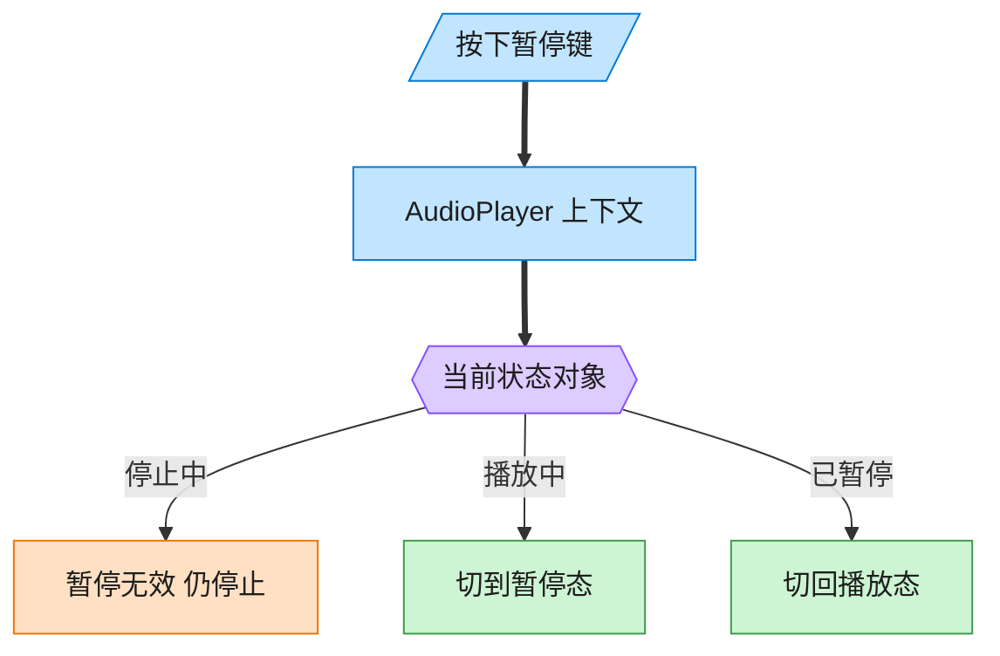
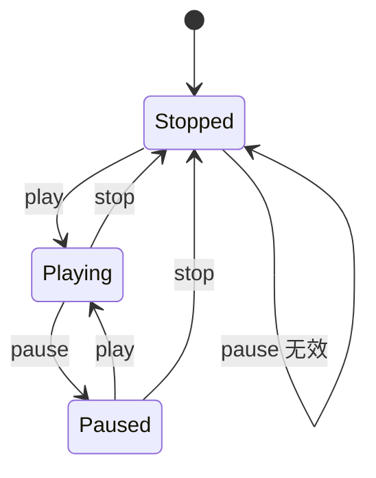

# State 状态模式（Java）

## 意图

允许一个对象在其内部状态改变时改变它的行为，使对象看起来似乎修改了它的类。

<!-- gof-architecture-diagram -->
## 架构图

> **生活类比**：同一颗暂停键：播放中按下就暂停，停止中按下则无效。播放器没有满屏 if-else，而是把「这个状态下该干什么」交给当前状态对象。





| 图中角色 | 本仓库示例 |
|---------|-----------|
| 播放器 | AudioPlayer 上下文，委托当前状态 |
| 三态 | Stopped / Playing / Paused |
| 转换 | 状态对象自己决定下一态 |

23 张图的完整图鉴见 [`docs/README.md`](../../docs/README.md#state-状态)。

## 适用场景

- 一个对象的行为取决于它的状态，并且必须在运行时根据状态改变行为
- 代码中包含大量与对象状态有关的条件语句（`if (state == PLAYING) ... else if (state == PAUSED) ...`），
  且这些条件语句难以维护
- 状态之间的转换关系相对明确（状态机）

## 实现方式

`PlayerState` 声明 `play`/`pause`/`stop`；`AudioPlayer`（上下文）把请求委托给当前状态对象，
自身不包含任何 `if/else` 状态判断，状态切换由具体状态类主动调用 `player.setState(...)` 完成：

```java
public class AudioPlayer {
    private PlayerState state;

    public void pressPlay() {
        state.play(this);           // 委托给当前状态
    }
}

public class StoppedState implements PlayerState {
    @Override
    public void play(AudioPlayer player) {
        player.setState(new PlayingState());   // 由状态类决定下一个状态
    }
}
```

## 文件说明

| 文件 | 说明 |
|------|------|
| `PlayerState.java` | 抽象状态接口 |
| `PlayingState.java` / `PausedState.java` / `StoppedState.java` | 具体状态 |
| `AudioPlayer.java` | 上下文，持有当前状态并转发请求 |
| `Main.java` | 程序入口，演示完整的状态流转 |

## 编译与运行

```bash
cd java/state
javac *.java
java Main
```

## 输出示例

```
=== 状态模式：音频播放器 ===

初始状态: Stopped

-- 按下播放 --
[已停止] 开始播放
  (状态切换: Stopped -> Playing)

-- 按下暂停 --
[播放中] 暂停播放
  (状态切换: Playing -> Paused)

-- 再按一次暂停（无效操作）--
[已暂停] 已经是暂停状态了，忽略

-- 按下播放（从暂停恢复）--
[已暂停] 继续播放
  (状态切换: Paused -> Playing)

-- 按下停止 --
[播放中] 停止播放
  (状态切换: Playing -> Stopped)

-- 停止状态下按下暂停（无效操作）--
[已停止] 尚未播放，无法暂停
```

（预期输出：本机未安装 JDK，未实机运行）

## 要点

1. **消除条件分支** —— 每种状态各自实现一个类，`AudioPlayer` 里完全没有
   `if (state == ...)` 这样的判断。
2. **状态自身决定流转** —— 下一个状态是什么，由当前状态类内部决定（如
   `StoppedState.play()` 决定切到 `PlayingState`），符合单一职责原则。
3. **与策略模式的区别** —— 结构上二者很像（都是持有一个接口引用并委托），
   但状态模式强调状态之间会相互切换，且行为随状态变化；策略模式的各策略
   通常是平级的、由外部选定，彼此不感知对方、也不主动切换。
