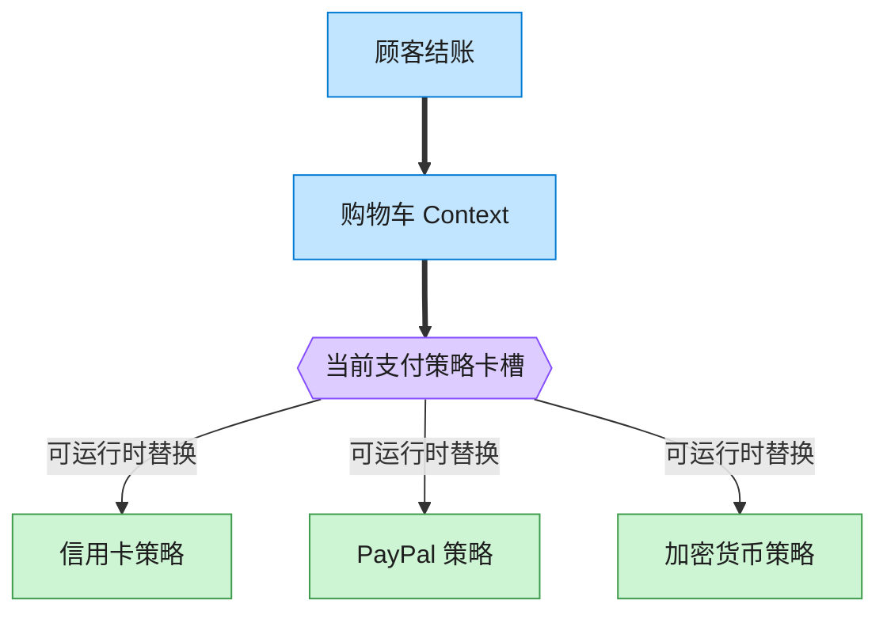

# Strategy 策略模式（Java）

## 意图

定义一系列算法，把它们各自封装起来，并使它们可以相互替换。策略模式使得算法可以独立于
使用它的客户而变化。

<!-- gof-architecture-diagram -->
## 架构图

> **生活类比**：收银台插卡：购物车不关心怎么扣款，结账时插入信用卡、PayPal 或加密货币策略卡。用户在结算页改选，算法当场替换。



| 图中角色 | 本仓库示例 |
|---------|-----------|
| 购物车 | ShoppingCart 上下文 |
| 卡槽 | PaymentStrategy 可替换算法 |
| 策略卡 | CreditCard / PayPal / Crypto |

23 张图的完整图鉴见 [`docs/README.md`](../../docs/README.md#strategy-策略)。

## 适用场景

- 完成同一个任务有多种可互相替换的算法/方式（如多种支付方式、多种排序算法）
- 需要在运行时动态选择算法，而不是在编译期通过继承固定下来
- 想避免用大量 `if/else` 或 `switch` 来选择不同的行为

## 实现方式

`PaymentStrategy` 定义统一的 `pay(amount)` 接口；`ShoppingCart`（上下文）持有一个
`PaymentStrategy` 引用，具体使用哪种支付方式由客户端在运行时注入，购物车本身完全
不关心支付的实现细节：

```java
public class ShoppingCart {
    private PaymentStrategy paymentStrategy;

    public void setPaymentStrategy(PaymentStrategy paymentStrategy) {
        this.paymentStrategy = paymentStrategy;    // 运行时切换算法
    }

    public void checkout() {
        paymentStrategy.pay(total);                // 不关心具体是哪种支付方式
    }
}
```

## 文件说明

| 文件 | 说明 |
|------|------|
| `PaymentStrategy.java` | 策略接口 |
| `CreditCardPayment.java` / `PayPalPayment.java` / `CryptoPayment.java` | 具体策略 |
| `ShoppingCart.java` | 上下文，持有并使用当前策略 |
| `Main.java` | 程序入口，演示同一个购物车切换三种支付方式 |

## 编译与运行

```bash
cd java/strategy
javac *.java
java Main
```

## 输出示例

```
=== 策略模式：可互换的支付方式 ===

-- 使用信用卡支付 --
购物车总金额: 271.00 元
[信用卡支付] 使用卡号 **** **** **** 3456 支付 271.00 元

-- 改用 PayPal 支付 --
购物车总金额: 271.00 元
[PayPal 支付] 使用账号 alice@example.com 支付 271.00 元

-- 改用加密货币支付 --
购物车总金额: 271.00 元
[加密货币支付] 向钱包地址 0xA1b2C3d4E5f6 转账等值 271.00 元的数字货币
```

（预期输出：本机未安装 JDK，未实机运行）

## 要点

1. **算法可互换** —— 三种支付方式实现同一个接口，`ShoppingCart` 无需修改任何代码
   即可切换支付方式。
2. **消除条件分支** —— 若不用策略模式，`checkout()` 内部往往会出现一长串
   `if (type == CREDIT_CARD) ... else if (type == PAYPAL) ...`，策略模式把每个分支
   拆成独立的类。
3. **符合开闭原则** —— 新增一种支付方式（如 `ApplePayPayment`）只需新增一个实现类，
   不需要修改 `ShoppingCart` 或其他现有策略。
