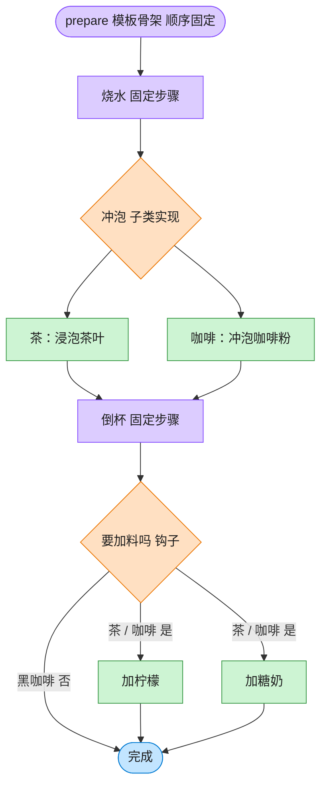

# Template Method 模板方法模式（Java）

## 意图

在一个方法中定义一个算法的骨架，而将一些步骤延迟到子类中实现。
模板方法使得子类可以在不改变算法结构的情况下，重新定义算法的某些特定步骤。

<!-- gof-architecture-diagram -->
## 架构图

> **生活类比**：冲泡饮料的菜谱骨架写死：烧水 → 冲泡 → 倒杯 → 是否加料。茶放茶叶加柠檬，咖啡放咖啡粉加糖奶，黑咖啡用钩子跳过加料。流程顺序谁也不能改。



| 图中角色 | 本仓库示例 |
|---------|-----------|
| 菜谱骨架 | Beverage.prepare 模板方法 |
| 可变步骤 | _brew / _add_condiments |
| 钩子 | _wants_condiments，黑咖啡返回否 |

23 张图的完整图鉴见 [`docs/README.md`](../../docs/README.md#template-method-模板方法)。

## 适用场景

- 多个子类有共同的行为流程，只是其中某些步骤的具体实现不同（如冲泡各种饮料都要
  “烧水 -> 冲泡 -> 倒杯 -> 加料”，只是“冲泡”和“加料”两步因饮料而异）
- 想通过重构把公共代码提取到父类，避免重复代码
- 想控制子类的扩展点：哪些步骤必须由子类实现、哪些步骤可选覆盖（钩子方法）

## 实现方式

`Beverage.prepareRecipe()` 是模板方法，用 `final` 修饰、固定了整体步骤顺序；
`brew()`/`addCondiments()` 是子类必须实现的抽象步骤；`customerWantsCondiments()`
是钩子方法（Hook），提供默认实现，子类可以选择性覆盖：

```java
public abstract class Beverage {
    public final void prepareRecipe() {     // 模板方法，步骤顺序不可变
        boilWater();
        brew();                              // 抽象步骤，子类实现
        pourInCup();
        if (customerWantsCondiments()) {     // 钩子方法，子类可选择性覆盖
            addCondiments();
        }
    }
}
```

## 文件说明

| 文件 | 说明 |
|------|------|
| `Beverage.java` | 抽象类，定义模板方法 `prepareRecipe()` 与钩子方法 |
| `Tea.java` | 具体子类：茶 |
| `Coffee.java` | 具体子类：咖啡，并覆盖钩子方法 |
| `Main.java` | 程序入口，演示茶、加调料的咖啡、不加调料的咖啡 |

## 编译与运行

```bash
cd java/template-method
javac *.java
java Main
```

## 输出示例

```
=== 模板方法模式：冲泡饮料 ===

制作茶:
烧开水
用沸水浸泡茶叶
倒入杯中
加入柠檬
-- 一杯茶冲泡完成 --

制作咖啡（加调料）:
烧开水
用沸水冲泡咖啡粉
倒入杯中
加入糖和牛奶
-- 一杯咖啡冲泡完成 --

制作咖啡（顾客不要调料，走钩子方法分支）:
烧开水
用沸水冲泡咖啡粉
倒入杯中
-- 一杯咖啡冲泡完成 --
```

（预期输出：本机未安装 JDK，未实机运行）

## 要点

1. **好莱坞原则** —— “别调用我们，我们会调用你”：父类的模板方法调用子类实现的步骤，
   而不是子类主动调用父类。
2. **`final` 保护算法结构** —— `prepareRecipe()` 声明为 `final`，子类只能实现/覆盖
   规定的步骤，不能重新排列冲泡流程。
3. **钩子方法提供弹性扩展点** —— `customerWantsCondiments()` 默认返回 `true`，
   `Coffee` 按需覆盖它，而 `Tea` 保持默认行为，体现钩子方法“可选覆盖”的特点。
