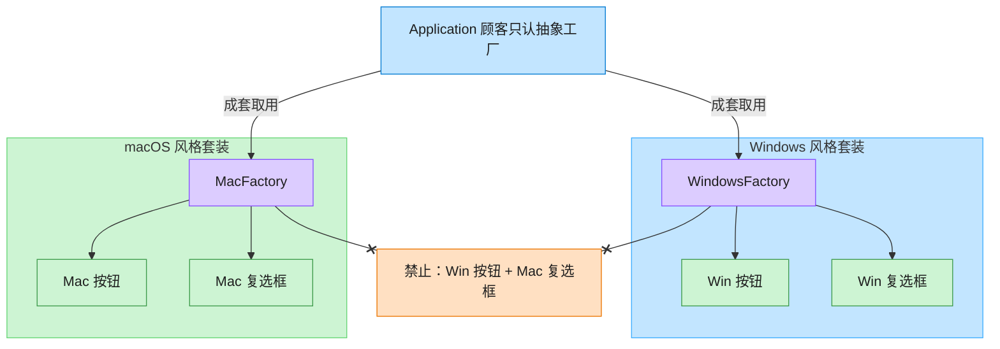

# Abstract Factory 抽象工厂模式（JavaScript）

## 意图
提供一个接口，用于创建一系列相关或相互依赖的对象，而无需指定它们具体的类。当系统需要
支持“成套切换”的产品族（例如同一套 UI 风格下的按钮、复选框）时，抽象工厂能保证客户端
拿到的产品始终是同一族、彼此匹配的。

<!-- gof-architecture-diagram -->
## 架构图

> **生活类比**：家具店一次卖「成套风格」。Windows 工厂成套出 Win 按钮+Win 复选框，Mac 工厂成套出 Mac 风格 —— 绝不混搭。



| 图中角色 | 本仓库示例 |
|---------|-----------|
| 顾客 / 应用 | Application，只依赖 GUIFactory |
| 成套工厂 | WindowsFactory / MacFactory |
| 成套产品 | Button + Checkbox 必须同一家族 |

23 张图的完整图鉴见 [`docs/README.md`](../../docs/README.md#abstract-factory-抽象工厂)。

## 适用场景
- 系统需要独立于其产品的创建、组合和表示方式。
- 系统需要由多个产品族中的一个来配置（例如按操作系统切换整套 UI 控件）。
- 需要强调一系列相关产品对象的设计，以便进行联合使用（同一族产品必须搭配使用）。
- 只想暴露产品的接口，而不暴露实现细节。

## 实现方式
定义抽象产品 `Button`、`Checkbox`，为 Windows / macOS 各提供一套具体实现；再定义抽象工厂
`GUIFactory`，由 `WindowsFactory`、`MacFactory` 具体实现 `createButton()` /
`createCheckbox()`。客户端 `Application` 只依赖抽象工厂与抽象产品，运行时通过
`createFactory(osName)` 决定实例化哪一套工厂，从而拿到同一族且互相匹配的产品：

```js
class GUIFactory {
  createButton() { throw new Error('子类必须实现 createButton()'); }
  createCheckbox() { throw new Error('子类必须实现 createCheckbox()'); }
}

class WindowsFactory extends GUIFactory {
  createButton() { return new WindowsButton(); }
  createCheckbox() { return new WindowsCheckbox(); }
}

class Application {
  constructor(factory) {
    this.#button = factory.createButton();
    this.#checkbox = factory.createCheckbox();
  }
}
```

## 文件说明
| 文件 | 说明 |
|------|------|
| `main.mjs` | 抽象工厂模式完整示例：抽象产品/工厂、Windows 与 macOS 两套具体实现、客户端渲染逻辑 |

## 编译与运行
```bash
node main.mjs
```

## 输出示例
```
=== 抽象工厂模式：跨平台 GUI 控件族 ===

-- 在 Windows 平台上渲染 UI --
[Windows 按钮] 方形边框，蓝色高亮
Windows 按钮：播放系统点击音效
[Windows 复选框] 方形勾选框
Windows 复选框：切换为方形对勾

-- 在 macOS 平台上渲染 UI --
[macOS 按钮] 圆角边框，毛玻璃质感
macOS 按钮：轻微缩放动画反馈
[macOS 复选框] 圆角勾选框
macOS 复选框：切换为圆角对勾动画
```

## 要点
1. 抽象工厂保证同一族产品被统一创建，避免混用不同风格的组件（例如 Windows 按钮配 macOS 复选框）。
2. 新增一个产品族（如 Linux 风格）只需新增一套具体产品 + 一个具体工厂，符合开闭原则。
3. 新增一种产品（如 Slider）则需要修改抽象工厂接口及所有具体工厂，这是抽象工厂模式的固有代价。
4. JS 中没有接口关键字，这里用“基类方法抛异常”的方式模拟抽象方法的强制实现约束。
