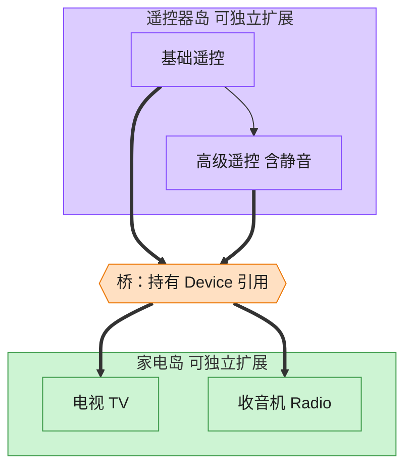

# Bridge 桥接模式（JavaScript）

## 意图
将抽象部分与实现部分分离，使二者可以独立变化。当一个类存在两个（或多个）独立变化的维度
时（例如“遥控器类型”和“设备类型”），继承会导致类数量随维度组合爆炸式增长，桥接模式用
组合替代继承来解决这一问题。

<!-- gof-architecture-diagram -->
## 架构图

> **生活类比**：遥控器和家电是两座岛。基础遥控 / 高级遥控是一座岛，电视 / 收音机是另一座岛。中间一座桥（组合引用）把它们连上，不必为每种组合造一个新类。



| 图中角色 | 本仓库示例 |
|---------|-----------|
| 遥控器岛 | RemoteControl / AdvancedRemoteControl 抽象 |
| 桥 | 抽象持有的 Device 引用 |
| 家电岛 | TV / Radio 实现 |

23 张图的完整图鉴见 [`docs/README.md`](../../docs/README.md#bridge-桥接)。

## 适用场景
- 不希望在抽象和实现之间有固定的绑定关系（例如运行时切换实现）。
- 类的抽象及其实现都应该可以通过生成子类的方式独立扩展。
- 对一个抽象的实现部分的修改不应该影响客户端代码。
- 存在两个独立变化的维度，且都可能有多种取值（遥控器：basic/advanced；设备：TV/Radio）。

## 实现方式
`Device` 是实现部分接口（`turnOn/turnOff/setVolume`），`TV`、`Radio` 是具体实现。
`RemoteControl` 是抽象部分，构造时持有一个 `Device` 引用——这个引用就是“桥”。
`AdvancedRemoteControl` 扩展抽象部分（新增 `mute()`），但完全不需要关心具体设备的实现细
节，也不需要为“高级遥控器 x 电视”“高级遥控器 x 收音机”分别建类：

```js
class RemoteControl {
  constructor(device) { this.device = device; } // 组合，而非继承 —— 这就是“桥”
  togglePower() { return this.device.isOn ? this.device.turnOff() : this.device.turnOn(); }
}

class AdvancedRemoteControl extends RemoteControl {
  mute() { /* 只扩展抽象端，实现端 Device 不受影响 */ }
}
```

## 文件说明
| 文件 | 说明 |
|------|------|
| `main.mjs` | 桥接模式完整示例：`Device`/`TV`/`Radio` 实现层级，`RemoteControl`/`AdvancedRemoteControl` 抽象层级 |

## 编译与运行
```bash
node main.mjs
```

## 输出示例
```
=== 桥接模式：遥控器（抽象）与设备（实现）独立变化 ===

-- 基础遥控器 + 电视 --
电视已开机
电视音量调整为 40
[电视] 电源=开, 音量=40

-- 基础遥控器 + 收音机（同一个遥控器抽象，换一个设备实现）--
收音机已开机
收音机音量调整为 20
[收音机] 电源=开, 音量=20

-- 高级遥控器 + 电视（扩展抽象端，不影响设备实现端）--
电视已开机
电视音量调整为 40
已静音
[电视] 电源=开, 音量=0
已取消静音
[电视] 电源=开, 音量=40
```

## 要点
1. 两个维度（遥控器种类 x 设备种类）分别独立扩展：新增一种设备不需要改遥控器代码，新增
   一种遥控器也不需要改设备代码，二者通过组合关系在运行时任意搭配。
2. 与适配器模式的区别：适配器是事后补救“让不兼容的接口能协作”，桥接是事前设计“主动把两
   个维度解耦”。
3. 如果只用继承（`BasicTVRemote`、`AdvancedTVRemote`、`BasicRadioRemote`……），类的数量会
   随两个维度的笛卡尔积增长；桥接模式把增长关系从乘法变成加法。
4. `RemoteControl` 持有 `Device` 引用即为“桥”本身，这是理解本模式的关键。
